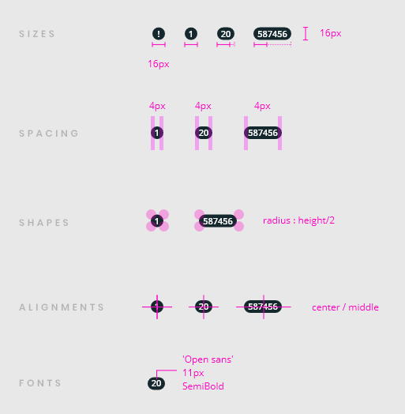
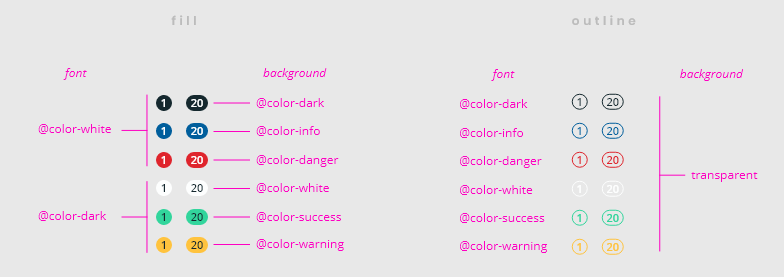
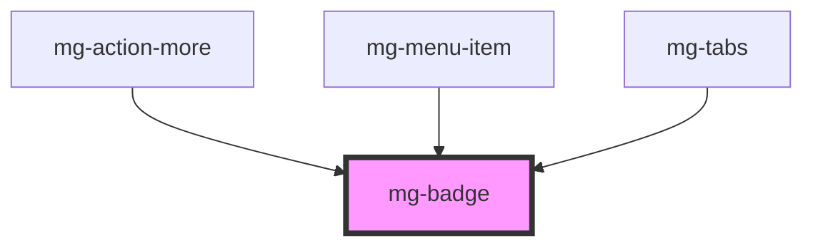

## Design

The badge is always placed on top of, or next to the element it is for.

The badge displays a number (can be followed by the `+` character) or a punctuation character.

## Specs

## Theming

<!-- Auto Generated Below -->

## Properties

| Property             | Attribute | Description                                                        | Type                                                                                       | Default       |
| -------------------- | --------- | ------------------------------------------------------------------ | ------------------------------------------------------------------------------------------ | ------------- |
| `label` _(required)_ | `label`   | Badge label. Include short description. Required for accessibility | `string`                                                                                   | `undefined`   |
| `outline`            | `outline` | Define if button is using outline style                            | `boolean`                                                                                  | `undefined`   |
| `value` _(required)_ | `value`   | Badge value                                                        | `number \| string`                                                                         | `undefined`   |
| `variant`            | `variant` | Define badge variant                                               | `"danger" \| "info" \| "primary" \| "secondary" \| "success" \| "text-color" \| "warning"` | `variants[0]` |

## CSS Custom Properties

| Name                      | Description                                                                                                                  |
| ------------------------- | ---------------------------------------------------------------------------------------------------------------------------- |
| `--mg-c-badge-font-size`  | Defines badge font size. Default value: `1.1rem`.                                                                            |
| `--mg-c-badge-size`       | Defines badge height and min-width. Default value: `--mg-b-size-2w`.                                                         |
| `--mg-c-badge-text-color` | Defines badge font color when used with the `text-color` variant and without `outline`. Default value: `--mg-b-color-light`. |

## Dependencies

### Used by

 - [mg-action-more](../../molecules/mg-action-more)
 - [mg-menu-item](../../molecules/menu/mg-menu-item)
 - [mg-tabs](../../molecules/mg-tabs)

### Graph

----------------------------------------------

*Built with [StencilJS](https://stenciljs.com/)*
