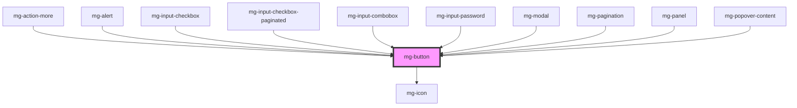

## Usage

A primary action button is usually unique on the screen, with other buttons displayed as "secondary" to highlight the primary action, such as Validation or Save.

A tooltip should be displayed on hover when the button only shows a non-explicit icon and has no label. The tooltip must indicate the button's action.

For a button that launches a potentially long process, it should be disabled and display a loader for the duration of the process. Use the `disable-on-click` attribute to ensure the button is disabled when clicked.

A button with an `undefined` `type` in a form will natively have a [submit type](https://developer.mozilla.org/en-US/docs/Web/HTML/Element/Button#attributes) and trigger form submission. For non-submission buttons, explicitly set the `type` attribute to "button".

## `disable-on-click`

When a click is triggered on a button with the `disable-on-click` property, the component will display a loader and set the `disabled` prop to `true`.  
This is used to prevent 'double click' by disabling the button immediately after it is clicked, such as when a form is submitted or an action is initiated.

### Resetting the button

To reset the button to its initial state after the process has completed, set the `disabled` prop to `false`.

#### Basic example

```vue
<mg-button disable-on-click @click="handleClick">Submit</mg-button>

<script>
  async function handleClick({ target }: { target: MgButton }) {
    // The click on the button has set the `disabled` prop to true
    // Execute an asynchronous script
    await doStuff();
    // Reset `disabled` to false after completion
    target.disabled = false;
  }
</script>
```

#### Example with business rules

In cases where the disabled status is also managed by business rules, you can do something like:

```vue
<mg-button
  disable-on-click
  :disabled="isDisabled"
  @click="handleClick"
>Submit</mg-button>

<script>
  const isDisabled = computed(() => {
    return firstDisabledParam || secondDisabledParam;
  });

  async function handleClick({ target }) {
    // The click on the button has set the `disabled` prop to true
    // Execute an asynchronous script
    await doStuff();
    // Set disabled to false to remove the loader
    target.disabled = false;
    // Reset the loader with the computed property
    target.disabled = isDisabled;
  }
</script>
```

<!-- Auto Generated Below -->


## Properties

| Property         | Attribute          | Description                                                                                                                                            | Type                                                                                              | Default     |
| ---------------- | ------------------ | ------------------------------------------------------------------------------------------------------------------------------------------------------ | ------------------------------------------------------------------------------------------------- | ----------- |
| `disableOnClick` | `disable-on-click` | Option to set input disable on click, in order to prevent multi-click. Parent component have to remove the attribute 'disabled' when the process ends. | `boolean`                                                                                         | `false`     |
| `disabled`       | `disabled`         | Disable button                                                                                                                                         | `boolean`                                                                                         | `undefined` |
| `form`           | `form`             | Define form id to attach button with. If this attribute is not set, the `<button>` is associated with its ancestor `<form>` element.                   | `string`                                                                                          | `undefined` |
| `fullWidth`      | `full-width`       | Set button to full-width                                                                                                                               | `boolean`                                                                                         | `false`     |
| `isIcon`         | `is-icon`          | Define if button is round. Used for icon button.                                                                                                       | `boolean`                                                                                         | `false`     |
| `label`          | `label`            | aria-label In case button text is not explicit enough                                                                                                  | `string`                                                                                          | `undefined` |
| `size`           | `size`             | Define button size                                                                                                                                     | `"large" \| "medium"`                                                                             | `'medium'`  |
| `type`           | `type`             | Define button type                                                                                                                                     | `"button" \| "reset" \| "submit"`                                                                 | `undefined` |
| `variant`        | `variant`          | Define button variant                                                                                                                                  | `"danger" \| "danger-alt" \| "flat" \| "info" \| "link" \| "primary" \| "secondary" \| "success"` | `'primary'` |


## Events

| Event             | Description                        | Type                   |
| ----------------- | ---------------------------------- | ---------------------- |
| `disabled-change` | Emmited event when disabled change | `CustomEvent<boolean>` |


## Slots

| Slot | Description    |
| ---- | -------------- |
|      | Button content |


## CSS Custom Properties

| Name                                        | Description                                                                                                        |
| ------------------------------------------- | ------------------------------------------------------------------------------------------------------------------ |
| `--mg-c-button-border-bottom-width`         | Defines the bottom border width of the button. Unset by default, fallback on `--mg-b-size-border`.                 |
| `--mg-c-button-border-left-width`           | Defines the left border width of the button. Unset by default, fallback on `--mg-b-size-border`.                   |
| `--mg-c-button-border-radius`               | Defines the border radius of the button. The default value is `--mg-b-size-radius`.                                |
| `--mg-c-button-border-radius-bottom-left`   | Defines the bottom left border radius of the button. Unset by default, fallback on `--mg-c-button-border-radius`.  |
| `--mg-c-button-border-radius-bottom-right`  | Defines the bottom right border radius of the button. Unset by default, fallback on `--mg-c-button-border-radius`. |
| `--mg-c-button-border-radius-top-left`      | Defines the top left border radius of the button. Unset by default, fallback on `--mg-c-button-border-radius`.     |
| `--mg-c-button-border-radius-top-right`     | Defines the top right border radius of the button. Unset by default, fallback on `--mg-c-button-border-radius`.    |
| `--mg-c-button-border-right-width`          | Defines the right border width of the button. Unset by default, fallback on `--mg-b-size-border`.                  |
| `--mg-c-button-border-top-width`            | Defines the top border width of the button. Unset by default, fallback on `--mg-b-size-border`.                    |
| `--mg-c-button-color-background-danger`     | Defines the background color for the danger variant button.                                                        |
| `--mg-c-button-color-background-danger-alt` | Defines the background color for the danger-alt variant button.                                                    |
| `--mg-c-button-color-background-info`       | Defines the background color for the info variant button.                                                          |
| `--mg-c-button-color-background-primary`    | Defines the background color for the primary variant button.                                                       |
| `--mg-c-button-color-background-secondary`  | Defines the background color for the secondary variant button.                                                     |
| `--mg-c-button-color-background-success`    | Defines the background color for the success variant button.                                                       |
| `--mg-c-button-color-background-warning`    | Defines the background color for the warning variant button.                                                       |
| `--mg-c-button-color-border-danger`         | Defines the border color for the danger variant button.                                                            |
| `--mg-c-button-color-border-danger-alt`     | Defines the border color for the danger-alt variant button.                                                        |
| `--mg-c-button-color-border-info`           | Defines the border color for the info variant button.                                                              |
| `--mg-c-button-color-border-primary`        | Defines the border color for the primary variant button.                                                           |
| `--mg-c-button-color-border-secondary`      | Defines the border color for the secondary variant button.                                                         |
| `--mg-c-button-color-border-success`        | Defines the border color for the success variant button.                                                           |
| `--mg-c-button-color-border-warning`        | Defines the border color for the warning variant button.                                                           |
| `--mg-c-button-color-gradient-danger`       | Defines the gradient color for the danger variant button.                                                          |
| `--mg-c-button-color-gradient-danger-alt`   | Defines the gradient color for the danger-alt variant button.                                                      |
| `--mg-c-button-color-gradient-info`         | Defines the gradient color for the info variant button.                                                            |
| `--mg-c-button-color-gradient-primary`      | Defines the gradient color for the primary variant button.                                                         |
| `--mg-c-button-color-gradient-secondary`    | Defines the gradient color for the secondary variant button.                                                       |
| `--mg-c-button-color-gradient-success`      | Defines the gradient color for the success variant button.                                                         |
| `--mg-c-button-color-gradient-warning`      | Defines the gradient color for the warning variant button.                                                         |
| `--mg-c-button-color-text-danger`           | Defines the font color for the danger variant button.                                                              |
| `--mg-c-button-color-text-danger-alt`       | Defines the font color for the danger-alt variant button.                                                          |
| `--mg-c-button-color-text-info`             | Defines the font color for the info variant button.                                                                |
| `--mg-c-button-color-text-primary`          | Defines the font color for the primary variant button.                                                             |
| `--mg-c-button-color-text-secondary`        | Defines the font color for the secondary variant button.                                                           |
| `--mg-c-button-color-text-success`          | Defines the font color for the success variant button.                                                             |
| `--mg-c-button-color-text-warning`          | Defines the font color for the warning variant button.                                                             |
| `--mg-c-button-font-weight`                 | Defines the font weight of the button. Unset by default, fallback on `normal`.                                     |
| `--mg-c-button-icon-border-radius`          | Defines the border radius of the button in icon mode. The default value is `--mg-b-size-min-height`.               |


## Dependencies

### Used by

 - [mg-action-more](../../molecules/mg-action-more)
 - [mg-alert](../../molecules/mg-alert)
 - [mg-input-checkbox](../../molecules/inputs/mg-input-checkbox)
 - mg-input-checkbox-paginated
 - [mg-input-combobox](../../molecules/inputs/mg-input-combobox)
 - [mg-input-password](../../molecules/inputs/mg-input-password)
 - [mg-modal](../../molecules/mg-modal)
 - [mg-pagination](../../molecules/mg-pagination)
 - [mg-panel](../../molecules/mg-panel)
 - mg-popover-content

### Depends on

- [mg-icon](../mg-icon)

### Graph


----------------------------------------------

*Built with [StencilJS](https://stenciljs.com/)*
