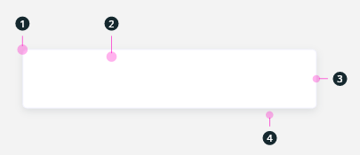
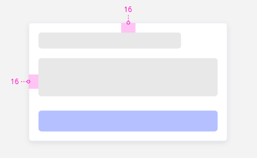
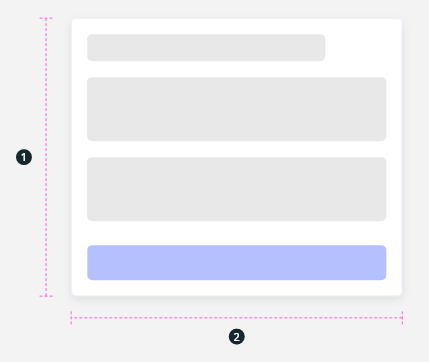
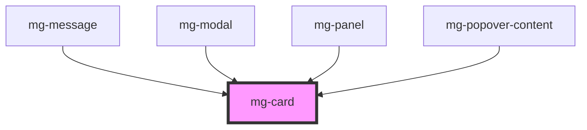

## Specifications

### Style

1. Border radius: 5px
2. Background: [@color-light](./?path=/docs/style-colors--docs)
3. Border: 1px, [@color-dark](./?path=/docs/style-colors--docs) with alpha at 5%
4. Shadow: [@shadow](./?path=/docs/style-colors--docs)

### Spacing

A padding of 16px is applied around the content

### Size

1. Ajusting with the content
2. Ajusting with its parent (100%)

<!-- Auto Generated Below -->

## Slots

| Slot | Description  |
| ---- | ------------ |
|      | Card content |

## CSS Custom Properties

| Name                                   | Description                                                                                                                                                   |
| -------------------------------------- | ------------------------------------------------------------------------------------------------------------------------------------------------------------- |
| `--mg-c-card-border`                   | Defines the border property for the card. Unset by default, fallback on `--mg-c-card-border-default`.                                                         |
| `--mg-c-card-border-default`           | Defines the default border property for the card. Default value: `var(--mg-b-size-border) solid color-mix(in srgb, var(--mg-b-color-dark), transparent 95%)`. |
| `--mg-c-card-border-radius`            | Defines the border radius property for the card. Unset by default, fallback on `--mg-c-card-border-radius-default`.                                           |
| `--mg-c-card-border-radius-default`    | Defines the default border radius property for the card. Default value: `--mg-b-size-radius`.                                                                 |
| `--mg-c-card-box-shadow`               | Defines the box shadow property for the card. Unset by default, fallback on `--mg-c-card-box-shadow-default`.                                                 |
| `--mg-c-card-box-shadow-default`       | Defines the default box shadow property for the card. Default value: `--mg-b-box-shadow`.                                                                     |
| `--mg-c-card-color-background`         | Defines the background property for the card. Unset by default, fallback on `--mg-c-card-color-background-default`.                                           |
| `--mg-c-card-color-background-default` | Defines the default background property for the card. Default value: `--mg-b-color-light`.                                                                    |
| `--mg-c-card-max-width`                | Defines the max-width property for the card. Unset by default.                                                                                                |
| `--mg-c-card-overflow`                 | Defines the overflow property for the card. Unset by default, fallback on `--mg-c-card-overflow-default`.                                                     |
| `--mg-c-card-overflow-default`         | Defines the default overflow property for the card. Unset by default.                                                                                         |
| `--mg-c-card-spacing`                  | Defines the padding property for the card. Unset by default, fallback on `--mg-c-card-spacing-default`.                                                       |
| `--mg-c-card-spacing-default`          | Defines the default padding property for the card. Default value: `--mg-b-size-16`.                                                                           |

## Dependencies

### Used by

 - [mg-message](../../molecules/mg-message)
 - [mg-modal](../../molecules/mg-modal)
 - [mg-panel](../../molecules/mg-panel)
 - mg-popover-content

### Graph

----------------------------------------------

*Built with [StencilJS](https://stenciljs.com/)*
