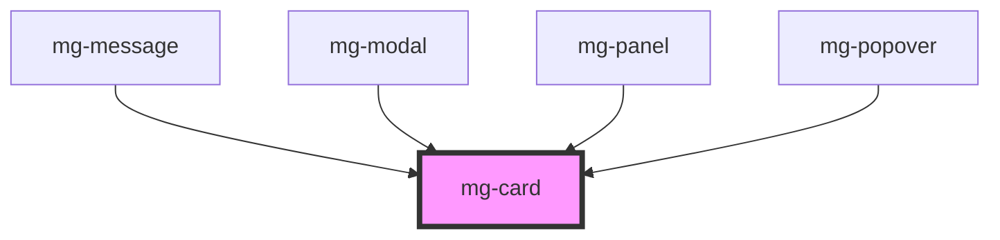

## Specifications

### Style

1. Border radius: 5px
2. Background: [@color-light](./?path=/docs/style-colors--page)
3. Border: 1px, [@color-dark](./?path=/docs/style-colors--page) with alpha at 5%
4. Shadow: [@shadow](./?path=/docs/style-colors--page)

### Variant on bar / on background

You can set variant color on left bar or on background of the card

Values for variant colors are : 
- info
- success
- warning
- danger
- app

*exemple of "app color" for the last one*

Variant applied on the left bar uses **[full colors](./?path=/docs/style-colors--page)**

Variant applied on the background uses **[soft colors](./?path=/docs/style-colors--page)**

### Spacing

A padding of 16px is applied around the content

### Size

1. Ajusting with the content
2. Ajusting with its parent (100%)

## CSS Variables

If needed some [variables](./?path=/story/css-variables--page) are available to customize the component:

- `--mg-card-padding`: define car padding, default: `1.6rem`
- `--mg-card-border-radius`: define card border radius, default: `0.5rem`
- `--mg-card-background`: define card background, default: `hsl(var(--color-light))`
- `--mg-card-border`: define card border, default: `0.1rem solid hsla(var(--color-dark), 5%)`
- `--mg-card-box-shadow`: define card shadow, default: `var(--box-shadow)`
- `--mg-card-box-overflow`: define card overflow, default: `unset`

<!-- Auto Generated Below -->

## Properties

| Property       | Attribute       | Description                                 | Type                                                    | Default     |
| -------------- | --------------- | ------------------------------------------- | ------------------------------------------------------- | ----------- |
| `variant`      | `variant`       | Define variant prop Default: undefined      | `"app" \| "danger" \| "info" \| "success" \| "warning"` | `undefined` |
| `variantStyle` | `variant-style` | Define variantStyle prop Default: undefined | `"bar-left" \| "fill"`                                  | `undefined` |

## Dependencies

### Used by

 - [mg-message](../../molecules/mg-message)
 - [mg-modal](../../molecules/mg-modal)
 - [mg-panel](../../molecules/mg-panel)
 - [mg-popover](../../molecules/mg-popover)

### Graph

----------------------------------------------

*Built with [StencilJS](https://stenciljs.com/)*
