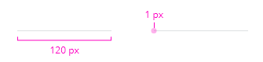
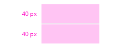
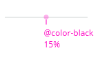

## Sizing

Two sizes are possible:

- Regular: 120px
- Full: 100%

Rules:

- Regular is the default mode.
- In full mode it takes 100% of its parent.
- The thickness is 1px.

## Spacing

Default margin applied on top and bottom of the divider is set to 40px.

## Color

<!-- Auto Generated Below -->

## Properties

| Property | Attribute | Description           | Type                  | Default     |
| -------- | --------- | --------------------- | --------------------- | ----------- |
| `size`   | `size`    | Define component size | `"full" \| "regular"` | `'regular'` |

## CSS Custom Properties

| Name                              | Description                                                                                                                      |
| --------------------------------- | -------------------------------------------------------------------------------------------------------------------------------- |
| `--mg-c-divider-background-color` | Defines the background color of the divider. The default value is `color-mix(in srgb, var(--mg-b-color-dark), transparent 85%)`. |
| `--mg-c-divider-thickness`        | Defines the thickness of the divider. The default value is `--mg-b-size-border`.                                                 |
| `--mg-c-divider-vertical-spacing` | Defines the vertical spacing of the divider. The default value is `--mg-b-size-5w`.                                              |

----------------------------------------------

*Built with [StencilJS](https://stenciljs.com/)*
