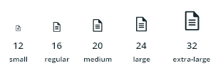
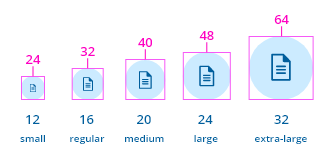
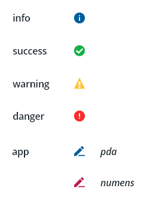
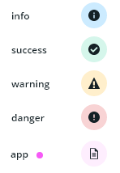

## Specifications

### Sizing

 

Sizes (px) :

- small : 12x12
- regular : 16x16
- medium : 20x20
- large : 24x24
- extra-large : 32x32

### With "variant" applied

When *variant* is set a circle is put back to the icon with a width and height equal to the size of the icon multiplied by 2.
The icon is centered in it.

## Styling

### Default

Default color for the icon is the color used for the text.
Color: text of the page (usually [@color-dark](./?path=/docs/style-colors--page))

### Variant style

### Variant
 

 

"variant" property applies [semantic color](http://core.pages.mgdis.fr/core-ui/core-ui/?path=/docs/style-colors--page) or "app color" to the background of the icon with Lightness set to 90% 
You can select "variant style" to apply "variant" on the icon or the background or both.

# File naming

Separator : "-" (dash).
By default, the pictograms are the "filled" version, but this doesn't need to be specified in the naming
Variant : "-outline". If pictogram variant has a background that has a full circle > add "-circle" *ex : check-circle, check-circle-outline*

## CSS Variables

If needed some [variables](./?path=/story/css-variables--page) are available to customize the component:

- `--mg-icon-small-size`: Define small icon size, default: `1.2rem`
- `--mg-icon-regular-size`: Define regular icon size, default: `1.6rem`
- `--mg-icon-medium-size`: Define medium icon size, default: `2rem`
- `--mg-icon-large-size`: Define large icon size, default: `2.4rem`
- `--mg-icon-extra-large-size`: Define extra large icon size, default: `3.6rem`
- `--mg-icon-border-radius`: Define icon border radiys, default: `50%`

<!-- Auto Generated Below -->

## Properties

| Property            | Attribute       | Description                                                                                                                                                                                                                                                                                                   | Type                                                           | Default     |
| ------------------- | --------------- | ------------------------------------------------------------------------------------------------------------------------------------------------------------------------------------------------------------------------------------------------------------------------------------------------------------- | -------------------------------------------------------------- | ----------- |
| `icon` _(required)_ | `icon`          | Icon to display.                                                                                                                                                                                                                                                                                              | `string`                                                       | `undefined` |
| `size`              | `size`          | Define icon size                                                                                                                                                                                                                                                                                              | `"extra-large" \| "large" \| "medium" \| "regular" \| "small"` | `'regular'` |
| `spin`              | `spin`          | Make the icon spin                                                                                                                                                                                                                                                                                            | `boolean`                                                      | `false`     |
| `variant`           | `variant`       | Define icon variant color                                                                                                                                                                                                                                                                                     | `"app" \| "danger" \| "info" \| "success" \| "warning"`        | `undefined` |
| `variantStyle`      | `variant-style` | Define icon color variant style Add a color to the icon based on variant color with given style 'full': Used to set a circular background with variant soft color and icon variant color 'background': Used to set a circular background with variant soft color 'icon': Used to set a color only to the icon | `"background" \| "full" \| "icon"`                             | `undefined` |

## Dependencies

### Used by

 - [mg-action-more](../../molecules/mg-action-more)
 - [mg-button](../mg-button)
 - [mg-details](../../molecules/mg-details)
 - [mg-input-checkbox](../../molecules/inputs/mg-input-checkbox)
 - [mg-input-checkbox-paginated](../../molecules/inputs/mg-input-checkbox/mg-input-checkbox-paginated)
 - [mg-input-date](../../molecules/inputs/mg-input-date)
 - [mg-input-numeric](../../molecules/inputs/mg-input-numeric)
 - [mg-input-password](../../molecules/inputs/mg-input-password)
 - [mg-input-radio](../../molecules/inputs/mg-input-radio)
 - [mg-input-select](../../molecules/inputs/mg-input-select)
 - [mg-input-text](../../molecules/inputs/mg-input-text)
 - [mg-input-textarea](../../molecules/inputs/mg-input-textarea)
 - [mg-input-toggle](../../molecules/inputs/mg-input-toggle)
 - [mg-item-more](../../molecules/mg-item-more)
 - [mg-menu-item](../../molecules/menu/mg-menu-item)
 - [mg-message](../../molecules/mg-message)
 - [mg-modal](../../molecules/mg-modal)
 - [mg-pagination](../../molecules/mg-pagination)
 - [mg-panel](../../molecules/mg-panel)
 - [mg-popover](../../molecules/mg-popover)
 - [mg-tabs](../../molecules/mg-tabs)

### Graph

```mermaid
graph TD;
  mg-action-more --> mg-icon
  mg-button --> mg-icon
  mg-details --> mg-icon
  mg-input-checkbox --> mg-icon
  mg-input-checkbox-paginated --> mg-icon
  mg-input-date --> mg-icon
  mg-input-numeric --> mg-icon
  mg-input-password --> mg-icon
  mg-input-radio --> mg-icon
  mg-input-select --> mg-icon
  mg-input-text --> mg-icon
  mg-input-textarea --> mg-icon
  mg-input-toggle --> mg-icon
  mg-item-more --> mg-icon
  mg-menu-item --> mg-icon
  mg-message --> mg-icon
  mg-modal --> mg-icon
  mg-pagination --> mg-icon
  mg-panel --> mg-icon
  mg-popover --> mg-icon
  mg-tabs --> mg-icon
  style mg-icon fill:#f9f,stroke:#333,stroke-width:4px
```

----------------------------------------------

*Built with [StencilJS](https://stenciljs.com/)*
