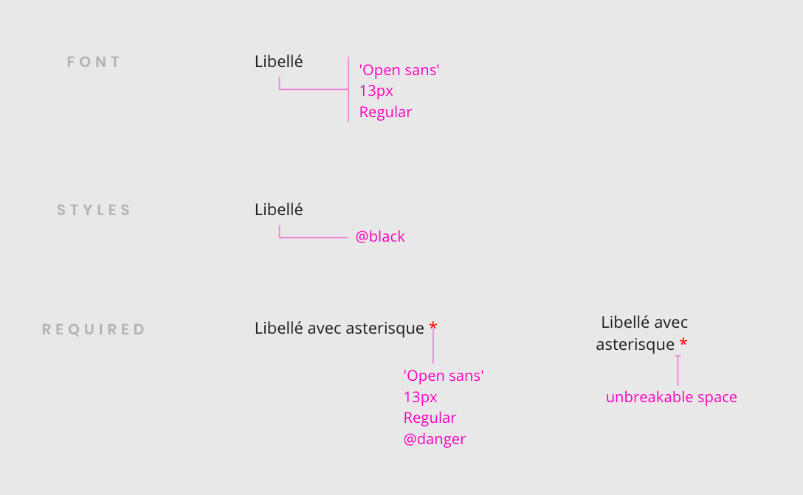
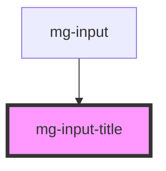

## Design

### Label

The label can be on more than one line.

### Styles

<!-- Auto Generated Below -->

## Properties

| Property                  | Attribute    | Description                                                       | Type      | Default     |
| ------------------------- | ------------ | ----------------------------------------------------------------- | --------- | ----------- |
| `identifier` _(required)_ | `identifier` | Label input id                                                    | `string`  | `undefined` |
| `isLegend`                | `is-legend`  | Switch from label to fieldset sementic                            | `boolean` | `false`     |
| `readonly`                | `readonly`   | If input is required an asterisk is added at the end of the label | `boolean` | `undefined` |
| `required`                | `required`   | If input is required an asterisk is added at the end of the label | `boolean` | `undefined` |

## Slots

| Slot | Description   |
| ---- | ------------- |
|      | Title content |

## Dependencies

### Used by

 - [mg-input](../../molecules/inputs/mg-input)

### Graph

----------------------------------------------

*Built with [StencilJS](https://stenciljs.com/)*
