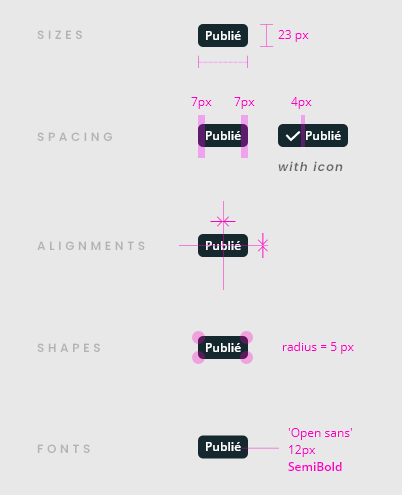

## Specs

### Fill / Outline tags

#### Colors

Icons take the color of the label.

### Soft tags

#### Font

They are not on SemiBold but **Regular**.

#### Colors

1. Icons takes the color of the tag variant.
2. Labels are [**@color-dark**](./?path=/docs/style-colors--docs) for all.
3. Color background is **[**soft color**](./?path=/docs/style-colors--docs)** of the tag variant.

#### Rules

For accessibility, soft variant tags cannot use an icon on its own.

## Theming

### With Icons

<!-- Auto Generated Below -->

## Properties

| Property  | Attribute | Description                          | Type                                                                       | Default       |
| --------- | --------- | ------------------------------------ | -------------------------------------------------------------------------- | ------------- |
| `outline` | `outline` | Define if tag is using outline style | `boolean`                                                                  | `undefined`   |
| `soft`    | `soft`    | Define if tag is using soft style    | `boolean`                                                                  | `undefined`   |
| `variant` | `variant` | Define tag variant                   | `"danger" \| "info" \| "primary" \| "secondary" \| "success" \| "warning"` | `variants[0]` |

## Slots

| Slot | Description |
| ---- | ----------- |
|      | Tag content |

## CSS Custom Properties

| Name                       | Description                                                                  |
| -------------------------- | ---------------------------------------------------------------------------- |
| `--mg-c-tag-border-radius` | Defines the border radius of the tag. Default value is `--mg-b-size-radius`. |
| `--mg-c-tag-font-size`     | Defines the font size of the tag. Default value is `1.2rem`.                 |
| `--mg-c-tag-height`        | Defines the height of the tag. Default value is `--mg-b-size-24`.            |

----------------------------------------------

*Built with [StencilJS](https://stenciljs.com/)*
