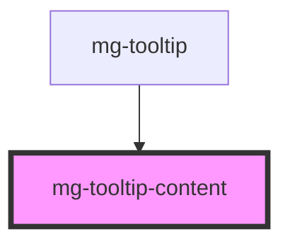

# mg-tooltip-content

<!-- Auto Generated Below -->

## Properties

| Property               | Attribute | Description                      | Type     | Default     |
| ---------------------- | --------- | -------------------------------- | -------- | ----------- |
| `message` _(required)_ | `message` | Displayed message in the tooltip | `string` | `undefined` |

## Dependencies

### Used by

 - [mg-tooltip](..)

### Graph

----------------------------------------------

*Built with [StencilJS](https://stenciljs.com/)*
