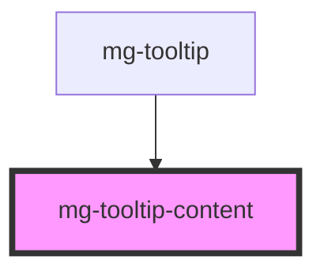

# mg-tooltip-content

In order to adhere to the ARIA tooltip pattern, which is essential for accessibility, we need to retrieve the tooltip content from outside the `mg-tooltip` shadow root.

The `mg-tooltip-content` component is appended to the `mg-tooltip` component as a slot when the component is loaded. It receives the tooltip content as props and manages the tooltip's style.

<!-- Auto Generated Below -->

## Properties

| Property               | Attribute | Description                      | Type     | Default     |
| ---------------------- | --------- | -------------------------------- | -------- | ----------- |
| `message` _(required)_ | `message` | Displayed message in the tooltip | `string` | `undefined` |

## Dependencies

### Used by

 - [mg-tooltip](..)

### Graph

----------------------------------------------

*Built with [StencilJS](https://stenciljs.com/)*
