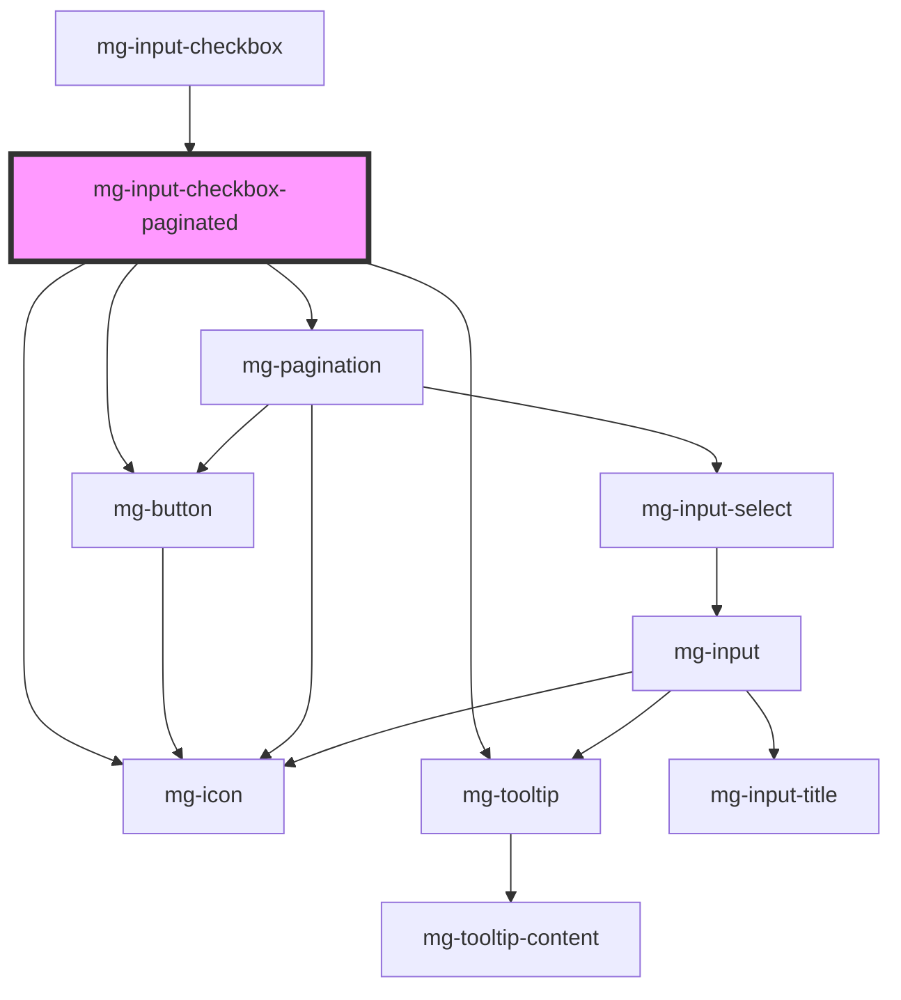

# mg-input-checkbox-paginated

<!-- Auto Generated Below -->

## Overview

Internal component use to manage sections instances

## Properties

| Property      | Attribute      | Description                                  | Type                           | Default     |
| ------------- | -------------- | -------------------------------------------- | ------------------------------ | ----------- |
| `checkboxes`  | --             | Define checkboxes to paginate                | `CheckboxItem[]`               | `[]`        |
| `currentPage` | `current-page` | Current page                                 | `number`                       | `1`         |
| `disabled`    | `disabled`     | Define if mg-input-checkbox-list is disabled | `boolean`                      | `undefined` |
| `invalid`     | `invalid`      | Define mg-input-checkbox input invalid       | `boolean`                      | `undefined` |
| `messages`    | --             | Define component message                     | `{ [x: string]: string; }`     | `undefined` |
| `name`        | `name`         | Define mg-input-checkbox input name          | `string`                       | `undefined` |
| `readonly`    | `readonly`     | Define if mg-input-checkbox-list is readonly | `boolean`                      | `undefined` |
| `sectionKind` | `section-kind` | Define section kind                          | `"not-selected" \| "selected"` | `undefined` |

## Events

| Event         | Description                                                                                       | Type                                        |
| ------------- | ------------------------------------------------------------------------------------------------- | ------------------------------------------- |
| `mass-action` | Emit 'mass-action' event used to informe that select-all/unselect-all button listner is triggered | `CustomEvent<"not-selected" \| "selected">` |

## Dependencies

### Used by

 - [mg-input-checkbox](..)

### Depends on

- [mg-button](../../../../atoms/mg-button)
- [mg-icon](../../../../atoms/mg-icon)
- [mg-tooltip](../../../../atoms/mg-tooltip)
- [mg-pagination](../../../mg-pagination)

### Graph

----------------------------------------------

*Built with [StencilJS](https://stenciljs.com/)*
