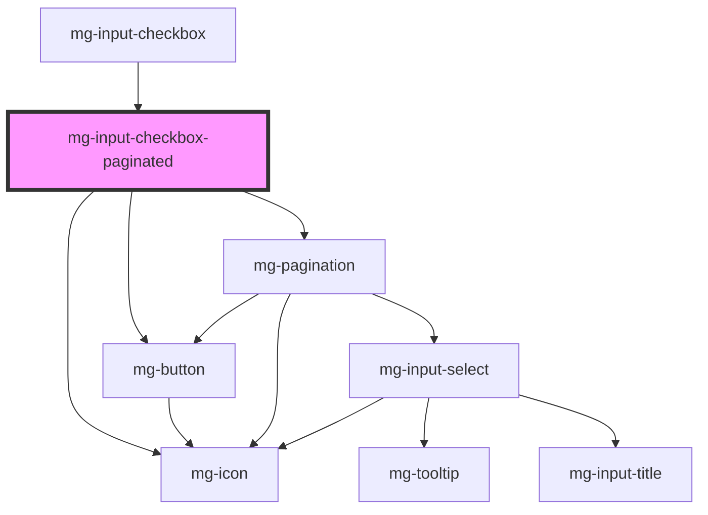

## Usage

True/False value notion.
Only 2 possible values.

### Theming

The style of the active checkbox is the browser's style.

## Specs

## Type "multi"

### Anatomy

- Button :
  - variant : secondary
  - icon : list
- Checkbox
- Popover

### type "multi" with than 10 values

when we have selected and not selected items we have two sections

when we only have selected OR unselected items we have one section displayed

Selected items section is collapsible

### Displayed values

#### Style

- Radius : 3px
- Font : OpenSans, Regular, 13px
- Color : [@color-dark-5](./?path=/docs/style-colors--page)

#### Alignment

Text is centered vertically and horizontally in the container

#### Spacing

#### Sizing

- Min-width : 35px
- Min-height : 35px

#### Behavior

##### Lack of space

1. Without values

If the space is too narrow the text button will do a line break.

1. With values

If the space is too narrow the button and values will do a line break.

The component is ajusting with the space available. If the width is not enought big the values will do a breakline.

### Values not displayed

#### Spacing

#### Style

## CSS Variables

If needed some [variables](./?path=/story/css-variables--page) are available to customize the component:

- `--mg-input-check-size`: Define checkbox size, default: `1.3rem`

## Warning

Please be aware that this component has a known issue ([#139](https://gitlab.mgdis.fr/core/core-ui/mg-components/-/issues/139)) **when used with the Vue2 framework**. It is essential that your project loads the [mg-model directive](http://core.pages.mgdis.fr/core-back/core/docs/mg-components-helpers/mg-model-vue) and that the component uses it.

<!-- Auto Generated Below -->

## Overview

Internal component use to manage sections instances

## Properties

| Property      | Attribute      | Description                                  | Type                                               | Default     |
| ------------- | -------------- | -------------------------------------------- | -------------------------------------------------- | ----------- |
| `checkboxes`  | --             | Define checkboxes to paginate                | `CheckboxItem[]`                                   | `[]`        |
| `disabled`    | `disabled`     | Define if mg-input-checkbox-list is disabled | `boolean`                                          | `undefined` |
| `identifier`  | `identifier`   | Define mg-input-checkbox-list identifier     | `string`                                           | `undefined` |
| `messages`    | --             | Define component message                     | `{ [x: string]: string; }`                         | `undefined` |
| `readonly`    | `readonly`     | Define if mg-input-checkbox-list is readonly | `boolean`                                          | `undefined` |
| `sectionKind` | `section-kind` | Define section kind                          | `SectionKind.NOT_SELECTED \| SectionKind.SELECTED` | `undefined` |

## Events

| Event         | Description                | Type                                                            |
| ------------- | -------------------------- | --------------------------------------------------------------- |
| `mass-action` | Define 'mass-action' event | `CustomEvent<SectionKind.NOT_SELECTED \| SectionKind.SELECTED>` |

## Dependencies

### Used by

 - [mg-input-checkbox](.)

### Depends on

- [mg-button](../../../atoms/mg-button)
- [mg-icon](../../../atoms/mg-icon)
- [mg-pagination](../../mg-pagination)

### Graph

----------------------------------------------

*Built with [StencilJS](https://stenciljs.com/)*
