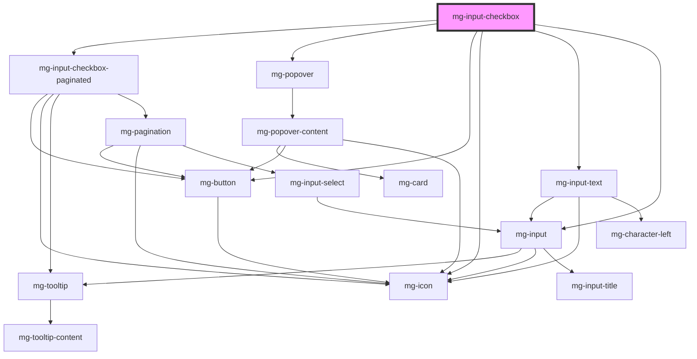

## Usage

True/False value notion.  
Only 2 possible values.

## Warning

Please be aware that this component has a known issue ([#139](https://gitlab.mgdis.fr/core/core-ui/mg-components/-/issues/139)) **when used with the Vue2 framework**. It is essential that your project loads the [mg-model directive](http://core.pages.mgdis.fr/core-back/core/docs/mg-components-helpers/mg-model-vue) and that the component uses it.

<!-- Auto Generated Below -->

## Properties

| Property                  | Attribute                 | Description                                                                                                                                                                                                                                                                      | Type                    | Default           |
| ------------------------- | ------------------------- | -------------------------------------------------------------------------------------------------------------------------------------------------------------------------------------------------------------------------------------------------------------------------------- | ----------------------- | ----------------- |
| `disabled`                | `disabled`                | Define if input is disabled                                                                                                                                                                                                                                                      | `boolean`               | `false`           |
| `displaySelectedValues`   | `display-selected-values` | Display selected values list in "multi" type This prop is only applied with prop type "multi" or when an "unset" mode render a "multi" type.                                                                                                                                     | `boolean`               | `undefined`       |
| `helpText`                | `help-text`               | Add a help text under the input, usually expected data format and example                                                                                                                                                                                                        | `string`                | `undefined`       |
| `identifier` _(required)_ | `identifier`              | Identifier is used for the element ID (id is a reserved prop in Stencil.js)                                                                                                                                                                                                      | `string`                | `undefined`       |
| `inputVerticalList`       | `input-vertical-list`     | Define if inputs are display verticaly                                                                                                                                                                                                                                           | `boolean`               | `false`           |
| `invalid`                 | `invalid`                 | Define input invalid state                                                                                                                                                                                                                                                       | `boolean`               | `undefined`       |
| `label` _(required)_      | `label`                   | Define input label                                                                                                                                                                                                                                                               | `string`                | `undefined`       |
| `labelHide`               | `label-hide`              | Define if label is visible                                                                                                                                                                                                                                                       | `boolean`               | `false`           |
| `labelOnTop`              | `label-on-top`            | Define if label is displayed on top                                                                                                                                                                                                                                              | `boolean`               | `undefined`       |
| `name`                    | `name`                    | Define input name If not set the value equals the identifier                                                                                                                                                                                                                     | `string`                | `this.identifier` |
| `readonly`                | `readonly`                | Define if mg-input-checkbox is readonly                                                                                                                                                                                                                                          | `boolean`               | `false`           |
| `required`                | `required`                | Define if mg-input-checkbox is required                                                                                                                                                                                                                                          | `boolean`               | `false`           |
| `tooltip`                 | `tooltip`                 | Add a tooltip message next to the input                                                                                                                                                                                                                                          | `string`                | `undefined`       |
| `tooltipPosition`         | `tooltip-position`        | Define tooltip position                                                                                                                                                                                                                                                          | `"input" \| "label"`    | `'input'`         |
| `type`                    | `type`                    | Define checkbox type When it's undefined the type is dynamic: - With 0-5 items type is 'checkbox' - With 5-10 items type is 'multi' When it set the type is locked to the defined value. When type is dynamic OR with 'multi' type AND Over 10 items "search" feature is enabled | `"checkbox" \| "multi"` | `undefined`       |
| `valid`                   | `valid`                   | Define input valid state                                                                                                                                                                                                                                                         | `boolean`               | `undefined`       |
| `value` _(required)_      | --                        | Component value If item.value is `null`, checkbox will be indeterminate by default                                                                                                                                                                                               | `CheckboxValue[]`       | `undefined`       |

## Events

| Event          | Description                         | Type                           |
| -------------- | ----------------------------------- | ------------------------------ |
| `input-valid`  | Emited event when checking validity | `CustomEvent<boolean>`         |
| `value-change` | Emitted event when value change     | `CustomEvent<CheckboxValue[]>` |

## Methods

### `displayError() => Promise<void>`

Display input error if it exists.

#### Returns

Type: `Promise<void>`

### `setError(valid: MgInputCheckbox['valid'], errorMessage: string) => Promise<void>`

Set an error and display a custom error message.
This method can be used to set the component's error state from its context by passing a boolean value to the `valid` parameter.
It must be paired with an error message to display for the given context.
When used to set validity to `false`, you should use this method again to reset the validity to `true`.

#### Parameters

| Name           | Type      | Description                     |
| -------------- | --------- | ------------------------------- |
| `valid`        | `boolean` | - value indicating the validity |
| `errorMessage` | `string`  | - the error message to display  |

#### Returns

Type: `Promise<void>`

## Dependencies

### Depends on

- mg-input-checkbox-paginated
- [mg-popover](../../mg-popover)
- [mg-button](../../../atoms/mg-button)
- [mg-icon](../../../atoms/mg-icon)
- [mg-input-text](../mg-input-text)
- [mg-input](../mg-input)

### Graph

----------------------------------------------

*Built with [StencilJS](https://stenciljs.com/)*
