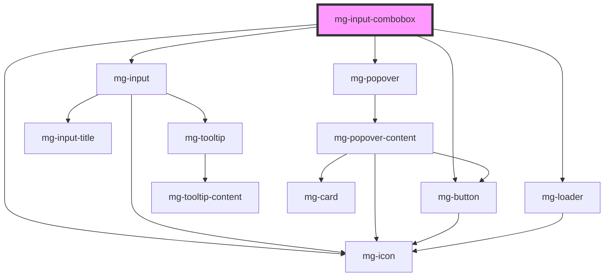

## Ressources

- [Combox role - Accessibility | MDN](https://developer.mozilla.org/en-US/docs/Web/Accessibility/ARIA/Roles/combobox_role)
- [Combox pattern example | WAI | W3C](https://www.w3.org/WAI/ARIA/apg/patterns/combobox/examples/combobox-autocomplete-list/)

<!-- Auto Generated Below -->

## Properties

| Property                  | Attribute          | Description                                                                                                                                               | Type                                                              | Default           |
| ------------------------- | ------------------ | --------------------------------------------------------------------------------------------------------------------------------------------------------- | ----------------------------------------------------------------- | ----------------- |
| `disabled`                | `disabled`         | Define if input is disabled                                                                                                                               | `boolean`                                                         | `false`           |
| `fetchmappings`           | --                 | Define fetch request mappings. Required with `fetchurl`                                                                                                   | `{ request: RequestMappingType; response: ResponseMappingType; }` | `undefined`       |
| `fetchoptions`            | --                 | Define fetch options object Require `fetchurl` prop to be defined otherwith it will be ignored if defined                                                 | `RequestInit`                                                     | `undefined`       |
| `fetchurl`                | `fetchurl`         | Define API url to fetch                                                                                                                                   | `URL \| string`                                                   | `undefined`       |
| `helpText`                | `help-text`        | Add a help text under the input, usually expected data format and example                                                                                 | `string`                                                          | `undefined`       |
| `identifier` _(required)_ | `identifier`       | Identifier is used for the element ID (id is a reserved prop in Stencil.js)                                                                               | `string`                                                          | `undefined`       |
| `invalid`                 | `invalid`          | Define input invalid state                                                                                                                                | `boolean`                                                         | `undefined`       |
| `items`                   | --                 | Define components items                                                                                                                                   | `(string \| Option)[]`                                            | `undefined`       |
| `itemsLabel` _(required)_ | `items-label`      | Define items label Include short description. Required for accessibility.                                                                                 | `string`                                                          | `undefined`       |
| `label` _(required)_      | `label`            | Input label                                                                                                                                               | `string`                                                          | `undefined`       |
| `labelHide`               | `label-hide`       | Define if label is visible                                                                                                                                | `boolean`                                                         | `false`           |
| `labelOnTop`              | `label-on-top`     | Define if label is displayed on top                                                                                                                       | `boolean`                                                         | `false`           |
| `mgWidth`                 | `mg-width`         | Define input width                                                                                                                                        | `"full" \| 16 \| 2 \| 4`                                          | `'full'`          |
| `name`                    | `name`             | Input name If not set the value equals the identifier                                                                                                     | `string`                                                          | `this.identifier` |
| `placeholder`             | `placeholder`      | Define input placeholder. It should be a word or short phrase that demonstrates the expected type of data, not a replacement for labels or help combobox. | `string`                                                          | `undefined`       |
| `readonly`                | `readonly`         | Define if input is readonly                                                                                                                               | `boolean`                                                         | `false`           |
| `required`                | `required`         | Define if input is required                                                                                                                               | `boolean`                                                         | `false`           |
| `tooltip`                 | `tooltip`          | Add a tooltip message next to the input                                                                                                                   | `string`                                                          | `undefined`       |
| `tooltipPosition`         | `tooltip-position` | Define tooltip position                                                                                                                                   | `"input" \| "label"`                                              | `'input'`         |
| `valid`                   | `valid`            | Define input valid state                                                                                                                                  | `boolean`                                                         | `undefined`       |
| `value`                   | `value`            | Define component value                                                                                                                                    | `string \| { title: string; value: unknown; }`                    | `undefined`       |

## Events

| Event           | Description                             | Type                                                        |
| --------------- | --------------------------------------- | ----------------------------------------------------------- |
| `filter-change` | Emited event when filter change         | `CustomEvent<string>`                                       |
| `input-valid`   | Emited event when checking validity     | `CustomEvent<boolean>`                                      |
| `load-more`     | Emited event when `load-more` is called | `CustomEvent<void>`                                         |
| `value-change`  | Emited event when value change          | `CustomEvent<string \| { title: string; value: unknown; }>` |

## Methods

### `displayError() => Promise<void>`

Display input error if it exists.

#### Returns

Type: `Promise<void>`

### `reset() => Promise<void>`

Reset value, validity and error state

#### Returns

Type: `Promise<void>`

### `setError(valid: MgInputCombobox["valid"], errorMessage: string) => Promise<void>`

Set an error and display a custom error message.
This method can be used to set the component's error state from its concombobox by passing a boolean value to the `valid` parameter.
It must be paired with an error message to display for the given concombobox.
When used to set validity to `false`, you should use this method again to reset the validity to `true`.

#### Parameters

| Name           | Type      | Description                     |
| -------------- | --------- | ------------------------------- |
| `valid`        | `boolean` | - value indicating the validity |
| `errorMessage` | `string`  | - the error message to display  |

#### Returns

Type: `Promise<void>`

### `setFocus() => Promise<void>`

Public method to play input focus

#### Returns

Type: `Promise<void>`

## Dependencies

### Depends on

- [mg-input](../mg-input)
- [mg-popover](../../mg-popover)
- [mg-icon](../../../atoms/mg-icon)
- [mg-button](../../../atoms/mg-button)
- [mg-loader](../../mg-loader)

### Graph

----------------------------------------------

*Built with [StencilJS](https://stenciljs.com/)*
