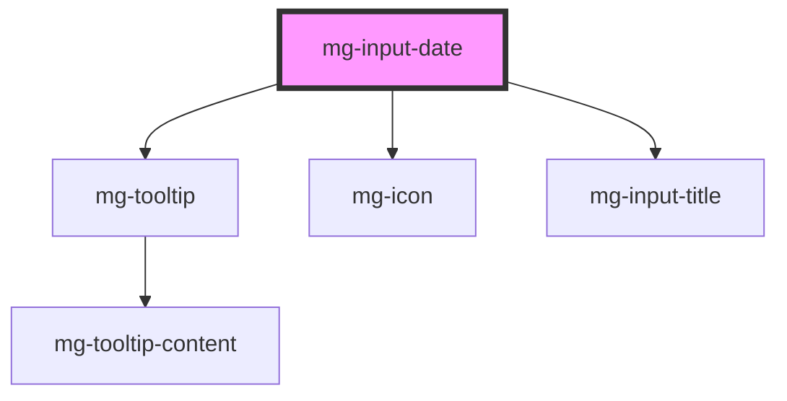

## Behavior

The behavior is the native behavior of the browser.

### Theming

Calendar and trigger: The style is the browser's native style.

<!-- Auto Generated Below -->

## Properties

| Property                  | Attribute          | Description                                                                                                                                                                                                                                                                                                                                                                                                                                         | Type                 | Default           |
| ------------------------- | ------------------ | --------------------------------------------------------------------------------------------------------------------------------------------------------------------------------------------------------------------------------------------------------------------------------------------------------------------------------------------------------------------------------------------------------------------------------------------------- | -------------------- | ----------------- |
| `disabled`                | `disabled`         | Define if input is disabled                                                                                                                                                                                                                                                                                                                                                                                                                         | `boolean`            | `false`           |
| `helpText`                | `help-text`        | Add a help text under the input, usually expected data format and example Available string variables:  - `{pattern}`: render innerHTML pattern based on system  - `{date}`: render innerText date with a pattern base format.  - `{defaultHelpText}`: render default `helpText` usefull to concat helpText local with your custom text. ex: `Input use {pattern} pattern` as `helpText` prop value will be render as `Input use mm/dd/yyyy pattern` | `string`             | `undefined`       |
| `identifier` _(required)_ | `identifier`       | Identifier is used for the element ID (id is a reserved prop in Stencil.js)                                                                                                                                                                                                                                                                                                                                                                         | `string`             | `undefined`       |
| `invalid`                 | `invalid`          | Define input invalid state                                                                                                                                                                                                                                                                                                                                                                                                                          | `boolean`            | `undefined`       |
| `label` _(required)_      | `label`            | Input label                                                                                                                                                                                                                                                                                                                                                                                                                                         | `string`             | `undefined`       |
| `labelHide`               | `label-hide`       | Define if label is visible                                                                                                                                                                                                                                                                                                                                                                                                                          | `boolean`            | `false`           |
| `labelOnTop`              | `label-on-top`     | Define if label is displayed on top                                                                                                                                                                                                                                                                                                                                                                                                                 | `boolean`            | `undefined`       |
| `max`                     | `max`              | Define input maximum date format: yyyy-mm-dd                                                                                                                                                                                                                                                                                                                                                                                                        | `string`             | `undefined`       |
| `min`                     | `min`              | Define input minimum date format: yyyy-mm-dd                                                                                                                                                                                                                                                                                                                                                                                                        | `string`             | `undefined`       |
| `name`                    | `name`             | Input name If not set the value equals the identifier                                                                                                                                                                                                                                                                                                                                                                                               | `string`             | `this.identifier` |
| `readonly`                | `readonly`         | Define if input is readonly                                                                                                                                                                                                                                                                                                                                                                                                                         | `boolean`            | `false`           |
| `required`                | `required`         | Define if input is required                                                                                                                                                                                                                                                                                                                                                                                                                         | `boolean`            | `false`           |
| `tooltip`                 | `tooltip`          | Add a tooltip message next to the input                                                                                                                                                                                                                                                                                                                                                                                                             | `string`             | `undefined`       |
| `tooltipPosition`         | `tooltip-position` | Define tooltip position                                                                                                                                                                                                                                                                                                                                                                                                                             | `"input" \| "label"` | `'input'`         |
| `valid`                   | `valid`            | Define input valid state                                                                                                                                                                                                                                                                                                                                                                                                                            | `boolean`            | `undefined`       |
| `value`                   | `value`            | Component value                                                                                                                                                                                                                                                                                                                                                                                                                                     | `string`             | `undefined`       |

## Events

| Event          | Description                         | Type                   |
| -------------- | ----------------------------------- | ---------------------- |
| `input-valid`  | Emited event when checking validity | `CustomEvent<boolean>` |
| `value-change` | Emited event when value change      | `CustomEvent<string>`  |

## Methods

### `displayError() => Promise<void>`

Display input error if it exists.

#### Returns

Type: `Promise<void>`

### `setError(valid: MgInputDate['valid'], errorMessage: string) => Promise<void>`

Set an error and display a custom error message.
This method can be used to set the component's error state from its context by passing a boolean value to the `valid` parameter.
It must be paired with an error message to display for the given context.
When used to set validity to `false`, you should use this method again to reset the validity to `true`.

#### Parameters

| Name           | Type      | Description                     |
| -------------- | --------- | ------------------------------- |
| `valid`        | `boolean` | - value indicating the validity |
| `errorMessage` | `string`  | - the error message to display  |

#### Returns

Type: `Promise<void>`

## Dependencies

### Depends on

- [mg-tooltip](../../../atoms/mg-tooltip)
- [mg-icon](../../../atoms/mg-icon)
- [mg-input-title](../../../atoms/internals/mg-input-title)

### Graph

----------------------------------------------

*Built with [StencilJS](https://stenciljs.com/)*
