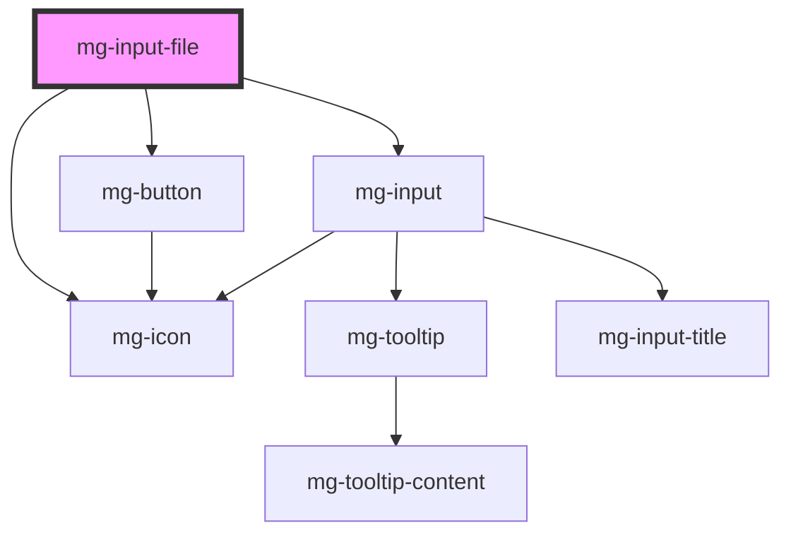

<!-- Auto Generated Below -->

## Properties

| Property                  | Attribute          | Description                                                                                                                                                                                                                                                                                     | Type                            | Default           |
| ------------------------- | ------------------ | ----------------------------------------------------------------------------------------------------------------------------------------------------------------------------------------------------------------------------------------------------------------------------------------------- | ------------------------------- | ----------------- |
| `accept`                  | `accept`           | Define file accept format The accept property is an attribute of the file `<input>` type that defines the file types the file input should accept (https://developer.mozilla.org/en-US/docs/Web/HTML/Element/input/file#accept).                                                                | `string`                        | `undefined`       |
| `capture`                 | `capture`          | Define input capture attribute The capture attribute is a Boolean attribute that specifies if the device's camera or microphone should be used to capture media directly, instead of choosing an existing file. (https://developer.mozilla.org/en-US/docs/Web/HTML/Element/input/file#capture). | `"" \| "environment" \| "user"` | `undefined`       |
| `disabled`                | `disabled`         | Define if input is disabled                                                                                                                                                                                                                                                                     | `boolean`                       | `false`           |
| `helpText`                | `help-text`        | Add a help text under the input, usually expected data format and example                                                                                                                                                                                                                       | `string`                        | `undefined`       |
| `identifier` _(required)_ | `identifier`       | Identifier is used for the element ID (id is a reserved prop in Stencil.js)                                                                                                                                                                                                                     | `string`                        | `undefined`       |
| `invalid`                 | `invalid`          | Define input invalid state                                                                                                                                                                                                                                                                      | `boolean`                       | `undefined`       |
| `label` _(required)_      | `label`            | Input label                                                                                                                                                                                                                                                                                     | `string`                        | `undefined`       |
| `labelHide`               | `label-hide`       | Define if label is visible                                                                                                                                                                                                                                                                      | `boolean`                       | `false`           |
| `labelOnTop`              | `label-on-top`     | Define if label is displayed on top                                                                                                                                                                                                                                                             | `boolean`                       | `false`           |
| `maxSize`                 | `max-size`         | Define max file size (in octets)                                                                                                                                                                                                                                                                | `number`                        | `undefined`       |
| `multiple`                | `multiple`         | Define multiple files When the multiple Boolean attribute is specified, the file input allows the user to select more than one file. (https://developer.mozilla.org/en-US/docs/Web/HTML/Element/input/file#multiple).                                                                           | `boolean`                       | `false`           |
| `name`                    | `name`             | Input name If not set the value equals the identifier                                                                                                                                                                                                                                           | `string`                        | `this.identifier` |
| `required`                | `required`         | Define if input is required                                                                                                                                                                                                                                                                     | `boolean`                       | `false`           |
| `tooltip`                 | `tooltip`          | Add a tooltip message next to the input                                                                                                                                                                                                                                                         | `string`                        | `undefined`       |
| `tooltipPosition`         | `tooltip-position` | Define tooltip position                                                                                                                                                                                                                                                                         | `"input" \| "label"`            | `'input'`         |
| `valid`                   | `valid`            | Define input valid state                                                                                                                                                                                                                                                                        | `boolean`                       | `undefined`       |
| `value`                   | `value`            | Component value                                                                                                                                                                                                                                                                                 | `any`                           | `undefined`       |

## Events

| Event          | Description                          | Type                   |
| -------------- | ------------------------------------ | ---------------------- |
| `input-valid`  | Emitted event when checking validity | `CustomEvent<boolean>` |
| `value-change` | Emitted event when value change      | `CustomEvent<any>`     |

## Methods

### `displayError() => Promise<void>`

Display input error if it exists.

#### Returns

Type: `Promise<void>`

### `reset() => Promise<void>`

Reset value, validity and error state

#### Returns

Type: `Promise<void>`

### `setError(valid: MgInputFile["valid"], errorMessage?: string, errorMessageLock?: boolean) => Promise<void>`

Set an error and display a custom error message.
This method can be used to set the component's error state from its context by passing a boolean value to the `valid` parameter.
It must be paired with an error message to display for the given context.
When used to set validity to `false`, you should use this method again to reset the validity to `true`.

#### Parameters

| Name               | Type      | Description                                 |
| ------------------ | --------- | ------------------------------------------- |
| `valid`            | `boolean` | - value indicating the validity             |
| `errorMessage`     | `string`  | - the error message to display              |
| `errorMessageLock` | `boolean` | - lock the error message and validity state |

#### Returns

Type: `Promise<void>`

### `setFocus() => Promise<void>`

Set focus on input add file button

#### Returns

Type: `Promise<void>`

## Dependencies

### Depends on

- [mg-button](../../../atoms/mg-button)
- [mg-icon](../../../atoms/mg-icon)
- [mg-input](../mg-input)

### Graph

----------------------------------------------

*Built with [StencilJS](https://stenciljs.com/)*
