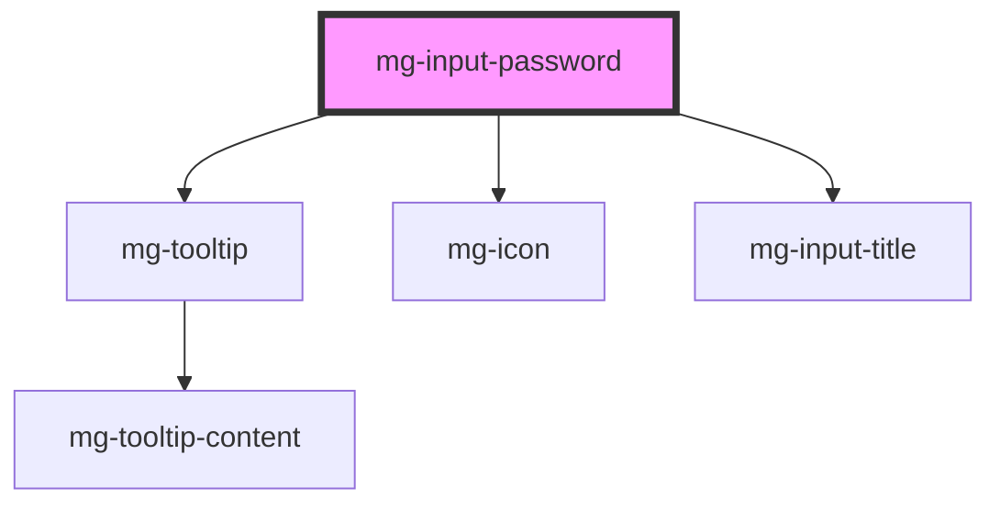

## Design

The standard display of "bullets" instead of characters is the standard one (depending on the rendering of the used browser).

<!-- Auto Generated Below -->

## Properties

| Property                  | Attribute      | Description                                                                                                                                    | Type                     | Default           |
| ------------------------- | -------------- | ---------------------------------------------------------------------------------------------------------------------------------------------- | ------------------------ | ----------------- |
| `disabled`                | `disabled`     | Define if input is disabled                                                                                                                    | `boolean`                | `false`           |
| `helpText`                | `help-text`    | Add a help text under the input, usually expected data format and example                                                                      | `string`                 | `undefined`       |
| `identifier` _(required)_ | `identifier`   | Identifier is used for the element ID (id is a reserved prop in Stencil.js)                                                                    | `string`                 | `undefined`       |
| `invalid`                 | `invalid`      | Define input invalid state                                                                                                                     | `boolean`                | `undefined`       |
| `label` _(required)_      | `label`        | Input label                                                                                                                                    | `string`                 | `undefined`       |
| `labelHide`               | `label-hide`   | Define if label is visible                                                                                                                     | `boolean`                | `false`           |
| `labelOnTop`              | `label-on-top` | Define if label is displayed on top                                                                                                            | `boolean`                | `undefined`       |
| `mgWidth`                 | `mg-width`     | Define input width                                                                                                                             | `"full" \| 16 \| 2 \| 4` | `'full'`          |
| `name`                    | `name`         | Input name If not set the value equals the identifier                                                                                          | `string`                 | `this.identifier` |
| `placeholder`             | `placeholder`  | Input placeholder. It should be a word or short phrase that demonstrates the expected type of data, not a replacement for labels or help text. | `string`                 | `undefined`       |
| `readonly`                | `readonly`     | Define if input is readonly                                                                                                                    | `boolean`                | `false`           |
| `required`                | `required`     | Define if input is required                                                                                                                    | `boolean`                | `false`           |
| `tooltip`                 | `tooltip`      | Add a tooltip message next to the input                                                                                                        | `string`                 | `undefined`       |
| `valid`                   | `valid`        | Define input valid state                                                                                                                       | `boolean`                | `undefined`       |
| `value`                   | `value`        | Component value                                                                                                                                | `string`                 | `undefined`       |

## Events

| Event          | Description                         | Type                   |
| -------------- | ----------------------------------- | ---------------------- |
| `input-valid`  | Emited event when checking validity | `CustomEvent<boolean>` |
| `value-change` | Emited event when value change      | `CustomEvent<string>`  |

## Methods

### `displayError() => Promise<void>`

Display input error if it exists.

#### Returns

Type: `Promise<void>`

### `setError(valid: MgInputPassword['valid'], errorMessage: string) => Promise<void>`

Set an error and display a custom error message.
This method can be used to set the component's error state from its context by passing a boolean value to the `valid` parameter.
It must be paired with an error message to display for the given context.
When used to set validity to `false`, you should use this method again to reset the validity to `true`.

#### Parameters

| Name           | Type      | Description                     |
| -------------- | --------- | ------------------------------- |
| `valid`        | `boolean` | - value indicating the validity |
| `errorMessage` | `string`  | - the error message to display  |

#### Returns

Type: `Promise<void>`

## Dependencies

### Depends on

- [mg-tooltip](../../../atoms/mg-tooltip)
- [mg-icon](../../../atoms/mg-icon)
- [mg-input-title](../../../atoms/internals/mg-input-title)

### Graph

----------------------------------------------

*Built with [StencilJS](https://stenciljs.com/)*
