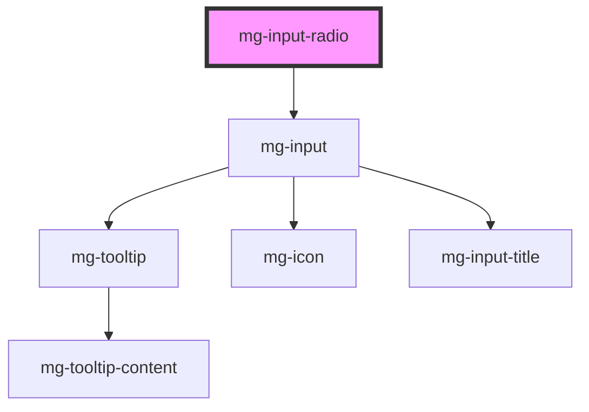

## Usage

- Always used in a group with a minimum of 2 options.
- Only one selected option is possible from all the options in the group.
- The label option is clickable and selects the option.
- The group can be initialized without any default value.

<!-- Auto Generated Below -->

## Properties

| Property                  | Attribute             | Description                                                                 | Type                        | Default           |
| ------------------------- | --------------------- | --------------------------------------------------------------------------- | --------------------------- | ----------------- |
| `disabled`                | `disabled`            | Define if input is disabled                                                 | `boolean`                   | `false`           |
| `helpText`                | `help-text`           | Add a help text under the input, usually expected data format and example   | `string`                    | `undefined`       |
| `identifier` _(required)_ | `identifier`          | Identifier is used for the element ID (id is a reserved prop in Stencil.js) | `string`                    | `undefined`       |
| `inputVerticalList`       | `input-vertical-list` | Define if inputs are display verticaly                                      | `boolean`                   | `false`           |
| `invalid`                 | `invalid`             | Define input invalid state                                                  | `boolean`                   | `undefined`       |
| `items` _(required)_      | --                    | Items are the possible options to select                                    | `RadioOption[] \| string[]` | `undefined`       |
| `label` _(required)_      | `label`               | Input label                                                                 | `string`                    | `undefined`       |
| `labelHide`               | `label-hide`          | Define if label is visible                                                  | `boolean`                   | `false`           |
| `labelOnTop`              | `label-on-top`        | Define if label is displayed on top                                         | `boolean`                   | `false`           |
| `name`                    | `name`                | Input name If not set the value equals the identifier                       | `string`                    | `this.identifier` |
| `readonly`                | `readonly`            | Define if input is readonly                                                 | `boolean`                   | `false`           |
| `required`                | `required`            | Define if input is required                                                 | `boolean`                   | `false`           |
| `tooltip`                 | `tooltip`             | Add a tooltip message next to the input                                     | `string`                    | `undefined`       |
| `tooltipPosition`         | `tooltip-position`    | Define tooltip position                                                     | `"input" \| "label"`        | `'input'`         |
| `valid`                   | `valid`               | Define input valid state                                                    | `boolean`                   | `undefined`       |
| `value`                   | `value`               | Component value                                                             | `any`                       | `undefined`       |

## Events

| Event          | Description                         | Type                   |
| -------------- | ----------------------------------- | ---------------------- |
| `input-valid`  | Emited event when checking validity | `CustomEvent<boolean>` |
| `value-change` | Emitted event when value change     | `CustomEvent<any>`     |

## Methods

### `displayError() => Promise<void>`

Display input error if it exists.

#### Returns

Type: `Promise<void>`

### `setError(valid: MgInputRadio['valid'], errorMessage: string) => Promise<void>`

Set an error and display a custom error message.
This method can be used to set the component's error state from its context by passing a boolean value to the `valid` parameter.
It must be paired with an error message to display for the given context.
When used to set validity to `false`, you should use this method again to reset the validity to `true`.

#### Parameters

| Name           | Type      | Description                     |
| -------------- | --------- | ------------------------------- |
| `valid`        | `boolean` | - value indicating the validity |
| `errorMessage` | `string`  | - the error message to display  |

#### Returns

Type: `Promise<void>`

## Dependencies

### Depends on

- [mg-input](../mg-input)

### Graph

----------------------------------------------

*Built with [StencilJS](https://stenciljs.com/)*
