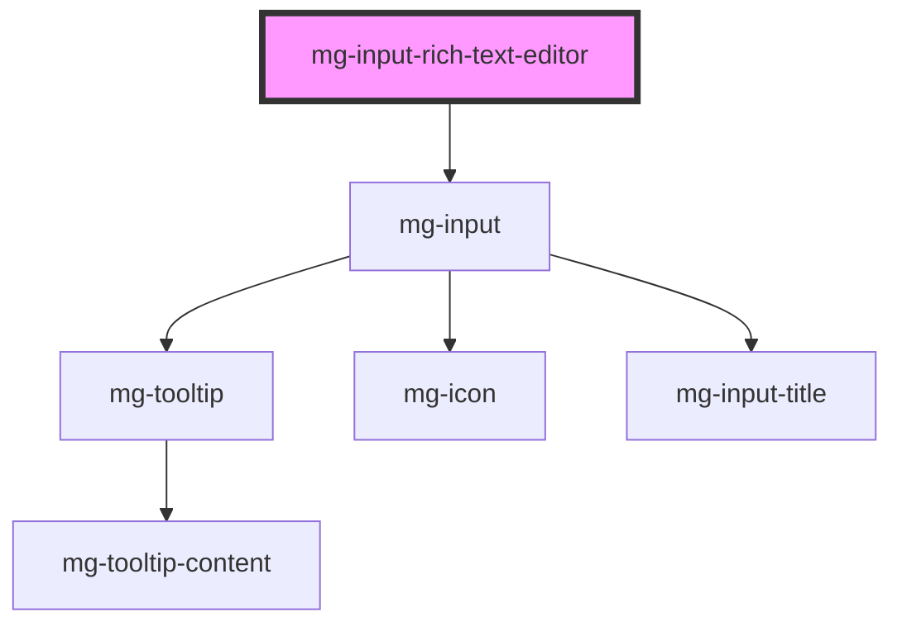

The `mg-input-rich-text-editor` component is a rich text editor input that uses Quill as its underlying editor. It provides a user-friendly interface for editing formatted text with various styling options.

## Features

- Rich text editing capabilities powered by Quill
- Customizable toolbar with formatting options
- Support for both HTML string and plain text formats
- Accessibility features
- Validation and error handling

## Content Management

### Receiving Content

The component can receive content in two different ways:

1. **HTML String**: A string containing formatted HTML
2. **Plain Text**: A string containing unformatted text

The component automatically detects the type of content received via the `value` property and handles it accordingly.

### Emitting Content

The component emits the modified content via the `value-change` event. To ensure compatibility with forms, the content is always emitted in HTML format, regardless of how it was initially received.

### HTML Security and Sanitization

⚠️ **Important**: When handling HTML content, it is crucial to sanitize the HTML to prevent XSS (Cross-Site Scripting) vulnerabilities. We strongly recommend using the `@mgdis/sanitize-html` package to sanitize HTML content before displaying it.

The sanitizer is configured by default to allow commonly used tags and attributes in a rich text editor while blocking potentially dangerous content like `<script>` tags or inline JavaScript attributes.

### Utility Methods

The component provides several methods to retrieve content in different formats:

- `getHTML()`: Retrieves the content in HTML format
- `getText()`: Retrieves the content in plain text format

<!-- Auto Generated Below -->

## Properties

| Property                  | Attribute               | Description                                                                                                                                                          | Type                        | Default     |
| ------------------------- | ----------------------- | -------------------------------------------------------------------------------------------------------------------------------------------------------------------- | --------------------------- | ----------- |
| `disabled`                | `disabled`              | Define if input is disabled                                                                                                                                          | `boolean`                   | `false`     |
| `helpText`                | `help-text`             | Add a help text under the input, usually expected data format and example                                                                                            | `string`                    | `undefined` |
| `identifier` _(required)_ | `identifier`            | Identifier is used for the element ID (id is a reserved prop in Stencil.js)                                                                                          | `string`                    | `undefined` |
| `invalid`                 | `invalid`               | Define input invalid state                                                                                                                                           | `boolean`                   | `undefined` |
| `label` _(required)_      | `label`                 | Input label                                                                                                                                                          | `string`                    | `undefined` |
| `labelHide`               | `label-hide`            | Define if label is visible                                                                                                                                           | `boolean`                   | `false`     |
| `labelOnTop`              | `label-on-top`          | Define if label is displayed on top                                                                                                                                  | `boolean`                   | `false`     |
| `modules`                 | --                      | Editor modules configuration                                                                                                                                         | `{ [x: string]: unknown; }` | `undefined` |
| `pattern`                 | `pattern`               | Define input pattern to validate Please refer to the Pattern section in the input documentation for detailed information on using regular expressions in components. | `string`                    | `undefined` |
| `patternErrorMessage`     | `pattern-error-message` | Define input pattern error message                                                                                                                                   | `string`                    | `undefined` |
| `placeholder`             | `placeholder`           | Input placeholder. It should be a word or short phrase that demonstrates the expected type of data, not a replacement for labels or help text.                       | `string`                    | `undefined` |
| `readonly`                | `readonly`              | Define if the editor is readonly                                                                                                                                     | `boolean`                   | `false`     |
| `required`                | `required`              | Define if input is required                                                                                                                                          | `boolean`                   | `false`     |
| `rows`                    | `rows`                  | Define the number of visible text lines for the control                                                                                                              | `number`                    | `5`         |
| `tooltip`                 | `tooltip`               | Add a tooltip message next to the input                                                                                                                              | `string`                    | `undefined` |
| `tooltipPosition`         | `tooltip-position`      | Define tooltip position                                                                                                                                              | `"input" \| "label"`        | `'input'`   |
| `valid`                   | `valid`                 | Define input valid state                                                                                                                                             | `boolean`                   | `undefined` |
| `value`                   | `value`                 | Define the value of the editor Can be either HTML string or plain text                                                                                               | `string`                    | `''`        |

## Events

| Event          | Description                         | Type                   |
| -------------- | ----------------------------------- | ---------------------- |
| `input-valid`  | Emited event when checking validity | `CustomEvent<boolean>` |
| `value-change` | Emited event when value change      | `CustomEvent<string>`  |

## Methods

### `displayError() => Promise<void>`

Display input error if it exists.

#### Returns

Type: `Promise<void>`

### `getHTML() => Promise<string>`

Get editor content as HTML

#### Returns

Type: `Promise<string>`

HTML content of the editor

### `getText() => Promise<string>`

Get editor content as plain text

#### Returns

Type: `Promise<string>`

Plain text content of the editor

### `reset() => Promise<void>`

Reset value, validity and error state

#### Returns

Type: `Promise<void>`

### `setError(valid: MgInputRichTextEditor["valid"], errorMessage: string) => Promise<void>`

Set an error and display a custom error message.
This method can be used to set the component's error state from its context by passing a boolean value to the `valid` parameter.
It must be paired with an error message to display for the given context.
When used to set validity to `false`, you should use this method again to reset the validity to `true`.

#### Parameters

| Name           | Type      | Description                     |
| -------------- | --------- | ------------------------------- |
| `valid`        | `boolean` | - value indicating the validity |
| `errorMessage` | `string`  | - the error message to display  |

#### Returns

Type: `Promise<void>`

## Dependencies

### Depends on

- [mg-input](../mg-input)

### Graph

----------------------------------------------

*Built with [StencilJS](https://stenciljs.com/)*
