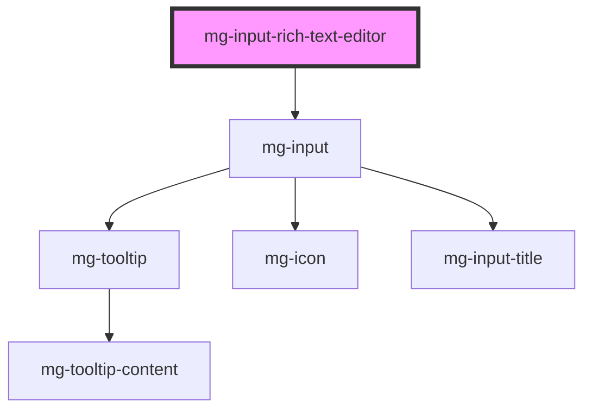

# mg-input-rich-text-editor

<!-- Auto Generated Below -->

## Properties

| Property                  | Attribute               | Description                                                                                                                                                          | Type                        | Default     |
| ------------------------- | ----------------------- | -------------------------------------------------------------------------------------------------------------------------------------------------------------------- | --------------------------- | ----------- |
| `helpText`                | `help-text`             | Add a help text under the input, usually expected data format and example                                                                                            | `string`                    | `undefined` |
| `identifier` _(required)_ | `identifier`            | Identifier is used for the element ID (id is a reserved prop in Stencil.js)                                                                                          | `string`                    | `undefined` |
| `invalid`                 | `invalid`               | Define input invalid state                                                                                                                                           | `boolean`                   | `undefined` |
| `label` _(required)_      | `label`                 | Input label                                                                                                                                                          | `string`                    | `undefined` |
| `labelHide`               | `label-hide`            | Define if label is visible                                                                                                                                           | `boolean`                   | `false`     |
| `labelOnTop`              | `label-on-top`          | Define if label is displayed on top                                                                                                                                  | `boolean`                   | `undefined` |
| `modules`                 | --                      | Quill modules configuration                                                                                                                                          | `{ [x: string]: unknown; }` | `undefined` |
| `pattern`                 | `pattern`               | Define input pattern to validate Please refer to the Pattern section in the input documentation for detailed information on using regular expressions in components. | `string`                    | `undefined` |
| `patternErrorMessage`     | `pattern-error-message` | Define input pattern error message                                                                                                                                   | `string`                    | `undefined` |
| `placeholder`             | `placeholder`           | Input placeholder. It should be a word or short phrase that demonstrates the expected type of data, not a replacement for labels or help text.                       | `string`                    | `undefined` |
| `readonly`                | `readonly`              | Define if the editor is readonly                                                                                                                                     | `boolean`                   | `false`     |
| `required`                | `required`              | Define if input is required                                                                                                                                          | `boolean`                   | `false`     |
| `rows`                    | `rows`                  | Define the number of visible text lines for the control                                                                                                              | `number`                    | `3`         |
| `tooltip`                 | `tooltip`               | Add a tooltip message next to the input                                                                                                                              | `string`                    | `undefined` |
| `tooltipPosition`         | `tooltip-position`      | Define tooltip position                                                                                                                                              | `"input" \| "label"`        | `'input'`   |
| `valid`                   | `valid`                 | Define input valid state                                                                                                                                             | `boolean`                   | `undefined` |
| `value`                   | `value`                 | Define the initial value of the editor                                                                                                                               | `string`                    | `''`        |

## Events

| Event         | Description                         | Type                   |
| ------------- | ----------------------------------- | ---------------------- |
| `input-valid` | Emited event when checking validity | `CustomEvent<boolean>` |

## Methods

### `displayError() => Promise<void>`

Display input error if it exists.

#### Returns

Type: `Promise<void>`

## Dependencies

### Depends on

- [mg-input](../mg-input)

### Graph

----------------------------------------------

*Built with [StencilJS](https://stenciljs.com/)*
