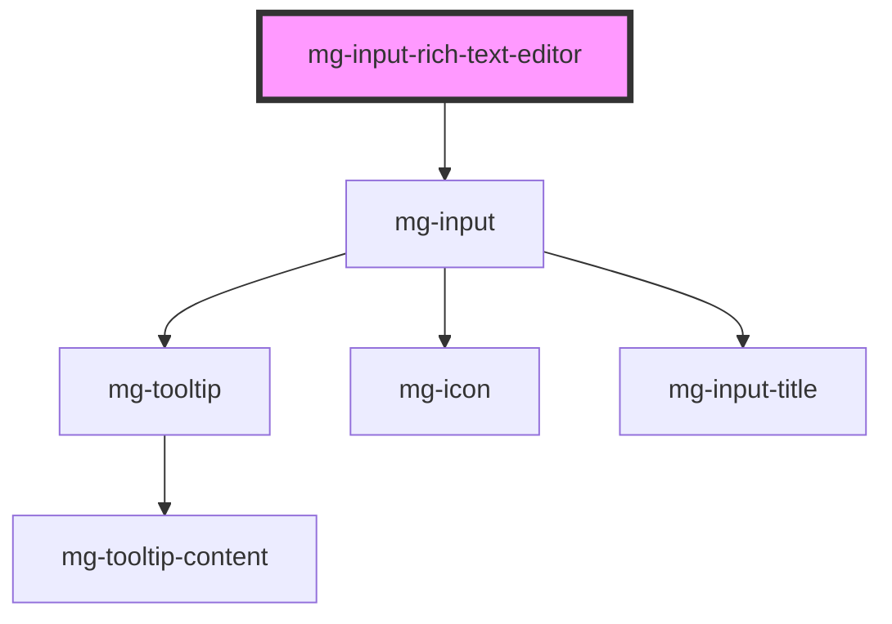

The `mg-input-rich-text-editor` component is a rich text editor input that uses Jodit as its underlying editor. It provides a user-friendly interface for editing formatted text with various styling options.

## Features

- Rich text editing capabilities powered by Jodit
- Support for both HTML string and plain text formats
- Customizable toolbar with formatting options
- Automatic HTML sanitization for security
- Validation and error handling

## Content management

### Receiving content

The component can receive content in two different ways:

1. **HTML String**: A string containing formatted HTML
2. **Plain Text**: A string containing unformatted text

The component automatically detects the type of content received via the `value` property and handles it accordingly.

### Emitting content

The component emits the modified content via the `value-change` event. To ensure compatibility with forms, the content is always emitted in HTML format, regardless of how it was initially received.

### Toolbar configuration

The component provides a default toolbar with commonly used formatting options. You can customize the toolbar by using the `modules` HTML attribute, which accepts a comma-separated list of button names.

#### Default toolbar

By default, the toolbar includes the following buttons (in order):

- **Text formatting**: `bold`, `italic`, `underline`, `strikethrough`, `eraser`
- **Lists**: `ul` (unordered list), `ol` (ordered list)
- **Text positioning**: `superscript`, `subscript`
- **Colors**: `brush` (text color/background)
- **Media**: `link`, `image`, `file`
- **Tables**: `table`
- **History**: `undo`, `redo`
- **Other**: `print`, `source` (HTML source editor)

The `|` character in the configuration represents a separator/divider in the toolbar.

#### Customizing the toolbar

You can customize the toolbar by passing a custom configuration to the `modules` prop as an HTML attribute. The configuration must be a comma-separated list of button names (strings) and separators (`|`).

**Example:**

```html
<mg-input-rich-text-editor
  modules="bold, italic, |, ul, ol"
  ...
></mg-input-rich-text-editor>
```

For the complete list of available buttons and advanced configuration options, refer to the [Jodit playground](https://xdsoft.net/jodit/play.html?currentTab=Buttons).

### HTML security and sanitization

**Automatic Sanitization**: The component automatically sanitizes all HTML content to prevent XSS (Cross-Site Scripting) vulnerabilities. The sanitization is performed using the `@mgdis/sanitize-html` package and is applied:

- When content is received via the `value` prop (initial value)
- When content is emitted via the `value-change` event
- When content is retrieved via the `getEditorHTML()` method
- When content is displayed in readonly mode
- When content changes in the editor

The sanitizer is configured by default to allow commonly used tags and attributes in a rich text editor (headings, lists, tables, links, images, formatting tags, etc.) while blocking potentially dangerous content like `<script>` tags or inline JavaScript attributes.

#### Customizing sanitization

You can customize the sanitization behavior using two HTML attributes to restrict specific tags or attributes that would otherwise be allowed by default:

- `sanitizer-disallow-tags`: Comma-separated list of tag names to remove from the sanitized HTML
- `sanitizer-disallow-attributes`: Format `tag:attr1,attr2;tag2:attr3` where:
  - Use `*` as tag name to apply to all tags
  - Separate tag:attributes pairs with semicolons (`;`)
  - Separate multiple attributes for the same tag with commas (`,`)

**Example:**

```html
<mg-input-rich-text-editor
  sanitizer-disallow-tags="img,script"
  sanitizer-disallow-attributes="*:style;a:target"
  ...
></mg-input-rich-text-editor>
```

This example will:
- Remove all `` and `<script>` tags from the sanitized HTML
- Remove `style` attributes from all tags
- Remove `target` attributes from `<a>` tags

**Note**: The sanitizer options only allow to restrict what is allowed by default. You cannot add tags or attributes that are not already allowed in the default configuration. This is intentional to enforce a secure configuration.

### Editor height

The component allows you to control the height of the editor using the `rows` property. The `rows` property defines the number of visible text lines for the control. The height is automatically calculated based on the font size and line height values.

**Default value**: `5` rows

**Example:**

```html
<mg-input-rich-text-editor
  rows="5"
  ...
></mg-input-rich-text-editor>
```

The calculated height value is applied to the entire editor container, including the toolbar and the content area. The editor will maintain this minimum height while allowing the content to grow if needed.

<!-- Auto Generated Below -->


## Properties

| Property                      | Attribute                       | Description                                                                                                                                                                                                              | Type                 | Default           |
| ----------------------------- | ------------------------------- | ------------------------------------------------------------------------------------------------------------------------------------------------------------------------------------------------------------------------ | -------------------- | ----------------- |
| `disabled`                    | `disabled`                      | Define if input is disabled                                                                                                                                                                                              | `boolean`            | `false`           |
| `helpText`                    | `help-text`                     | Add a help text under the input, usually expected data format and example                                                                                                                                                | `string`             | `undefined`       |
| `identifier` _(required)_     | `identifier`                    | Identifier is used for the element ID (id is a reserved prop in Stencil.js)                                                                                                                                              | `string`             | `undefined`       |
| `invalid`                     | `invalid`                       | Define input invalid state                                                                                                                                                                                               | `boolean`            | `undefined`       |
| `label` _(required)_          | `label`                         | Input label                                                                                                                                                                                                              | `string`             | `undefined`       |
| `labelHide`                   | `label-hide`                    | Define if label is visible                                                                                                                                                                                               | `boolean`            | `false`           |
| `labelOnTop`                  | `label-on-top`                  | Define if label is displayed on top                                                                                                                                                                                      | `boolean`            | `false`           |
| `modules`                     | `modules`                       | Editor modules configuration Must be passed as an HTML attribute with a comma-separated list (e.g., modules="bold, italic, \|, ul, ol")                                                                                  | `string`             | `undefined`       |
| `name`                        | `name`                          | Input name If not set the value equals the identifier                                                                                                                                                                    | `string`             | `this.identifier` |
| `pattern`                     | `pattern`                       | Define input pattern to validate Please refer to the Pattern section in the input documentation for detailed information on using regular expressions in components.                                                     | `string`             | `undefined`       |
| `patternErrorMessage`         | `pattern-error-message`         | Define input pattern error message                                                                                                                                                                                       | `string`             | `undefined`       |
| `placeholder`                 | `placeholder`                   | Input placeholder. It should be a word or short phrase that demonstrates the expected type of data, not a replacement for labels or help text.                                                                           | `string`             | `undefined`       |
| `readonly`                    | `readonly`                      | Define if the editor is readonly                                                                                                                                                                                         | `boolean`            | `false`           |
| `required`                    | `required`                      | Define if input is required                                                                                                                                                                                              | `boolean`            | `false`           |
| `rows`                        | `rows`                          | Define the number of visible text lines for the control                                                                                                                                                                  | `number`             | `5`               |
| `sanitizerDisallowAttributes` | `sanitizer-disallow-attributes` | Attributes to disallow in sanitized HTML Must be passed as an HTML attribute with format: "tag:attr1,attr2;tag2:attr3" (e.g., sanitizer-disallow-attributes="*:style;a:target") Use "*" as tag name to apply to all tags | `string`             | `undefined`       |
| `sanitizerDisallowTags`       | `sanitizer-disallow-tags`       | Tags to disallow in sanitized HTML Must be passed as an HTML attribute with a comma-separated list (e.g., sanitizer-disallow-tags="img,script")                                                                          | `string`             | `undefined`       |
| `tooltip`                     | `tooltip`                       | Add a tooltip message next to the input                                                                                                                                                                                  | `string`             | `undefined`       |
| `tooltipPosition`             | `tooltip-position`              | Define tooltip position                                                                                                                                                                                                  | `"input" \| "label"` | `'input'`         |
| `valid`                       | `valid`                         | Define input valid state                                                                                                                                                                                                 | `boolean`            | `undefined`       |
| `value`                       | `value`                         | Define the value of the editor Can be either HTML string or plain text                                                                                                                                                   | `string`             | `''`              |


## Events

| Event          | Description                         | Type                   |
| -------------- | ----------------------------------- | ---------------------- |
| `input-valid`  | Emited event when checking validity | `CustomEvent<boolean>` |
| `value-change` | Emited event when value change      | `CustomEvent<string>`  |


## Methods

### `displayError() => Promise<void>`

Display input error if it exists.

#### Returns

Type: `Promise<void>`


### `getEditorHTML() => Promise<string>`

Get editor content as HTML

#### Returns

Type: `Promise<string>`

HTML content of the editor (sanitized)

### `getEditorText() => Promise<string>`

Get editor content in plain text format

#### Returns

Type: `Promise<string>`

Plain text content of the editor

### `reset() => Promise<void>`

Reset value, validity and error state

#### Returns

Type: `Promise<void>`


### `setError(valid: MgInputRichTextEditor["valid"], errorMessage?: string, errorMessageLock?: boolean) => Promise<void>`

Set an error and display a custom error message.
This method can be used to set the component's error state from its context by passing a boolean value to the `valid` parameter.
It must be paired with an error message to display for the given context.
When used to set validity to `false`, you should use this method again to reset the validity to `true`.

#### Parameters

| Name               | Type      | Description                                 |
| ------------------ | --------- | ------------------------------------------- |
| `valid`            | `boolean` | - value indicating the validity             |
| `errorMessage`     | `string`  | - the error message to display              |
| `errorMessageLock` | `boolean` | - lock the error message and validity state |

#### Returns

Type: `Promise<void>`


### `setFocus() => Promise<void>`

Set focus on input.

#### Returns

Type: `Promise<void>`


## Dependencies

### Depends on

- [mg-input](../mg-input)

### Graph

```mermaid
graph TD;
  mg-input-rich-text-editor --> mg-input
  mg-input --> mg-tooltip
  mg-input --> mg-icon
  mg-input --> mg-input-title
  mg-tooltip --> mg-tooltip-content
  style mg-input-rich-text-editor fill:#f9f,stroke:#333,stroke-width:4px
```

----------------------------------------------

*Built with [StencilJS](https://stenciljs.com/)*
