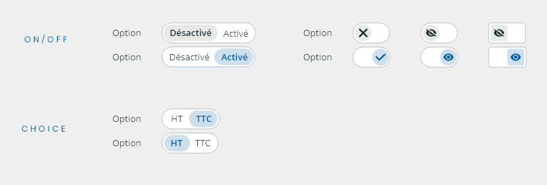
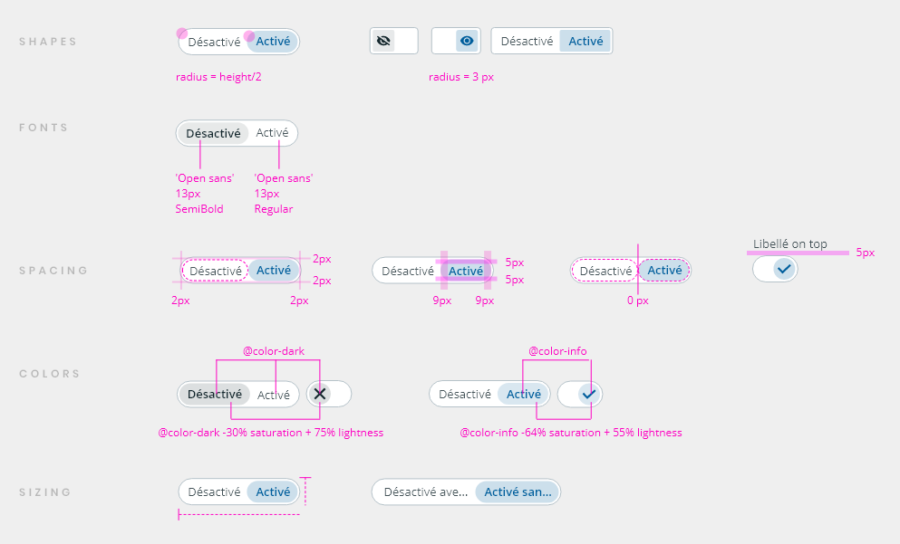
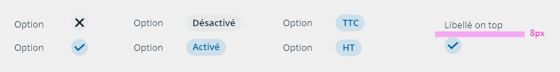
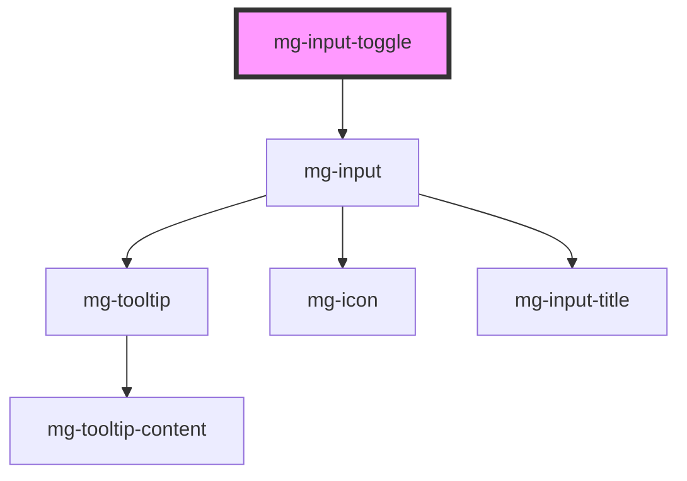

## Usage

Clicking anywhere on the entire component area toggles the selected value.

The first value is always selected by default.

When the "on/off" property is used, the first value is always the disabled value and the style is adjusted.

The values must be transcribed by texts or icons.

### Types

### Specs

### Readonly

<!-- Auto Generated Below -->

## Properties

| Property                  | Attribute          | Description                                                                 | Type                        | Default           |
| ------------------------- | ------------------ | --------------------------------------------------------------------------- | --------------------------- | ----------------- |
| `disabled`                | `disabled`         | Define if input is disabled                                                 | `boolean`                   | `false`           |
| `helpText`                | `help-text`        | Add a help text under the input, usually expected data format and example   | `string`                    | `undefined`       |
| `identifier` _(required)_ | `identifier`       | Identifier is used for the element ID (id is a reserved prop in Stencil.js) | `string`                    | `undefined`       |
| `isIcon`                  | `is-icon`          | Define if toggle display icon                                               | `boolean`                   | `false`           |
| `isOnOff`                 | `is-on-off`        | Define if toggle have on/off style                                          | `boolean`                   | `false`           |
| `items` _(required)_      | --                 | Items are the possible options to select                                    | `ToggleValue[] \| string[]` | `undefined`       |
| `label` _(required)_      | `label`            | Input label                                                                 | `string`                    | `undefined`       |
| `labelHide`               | `label-hide`       | Define if label is visible                                                  | `boolean`                   | `false`           |
| `labelOnTop`              | `label-on-top`     | Define if label is displayed on top                                         | `boolean`                   | `undefined`       |
| `name`                    | `name`             | Input name If not set the value equals the identifier                       | `string`                    | `this.identifier` |
| `readonly`                | `readonly`         | Define if input is readonly                                                 | `boolean`                   | `false`           |
| `tooltip`                 | `tooltip`          | Add a tooltip message next to the input                                     | `string`                    | `undefined`       |
| `tooltipPosition`         | `tooltip-position` | Define tooltip position                                                     | `"input" \| "label"`        | `'input'`         |
| `value`                   | `value`            | Component value                                                             | `any`                       | `undefined`       |

## Events

| Event          | Description                         | Type                   |
| -------------- | ----------------------------------- | ---------------------- |
| `input-valid`  | Emited event when checking validity | `CustomEvent<boolean>` |
| `value-change` | Emited event when value change      | `CustomEvent<any>`     |

## Methods

### `setError(valid: boolean, errorMessage: string) => Promise<void>`

Set an error and display a custom error message.
This method can be used to set the component's error state from its context by passing a boolean value to the `valid` parameter.
It must be paired with an error message to display for the given context.
When used to set validity to `false`, you should use this method again to reset the validity to `true`.

#### Parameters

| Name           | Type      | Description                     |
| -------------- | --------- | ------------------------------- |
| `valid`        | `boolean` | - value indicating the validity |
| `errorMessage` | `string`  | - the error message to display  |

#### Returns

Type: `Promise<void>`

## Slots

| Slot       | Description                 |
| ---------- | --------------------------- |
| `"item-1"` | Left option toggle content  |
| `"item-2"` | Right option toggle content |

## CSS Custom Properties

| Name                                      | Description                                                                                                                          |
| ----------------------------------------- | ------------------------------------------------------------------------------------------------------------------------------------ |
| `--mg-c-input-border-radius`              | Defines the border radius of the input. Default value is `--mg-b-size-radius`.                                                       |
| `--mg-c-input-border-width`               | Defines the width of the input border. Default value is `--mg-b-size-border`.                                                        |
| `--mg-c-input-check-size`                 | Defines the size of the input check. Default value is `--mg-b-size-16`.                                                              |
| `--mg-c-input-color-border`               | Defines the color of the input border. Default value is `rgb(181, 194, 201)`.                                                        |
| `--mg-c-input-color-box-shadow-focus`     | Defines the shadow color of the input when focused. Default value is `rgba(0, 221, 255, 0.5)`.                                       |
| `--mg-c-input-error-color-background`     | Defines the background color of the input error message. Default value is `color-mix(in srgb, var(--mg-b-color-danger), white 95%)`. |
| `--mg-c-input-placeholder-color-text`     | Defines the color of the placeholder text. Default value is `rgb(181, 194, 201)`.                                                    |
| `--mg-c-input-toggle-border-radius-ratio` | Defines the border radius ratio of the input toggle. Default value is `2`.                                                           |

## Dependencies

### Depends on

- [mg-input](../mg-input)

### Graph

----------------------------------------------

*Built with [StencilJS](https://stenciljs.com/)*
