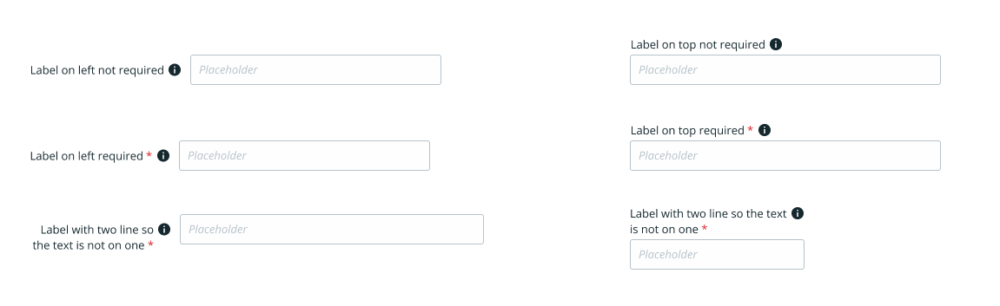
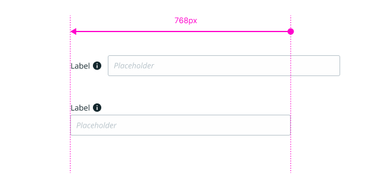
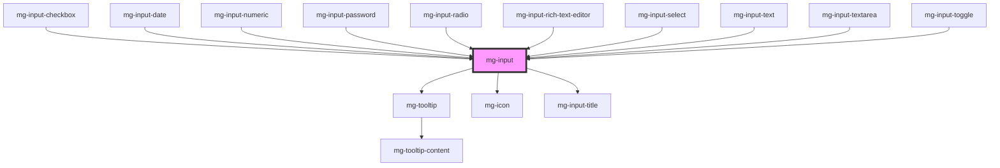

## UX

### Label

- The label is located on the left of the input field.
- The text is to be right aligned.
- The label can be on one or more lines.
- The label can be positioned above the input field.

### Input help

The message displayed indicates the format expected by the input field "example: email@provider.com" or "expected format: DD/MM/YYYY (ex: 13/04/2019)"

### Message order

When the messages are displayed under the field the order is as follows:

1. input help
2. error

### Placeholder

The placeholder should not be used as an input help.  
♿ RGAA: The placeholder is not considered a valid label under the RGAA so is not subject to a contrast ratio.

### Read only

- The value is no longer editable.
- The input field no longer has a border or background.
- The value is displayed in bold.
- If there is no value entered, nothing is displayed.

### Required field

The asterisk is displayed regardless of the status of the field: input, read-only, disabled.

### Pattern

Please ensure to consider this when using regular expressions in your components.

Since mid-2023, there have been updates to the regular expressions used in native inputs. Browsers now uses the 'v' flag instead of the 'u' flag.  
Consequently, all literal characters must be escaped, and there's no longer a need to use the `^` and `$` characters to indicate the start and end of the string.

For exemple this RegExp working using the 'u' flag `^[\d ()+]*$` should be converted to the corresponding 'v' flag `[\d\s\(\)\+]` on our components. You can get more info on the [MDN documentation](https://developer.mozilla.org/en-US/docs/Web/HTML/Attributes/pattern#overview).

If needed, this library has been identified for converting regular expressions: [regexpu-core](https://www.npmjs.com/package/regexpu-core).

## Specs

### Positioning of "i" icon

By default, the "i" icon is positioned next to the input field.

You can position it next to the label by using the `tooltip-placement` prop with the value `label`.

When `label-on-top` is enabled, the "i" icon moves next to the label, overriding the `tooltip-placement` setting.

When the `label-hide` prop is enabled, the "i" icon moves next to the input, overriding the `tooltip-placement` setting.

### Value positioning

By default, the value is left aligned, you can change the CSS variable `--mg-inputs-text-align` to right align.

### Responsive

When the viewport width is less than 768px, the label is stacked above the input field.

If you are creating a form that combines mg-components inputs with inputs from one of our legacy libraries (such as form, ui-components, ui-components-vuejs), please refer to [this section on mg-form](.?path=/docs/molecules-mg-form--docs#combining-mg-input--with-legacy-libraries).

### Errors

Input field border and error message text are in [@color-danger](./?path=/docs/style-colors--docs).  
Error message background is a variant of [@color-danger](./?path=/docs/style-colors--docs) : #FEF6F6 or HSL (357,80%,98%).

## Behavior

### Errors

Error is triggered and displayed when we leave the input field.

When we enter in an input field with an error its state is checked everytime the user update its content, when the error is fixed the message disapears.

<!-- Auto Generated Below -->

## Properties

| Property                  | Attribute          | Description                                                                 | Type                 | Default     |
| ------------------------- | ------------------ | --------------------------------------------------------------------------- | -------------------- | ----------- |
| `ariaDescribedbyIDs`      | --                 | Define aria-describedby ids to link with                                    | `string[]`           | `undefined` |
| `errorMessage`            | `error-message`    | Define error message to display                                             | `string`             | `undefined` |
| `helpText`                | `help-text`        | Define help text to display                                                 | `string`             | `undefined` |
| `identifier` _(required)_ | `identifier`       | Identifier is used for the element ID (id is a reserved prop in Stencil.js) | `string`             | `undefined` |
| `label` _(required)_      | `label`            | Define input label                                                          | `string`             | `undefined` |
| `labelHide`               | `label-hide`       | Define if label is visible                                                  | `boolean`            | `false`     |
| `labelOnTop`              | `label-on-top`     | Define if label is displayed on top                                         | `boolean`            | `false`     |
| `required`                | `required`         | Define if input is required                                                 | `boolean`            | `false`     |
| `tooltip`                 | `tooltip`          | Add a tooltip message next to the input                                     | `string`             | `undefined` |
| `tooltipPosition`         | `tooltip-position` | Define tooltip position                                                     | `"input" \| "label"` | `'input'`   |

## Slots

| Slot | Description   |
| ---- | ------------- |
|      | Input content |

## CSS Custom Properties

| Name                                      | Description                                                                                                                          |
| ----------------------------------------- | ------------------------------------------------------------------------------------------------------------------------------------ |
| `--mg-c-input-border-radius`              | Defines the border radius of the input. Default value is `--mg-b-size-radius`.                                                       |
| `--mg-c-input-border-width`               | Defines the width of the input border. Default value is `--mg-b-size-border`.                                                        |
| `--mg-c-input-check-size`                 | Defines the size of the input check. Default value is `--mg-b-size-16`.                                                              |
| `--mg-c-input-color-border`               | Defines the color of the input border. Default value is `rgb(181, 194, 201)`.                                                        |
| `--mg-c-input-color-box-shadow-focus`     | Defines the shadow color of the input when focused. Default value is `rgba(0, 221, 255, 0.5)`.                                       |
| `--mg-c-input-error-color-background`     | Defines the background color of the input error message. Default value is `color-mix(in srgb, var(--mg-b-color-danger), white 95%)`. |
| `--mg-c-input-placeholder-color-text`     | Defines the color of the placeholder text. Default value is `rgb(181, 194, 201)`.                                                    |
| `--mg-c-input-toggle-border-radius-ratio` | Defines the border radius ratio of the input toggle. Default value is `2`.                                                           |

## Dependencies

### Used by

 - [mg-input-checkbox](../mg-input-checkbox)
 - [mg-input-date](../mg-input-date)
 - [mg-input-numeric](../mg-input-numeric)
 - [mg-input-password](../mg-input-password)
 - [mg-input-radio](../mg-input-radio)
 - [mg-input-rich-text-editor](../mg-input-rich-text-editor)
 - [mg-input-select](../mg-input-select)
 - [mg-input-text](../mg-input-text)
 - [mg-input-textarea](../mg-input-textarea)
 - [mg-input-toggle](../mg-input-toggle)

### Depends on

- [mg-tooltip](../../../atoms/mg-tooltip)
- [mg-icon](../../../atoms/mg-icon)
- mg-input-title

### Graph

----------------------------------------------

*Built with [StencilJS](https://stenciljs.com/)*
