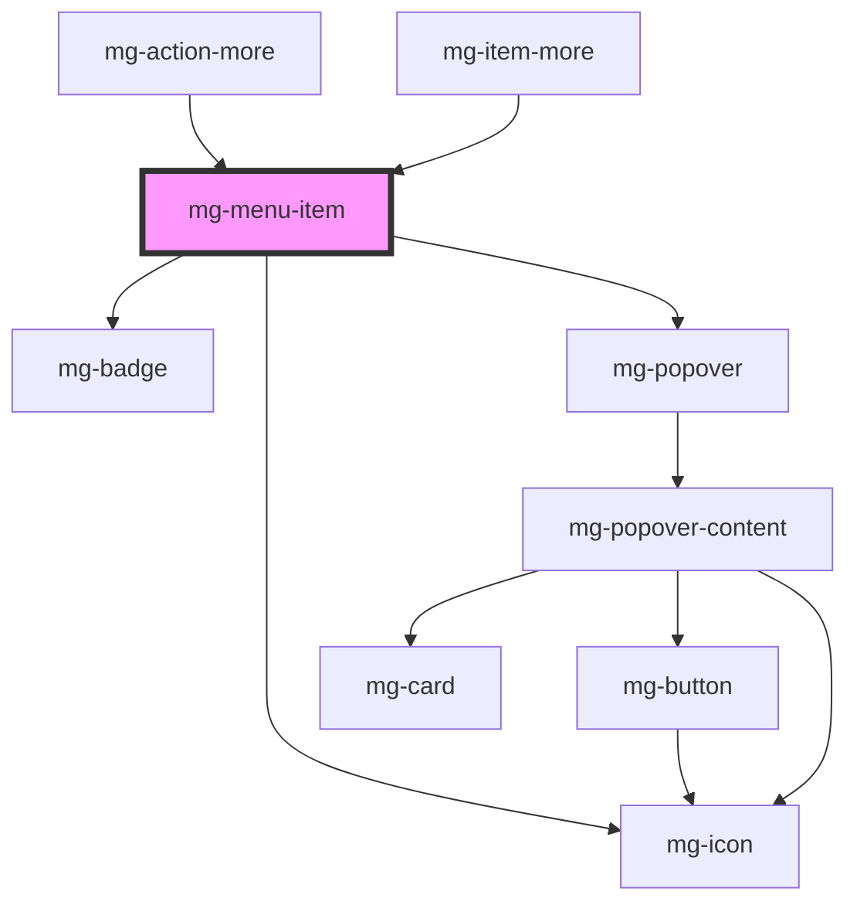

## Usage

Item menu is used with horizontal or vertical menus.

## Child content

### Horizontal and vertical menus

Child content is displayed:

- by clicking on the item
- by pressing the space or enter key

It is closed:

- by clicking on the item
- by pressing the space or enter key
- by clicking outside of the child content if the menu is horizontal

The child content can be:

- another horizontal or vertical menu with sub items
- a slot for HTML content

#### In an horizontal menu

Child content is displayed in a floating component over the content (like a popover).
It is aligned to the left bottom of the item, excepted for the last item of the menu which is aligned to the right bottom.

If the floating component is higher than the screen size, there is no overflow, user has to scroll the page.

#### In a vertical menu

Menu is displayed under the item, with the same width. **(i) Vertical menu is recommended if you display a submenu.**
Idem for the slot.
There is no space to display child content.
Items below are pushed to bottom.

##### Spacing

Sub-items add to their left spacing the spacing between left border and content of their parent's item.

<!-- Auto Generated Below -->

## Properties

| Property     | Attribute    | Description                                                                      | Type                                                                  | Default                    |
| ------------ | ------------ | -------------------------------------------------------------------------------- | --------------------------------------------------------------------- | -------------------------- |
| `expanded`   | `expanded`   | Define menu-item content expanded.                                               | `boolean`                                                             | `false`                    |
| `href`       | `href`       | Define menu-item href when defined menu-item contain an anchor instead of button | `string`                                                              | `undefined`                |
| `identifier` | `identifier` | Identifier is used to control mg-popover                                         | `string`                                                              | `createID('mg-menu-item')` |
| `status`     | `status`     | Define menu-item status.                                                         | `Status.ACTIVE \| Status.DISABLED \| Status.HIDDEN \| Status.VISIBLE` | `Status.VISIBLE`           |
| `target`     | `target`     | Define target type                                                               | `"_blank" \| "_parent" \| "_self" \| "_top"`                          | `undefined`                |

## Events

| Event           | Description                       | Type                                                                               |
| --------------- | --------------------------------- | ---------------------------------------------------------------------------------- |
| `item-loaded`   | Emited event when item is loaded  | `CustomEvent<void>`                                                                |
| `item-updated`  | Emited event when item is updated | `CustomEvent<void>`                                                                |
| `status-change` | Emited event when status change   | `CustomEvent<Status.ACTIVE \| Status.DISABLED \| Status.HIDDEN \| Status.VISIBLE>` |

## Slots

| Slot            | Description                   |
| --------------- | ----------------------------- |
|                 | Menu item content             |
| `"image"`       | Menu item image content       |
| `"information"` | Menu item information content |
| `"label"`       | Menu item label content       |
| `"metadata"`    | Menu item metadata content    |

## CSS Custom Properties

| Name                                           | Description                                                                                                                      |
| ---------------------------------------------- | -------------------------------------------------------------------------------------------------------------------------------- |
| `--mg-c-menu-item-color`                       | Defines the color of the menu item. Unset by default, fallback on `var(--mg-b-color-dark)`.                                      |
| `--mg-c-menu-item-color-background-focus`      | Defines the background color of the focused menu item. Default value is `color-mix(in srgb, var(--mg-b-color-dark), white 90%)`. |
| `--mg-c-menu-item-color-border-active`         | Defines the border color of the active menu item. Default value is `var(--mg-b-color-app)`.                                      |
| `--mg-c-menu-item-color-text-active`           | Defines the color of the active menu item. Default value is `--mg-b-color-app`.                                                  |
| `--mg-c-menu-item-navigation-button-max-width` | Defines the max-width property for the navigation button. Unset by default.                                                      |

## Dependencies

### Used by

 - [mg-action-more](../../mg-action-more)
 - mg-item-more

### Depends on

- [mg-badge](../../../atoms/mg-badge)
- [mg-icon](../../../atoms/mg-icon)
- [mg-popover](../../mg-popover)

### Graph

----------------------------------------------

*Built with [StencilJS](https://stenciljs.com/)*
