## Use

Item menu is used with horizontal or vertical menus.

## Anatomy

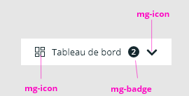

An item must have a label.
An icon can be added before the text.
A badge can be added after the text.
When a submenu is available, a chevron is displayed (in horizontal and vertical menus) to indicate its presence.

## Specs

Item's display depends on the size of the menu (regular, medium, large) and its mode (horizontal, vertical).

### Spacing

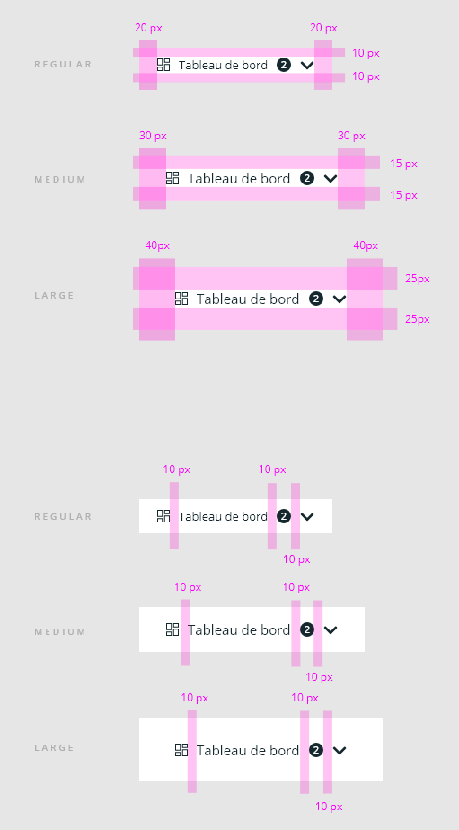

### Sizing

#### Horizontal menu

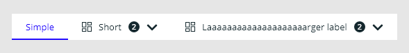

Width of the item depends on its content.

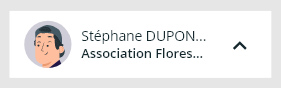

If a max-width is set, the _label_ and the _meta_ use an ellipsis to truncate the content if necessary.

#### Vertical menu

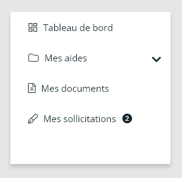

Width of the item is 100% width of the menu.

### Alignment

#### Horizontal and vertical menus

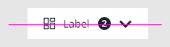

All contents are aligned vertically.

#### Vertical menu

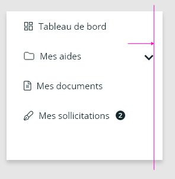

All items are aligned to left.
The chevron is aligned to the right of the item.

### Styling

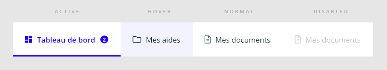

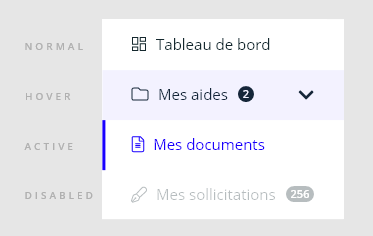

Hover item: the background is colored
Active item: the font color changes, an active bar (3px) is displayed at the bottom of the item for horizontal, at the left of the item for vertical menus.

#### Colors

Standard color is @color-dark.
Active color is the color of the app.
Hover color is the color of the app with an opacity set to 10%.
Disabled item's opacity is set to 40%.

#### Fonts

Family: Open Sans
Regular size: 13px
Medium/Large size: 15px

#### Icons

Regular/Medium/Large menus: regular size

## Behavior

### Click

Click on an item of the menu can:

- redirect to a url
- display child content (see below)

If child content is available, an icon "chevron-down" is displayed at the right of the item.
When opening the child content, the chevron makes a 180° rotation.
When closing the child content, the chevron returns to position 0°.

## Child content

### Horizontal and vertical menus

Child content is displayed

- by clicking on the item
- by pressing the space or enter key

It is closed

- by clicking on the item
- by pressing the space or enter key
- by clicking outside of the child content if the menu is horizontal

The child content can be:

- another horizontal or vertical menu with sub items
- a slot for HTML content

#### In an horizontal menu

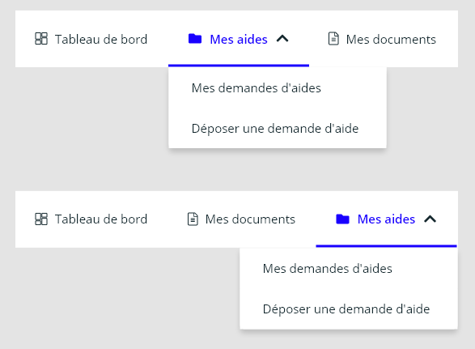

Child content is displayed in a floating component over the content (like a popover).
It is aligned to the left bottom of the item, excepted for the last item of the menu which is aligned to the right bottom.

If the floating component is higher than the screen size, there is no overflow, user has to scroll the page.

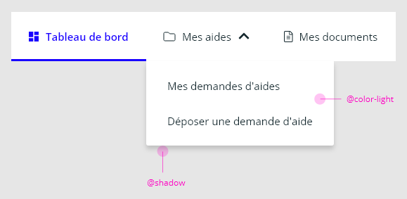

The floating component has a _@color-light_ background and a _@shadow_.

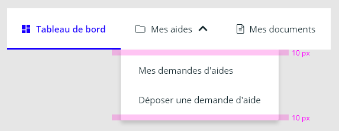

If the floating component displays a submenu, there are top and bottom spacing of 10px.

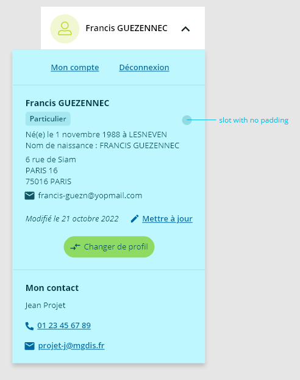

If the floating component displays a slot, there is no spacing.

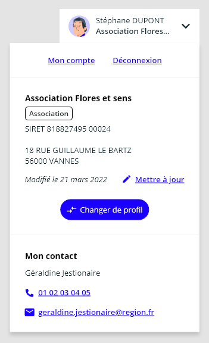

The minimal width of the submenu is the item's width.
Width of the submenu is determined by the width of the largest item or the content of the slot.

#### In a vertical menu

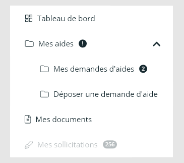

Menu is displayed under the item, with the same width. **(i) Vertical menu is recommended if you display a submenu.**
Idem for the slot.
There is no space to display child content.
Items below are pushed to bottom.

##### Spacing

Sub-items add to their left spacing the spacing between left border and content of their parent's item.

## Slots

### Image

Recommanded element is an icon or a SVG.

### Information

Recommanded element is a mg-badge. Use it when you need to notify new events in this section.

## CSS Variables

### global

- `--mg-c-menu-item-focused-background-color-hsl`: define mg-menu-item focused background color. default: `--mg-b-color-app-hsl`.
- `--mg-c-menu-item-border-color-active-hsl`: define mg-menu-item border color. default: `--mg-b-color-app-hsl`.
- `--mg-c-menu-item-color-hsl`: define mg-menu-item font color. default: `--mg-b-color-dark`.
- `--mg-c-menu-item-color-active-hsl`: define mg-menu-item font color active. default: `--mg-b-color-app-hsl`.
- `--mg-c-menu-item-navigation-button-column-gap`: define mg-menu-item button column gap. default: `unset`.

### navigation-button

- `--mg-c-menu-item-navigation-button-max-width`: define mg-menu-item button max-width. Useful to apply `text-overflow: ellipsis;` on `mg-menu-item__navigation-button-text` element. default: `unset`.

<!-- Auto Generated Below -->

## Properties

| Property     | Attribute    | Description                                                                      | Type                                                                  | Default                    |
| ------------ | ------------ | -------------------------------------------------------------------------------- | --------------------------------------------------------------------- | -------------------------- |
| `expanded`   | `expanded`   | Define menu-item content expanded.                                               | `boolean`                                                             | `false`                    |
| `href`       | `href`       | Define menu-item href when defined menu-item contain an anchor instead of button | `string`                                                              | `undefined`                |
| `identifier` | `identifier` | Identifier is used to control mg-popover                                         | `string`                                                              | `createID('mg-menu-item')` |
| `status`     | `status`     | Define menu-item status.                                                         | `Status.ACTIVE \| Status.DISABLED \| Status.HIDDEN \| Status.VISIBLE` | `Status.VISIBLE`           |
| `target`     | `target`     | Define target type                                                               | `"_blank" \| "_parent" \| "_self" \| "_top"`                          | `undefined`                |

## Events

| Event           | Description                       | Type                                                                               |
| --------------- | --------------------------------- | ---------------------------------------------------------------------------------- |
| `item-loaded`   | Emited event when item is loaded  | `CustomEvent<void>`                                                                |
| `item-updated`  | Emited event when item is updated | `CustomEvent<void>`                                                                |
| `status-change` | Emited event when status change   | `CustomEvent<Status.ACTIVE \| Status.DISABLED \| Status.HIDDEN \| Status.VISIBLE>` |

## Dependencies

### Used by

 - [mg-action-more](../../mg-action-more)
 - [mg-item-more](../../mg-item-more)

### Depends on

- [mg-badge](../../../atoms/mg-badge)
- [mg-icon](../../../atoms/mg-icon)
- [mg-popover](../../mg-popover)

### Graph
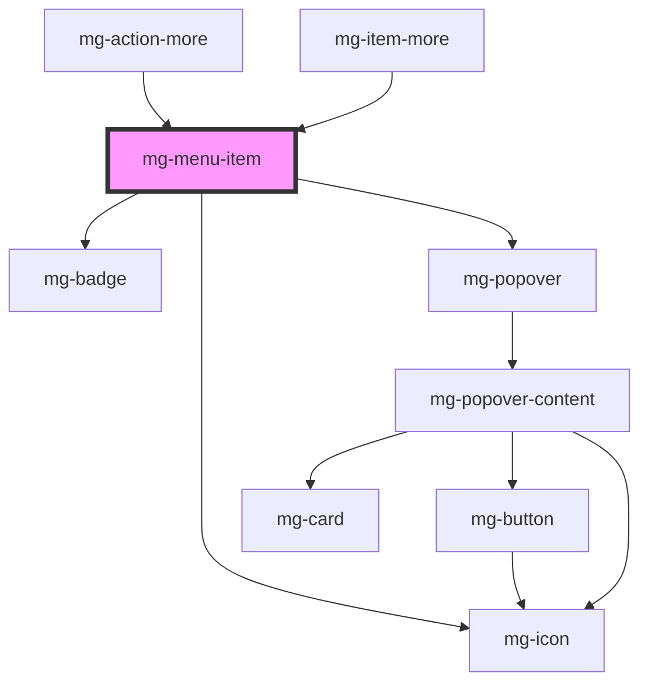

----------------------------------------------

*Built with [StencilJS](https://stenciljs.com/)*
