## Horizontal

### Use

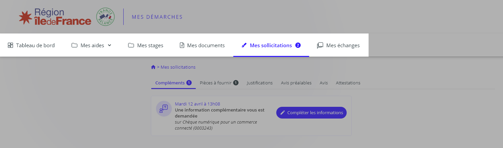

Horizontal menu is used with large ("desktop") resolutions, it is placed in the upper area of the screen.

### Anatomy

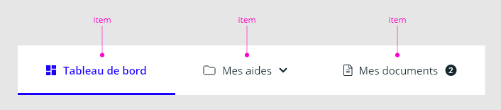

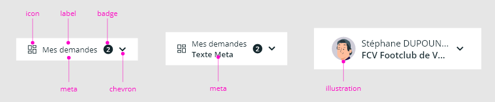

### Behavior

#### Sizing

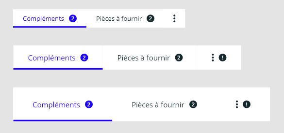

A horizontal menu can display different item sizes: regular, medium, large.

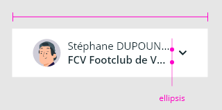

The content of the element determines its width, but to handle the case where the content is too large (long label), it is possible to specify a maximum width for the element._Label_ and _Meta_ are then truncated.

#### Sub-content

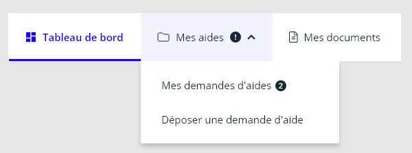

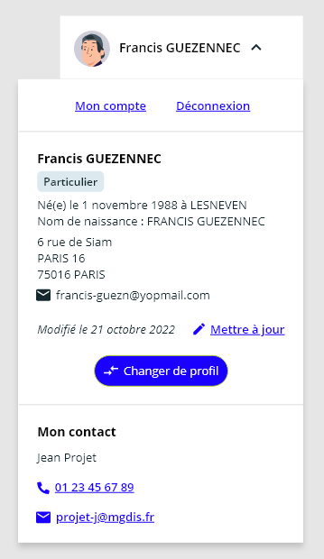

A "submenu" or a "free content" can be set to the item.
An icon "chevron-down" at the right of the item informs the user.

##### Badge

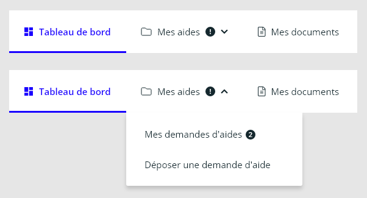

If at least one sub-item has a badge, the item displays a badge with an exclamation symbol.

#### Overflow

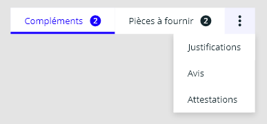

When not all items can be displayed due to the width of the menu container, the items are grouped into a "plus item".

## Vertical

### Use

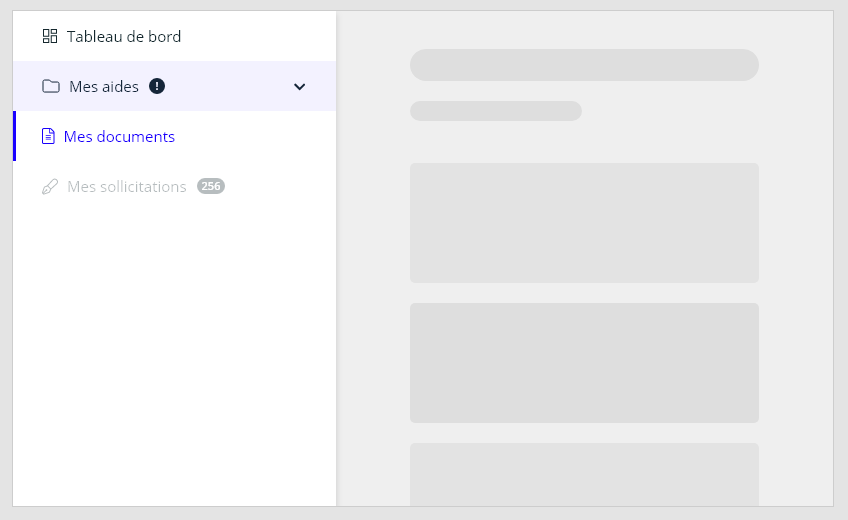

The horizontal menu is used with large resolutions ("desktop"), it is mainly placed in the left area of the screen.

### Anatomy

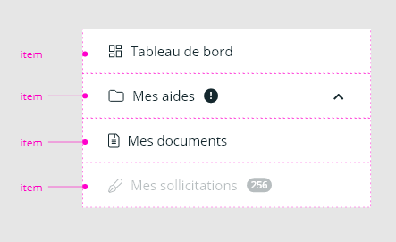

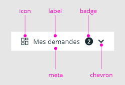

### Behavior

#### Sub content

An item can display a sub content which can be another vertical menu.
This item displays a chevron to its right.
The submenu is displayed by clicking on the item.

##### Badge

If at least one sub-item has a badge, the item displays a badge with an exclamation symbol.

#### Overflow

When not all items can be displayed due to the height of the menu container, a scroll bar helps to see hidden items.

**🔺child mg-menu-item slots image / information**

With a mg-badge/mg-tag/mg-icon, **you must set the component using HTML attributes** instead, because the behavior uses the [cloneNode](https://developer.mozilla.org/fr/docs/Web/API/Node/cloneNode) method which breaks properties.

## CSS Variables

### global

- `--mg-menu-background-color-hsl`: define mg-menu background color. Default: `--color-light`.

<!-- Auto Generated Below -->

## Properties

| Property             | Attribute   | Description                                                                         | Type                                                                                       | Default                |
| -------------------- | ----------- | ----------------------------------------------------------------------------------- | ------------------------------------------------------------------------------------------ | ---------------------- |
| `direction`          | `direction` | Component display direction.                                                        | `Direction.HORIZONTAL \| Direction.VERTICAL`                                               | `Direction.HORIZONTAL` |
| `itemmore`           | --          | Customize "mg-item-more" element Used with direction: 'vertical' to manage overflow | `{ size?: "regular" \| "medium" \| "large"; icon?: IconType; slotlabel?: SlotLabelType; }` | `undefined`            |
| `label` _(required)_ | `label`     | Menu label. Include short menu description. Required for accessibility              | `string`                                                                                   | `undefined`            |
| `size`               | `size`      | Define mg-menu size                                                                 | `"large" \| "medium" \| "regular"`                                                         | `'regular'`            |

## Dependencies

### Used by

 - [mg-action-more](../../mg-action-more)
 - [mg-item-more](../../mg-item-more)

### Graph
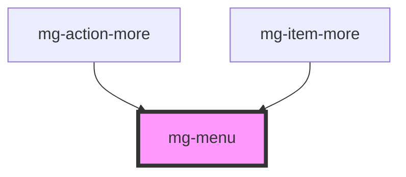

----------------------------------------------

*Built with [StencilJS](https://stenciljs.com/)*
