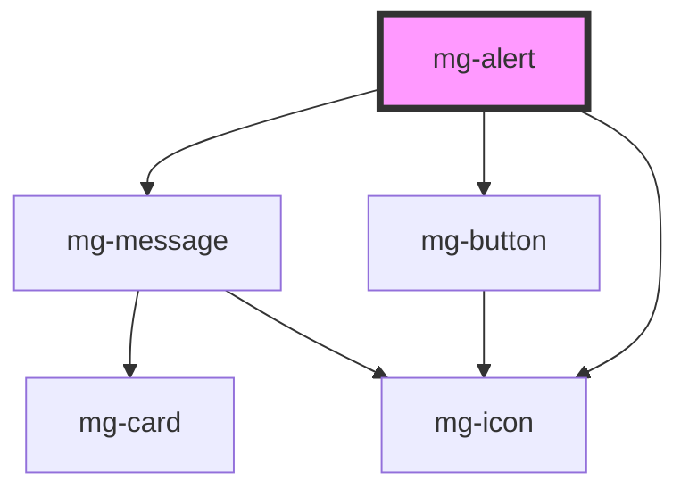

## Usage

When a trigger (such as a button) is activated, it can display an alert message. By default, activating the trigger erases any previous alert messages of the same type on the screen.

## Hide component

To hide the component, you must use the native `hidden` attribute.

<!-- Auto Generated Below -->

## Properties

| Property       | Attribute       | Description                                                                                                                   | Type                                           | Default     |
| -------------- | --------------- | ----------------------------------------------------------------------------------------------------------------------------- | ---------------------------------------------- | ----------- |
| `closeButton`  | `close-button`  | Define if message has a cross button                                                                                          | `boolean`                                      | `false`     |
| `delay`        | `delay`         | Add a delay to hide/close message when it passed Value is defined in seconds and must greater than 2 seconds (PDA9-314 RG-06) | `number`                                       | `undefined` |
| `variant`      | `variant`       | Define variant                                                                                                                | `"danger" \| "info" \| "success" \| "warning"` | `undefined` |
| `variantStyle` | `variant-style` | Define variant style                                                                                                          | `"bar-left" \| "fill"`                         | `undefined` |

## Events

| Event            | Description                         | Type                |
| ---------------- | ----------------------------------- | ------------------- |
| `component-hide` | Emited event when alert is hidden   | `CustomEvent<void>` |
| `component-show` | Emited event when alert is diplayed | `CustomEvent<void>` |

## Dependencies

### Depends on

- [mg-message](../mg-message)
- [mg-button](../../atoms/mg-button)
- [mg-icon](../../atoms/mg-icon)

### Graph

----------------------------------------------

*Built with [StencilJS](https://stenciljs.com/)*
