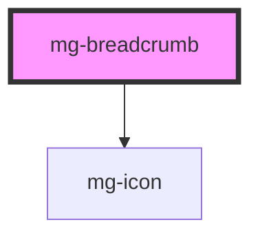

## Behavior

The breadcrumb displays the user's location in the hierarchy and allows navigation to parent levels. The last item is the current page.

## Implementation with a router

If your app uses a client-side router, listen to the `item-click` event. The detail includes the native `event` so you can call `preventDefault()` and handle navigation in a single listener:

```js
document.querySelector('mg-breadcrumb').addEventListener('item-click', (e) => {
  e.detail.event.preventDefault();
  // Your router.navigate(e.detail.href);
});
```

<!-- Auto Generated Below -->


## Properties

| Property | Attribute | Description                                                                                                                                          | Type               | Default     |
| -------- | --------- | ---------------------------------------------------------------------------------------------------------------------------------------------------- | ------------------ | ----------- |
| `items`  | --        | Breadcrumb items (hierarchical order: root → current page). Must be set via JavaScript (property only). Passing via HTML attribute is not supported. | `BreadcrumbItem[]` | `undefined` |


## Events

| Event        | Description                                                                                                                                                      | Type                                                |
| ------------ | ---------------------------------------------------------------------------------------------------------------------------------------------------------------- | --------------------------------------------------- |
| `item-click` | Emitted when a link is clicked (e.g. for routing without full page reload). The native event is included so preventDefault() can be called in a single listener. | `CustomEvent<{ href: string; event: MouseEvent; }>` |


## Dependencies

### Depends on

- [mg-icon](../../atoms/mg-icon)

### Graph


----------------------------------------------

*Built with [StencilJS](https://stenciljs.com/)*
