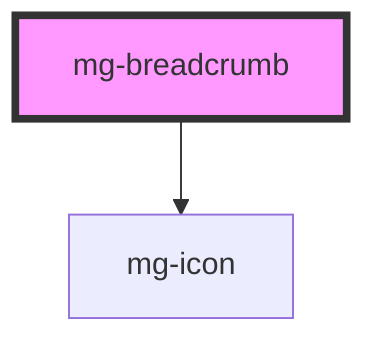

## Behavior

The breadcrumb displays the user's location in the hierarchy and allows navigation to parent levels. The last item is the current page.

<!-- Auto Generated Below -->

## Properties

| Property             | Attribute | Description                                                                                                                                          | Type               | Default     |
| -------------------- | --------- | ---------------------------------------------------------------------------------------------------------------------------------------------------- | ------------------ | ----------- |
| `items` _(required)_ | --        | Breadcrumb items (hierarchical order: root → current page). Must be set via JavaScript (property only). Passing via HTML attribute is not supported. | `BreadcrumbItem[]` | `undefined` |

## Dependencies

### Depends on

- [mg-icon](../../atoms/mg-icon)

### Graph

----------------------------------------------

*Built with [StencilJS](https://stenciljs.com/)*
