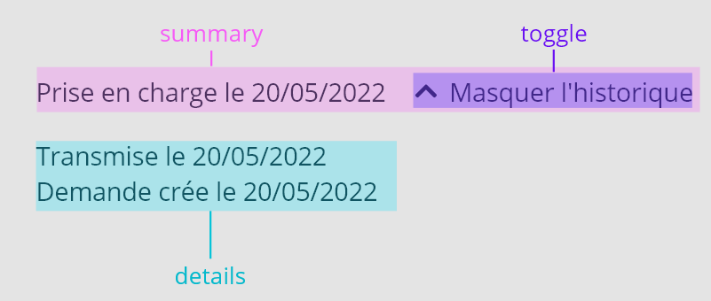
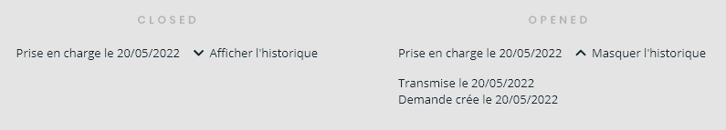
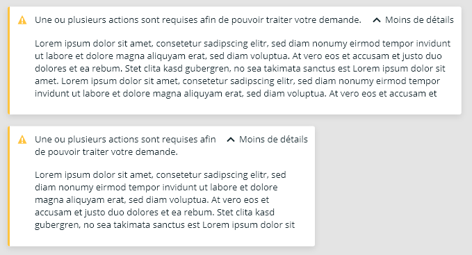
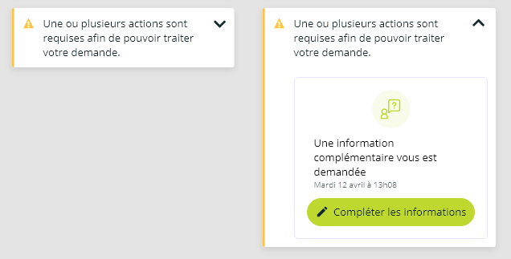
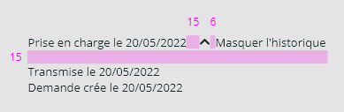
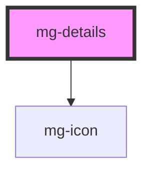

## Properties



- **summary** and **details** are slots which allow html content
- **toggle** is defined by mg-icon plus a custom text
  - mg-icon _chevron-down_ is used for the close state
  - mg-icon _chevron-up_ is used for the open state

## Behavior

### Action

The complete zone including the _summary_ and the _toggle_ is clickable and toggles the state of the component.



### Position

_Toggle_ follows the _summary_ and is always on the top right.



### Responsive

In mobile resolution, the text of the _toggle_ is hidden



## Specs

### Spacing



### Icons

Toggle's icon is chevron-down when closed.
Toggle's icon is chevron-up when opened.

The icon is displayed in "small" size.

### Style

Toggle's text is in 'Open Sans', 13px, Regular, [@color-dark](./?path=/docs/style-colors--docs).

## CSS Variables

If needed some [variables](./?path=/docs/css-variables--docs) are available to customize the component:

- `--mg-details-spacing`: define space between summary and details, default: `1.5rem`

## 💥 Troubleshooting

### How to resize the `<iframe>` element when the `<mg-details>` component is toggled?

You can use the external library `iframe-resizer`. When the library is instantiated in the `window`, it adds a new property `parentIFrame` which includes a `size()` method.

Then you can use `window.parentIFrame.size()` to manually trigger a resize on the `iframe` when the `<mg-details>` element's `expanded` property is toggled.

```jsx
class MyComponent {
  [...] 
  #expanded = true;

  handleExpandedChange = () => {
    if (window.parentIFrame) {
      // This setTimeout is mandatory
      // We have to ensure that component resizing is done before triggering iframe resizing
      setTimeout(() => {
        window.parentIFrame.size()
      }, 0);
    }
  };

  render() {
    return (
      <mg-details
        [...]
        expanded={this.#expanded}
        on-expanded-change={this.handleExpandedChange}
      >
        [...]
      </mg-details>
    );
  }
}
```

<!-- Auto Generated Below -->


## Properties

| Property                    | Attribute       | Description                             | Type      | Default     |
| --------------------------- | --------------- | --------------------------------------- | --------- | ----------- |
| `expanded`                  | `expanded`      | Define if details are diplayed          | `boolean` | `false`     |
| `hideSummary`               | `hide-summary`  | Hide summary element                    | `boolean` | `false`     |
| `toggleClosed` _(required)_ | `toggle-closed` | Displayed title when details are closed | `string`  | `undefined` |
| `toggleOpened` _(required)_ | `toggle-opened` | Displayed title when details are opened | `string`  | `undefined` |


## Events

| Event             | Description                        | Type                   |
| ----------------- | ---------------------------------- | ---------------------- |
| `expanded-change` | Emmited event when expanded change | `CustomEvent<boolean>` |


## Dependencies

### Depends on

- [mg-icon](../../atoms/mg-icon)

### Graph


----------------------------------------------

*Built with [StencilJS](https://stenciljs.com/)*
