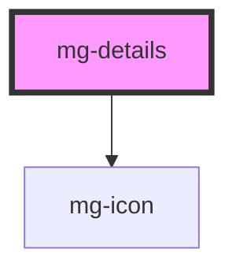

<!-- Auto Generated Below -->

## Properties

| Property                    | Attribute       | Description                             | Type      | Default     |
| --------------------------- | --------------- | --------------------------------------- | --------- | ----------- |
| `expanded`                  | `expanded`      | Define if details are diplayed          | `boolean` | `false`     |
| `hideSummary`               | `hide-summary`  | Hide summary element                    | `boolean` | `false`     |
| `toggleClosed` _(required)_ | `toggle-closed` | Displayed title when details are closed | `string`  | `undefined` |
| `toggleOpened` _(required)_ | `toggle-opened` | Displayed title when details are opened | `string`  | `undefined` |

## Events

| Event             | Description                        | Type                   |
| ----------------- | ---------------------------------- | ---------------------- |
| `expanded-change` | Emmited event when expanded change | `CustomEvent<boolean>` |

## Slots

| Slot        | Description     |
| ----------- | --------------- |
| `"details"` | Details content |
| `"summary"` | Summary content |

## CSS Custom Properties

| Name                     | Description                                                                              |
| ------------------------ | ---------------------------------------------------------------------------------------- |
| `--mg-c-details-spacing` | Defines the spacing between the summary and the details. Default value: `--mg-b-size-8`. |

## Dependencies

### Depends on

- [mg-icon](../../atoms/mg-icon)

### Graph

----------------------------------------------

*Built with [StencilJS](https://stenciljs.com/)*
