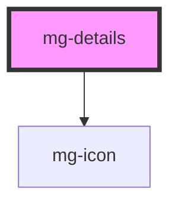

## Responsive

Under 700px, the text of the summary "button" is hidden, unless the summary slot is empty.

## 💥 Troubleshooting

### How to resize the `<iframe>` element when the `<mg-details>` component is toggled?

You can use the external library `iframe-resizer`. When the library is instantiated in the `window`, it adds a new property `parentIFrame` which includes a `size()` method.

Then you can use `window.parentIFrame.size()` to manually trigger a resize on the `iframe` when the `<mg-details>` element's `expanded` property is toggled.

```jsx
class MyComponent {
  [...] 
  #expanded = true;

  handleExpandedChange = () => {
    if (window.parentIFrame) {
      // This setTimeout is mandatory
      // We have to ensure that component resizing is done before triggering iframe resizing
      setTimeout(() => {
        window.parentIFrame.size()
      }, 0);
    }
  };

  render() {
    return (
      <mg-details
        [...]
        expanded={this.#expanded}
        on-expanded-change={this.handleExpandedChange}
      >
        [...]
      </mg-details>
    );
  }
}
```

<!-- Auto Generated Below -->


## Properties

| Property                    | Attribute       | Description                             | Type      | Default     |
| --------------------------- | --------------- | --------------------------------------- | --------- | ----------- |
| `expanded`                  | `expanded`      | Define if details are diplayed          | `boolean` | `false`     |
| `hideSummary`               | `hide-summary`  | Hide summary element                    | `boolean` | `false`     |
| `toggleClosed` _(required)_ | `toggle-closed` | Displayed title when details are closed | `string`  | `undefined` |
| `toggleOpened` _(required)_ | `toggle-opened` | Displayed title when details are opened | `string`  | `undefined` |


## Events

| Event             | Description                        | Type                   |
| ----------------- | ---------------------------------- | ---------------------- |
| `expanded-change` | Emmited event when expanded change | `CustomEvent<boolean>` |


## Slots

| Slot        | Description     |
| ----------- | --------------- |
| `"details"` | Details content |
| `"summary"` | Summary content |


## CSS Custom Properties

| Name                     | Description                                                                              |
| ------------------------ | ---------------------------------------------------------------------------------------- |
| `--mg-c-details-spacing` | Defines the spacing between the summary and the details. Default value: `--mg-b-size-8`. |


## Dependencies

### Depends on

- [mg-icon](../../atoms/mg-icon)

### Graph


----------------------------------------------

*Built with [StencilJS](https://stenciljs.com/)*
