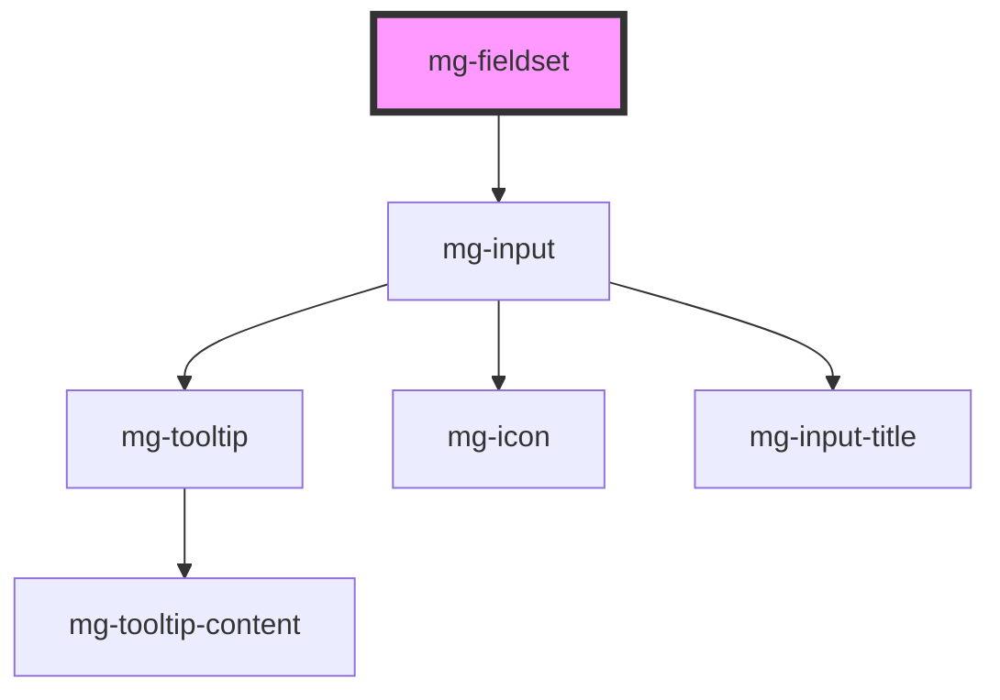

<!-- Auto Generated Below -->

## Properties

| Property                  | Attribute               | Description                                                                  | Type                                           | Default           |
| ------------------------- | ----------------------- | ---------------------------------------------------------------------------- | ---------------------------------------------- | ----------------- |
| `disabled`                | `disabled`              | Define if inputs are disabled                                                | `boolean`                                      | `false`           |
| `helpText`                | `help-text`             | Add a help text under the fieldset, usually expected data format and example | `string`                                       | `undefined`       |
| `identifier` _(required)_ | `identifier`            | Identifier is used for the element ID (id is a reserved prop in Stencil.js)  | `string`                                       | `undefined`       |
| `legend` _(required)_     | `legend`                | Fieldset legend                                                              | `string`                                       | `undefined`       |
| `legendBorderDisplay`     | `legend-border-display` | Define if legend border is visible.                                          | `boolean`                                      | `false`           |
| `legendHeadingLevel`      | `legend-heading-level`  | Define heading level, use to define label with associated semantic           | `"h1" \| "h2" \| "h3" \| "h4" \| "h5" \| "h6"` | `undefined`       |
| `legendHide`              | `legend-hide`           | Define if legend is visible                                                  | `boolean`                                      | `false`           |
| `name`                    | `name`                  | Fieldset name If not set the value equals the identifier                     | `string`                                       | `this.identifier` |
| `readonly`                | `readonly`              | Define if inputs are readonly                                                | `boolean`                                      | `false`           |
| `tooltip`                 | `tooltip`               | Add a tooltip message next to the fieldset                                   | `string`                                       | `undefined`       |

## Methods

### `displayError() => Promise<void>`

Display inputs error if it exists.

#### Returns

Type: `Promise<void>`

### `setCustomValidity(errorMessage?: string) => Promise<void>`

Component is not a candidate for constraint validation.
You can use this method to define the `errorMessage` and set the `valid` state to `false`.

#### Parameters

| Name           | Type     | Description                                                                                            |
| -------------- | -------- | ------------------------------------------------------------------------------------------------------ |
| `errorMessage` | `string` | - error message to display. Use a valid `string` to define an error or `undefined` to delete the error |

#### Returns

Type: `Promise<void>`

## Dependencies

### Depends on

- [mg-input](../inputs/mg-input)

### Graph

----------------------------------------------

*Built with [StencilJS](https://stenciljs.com/)*
