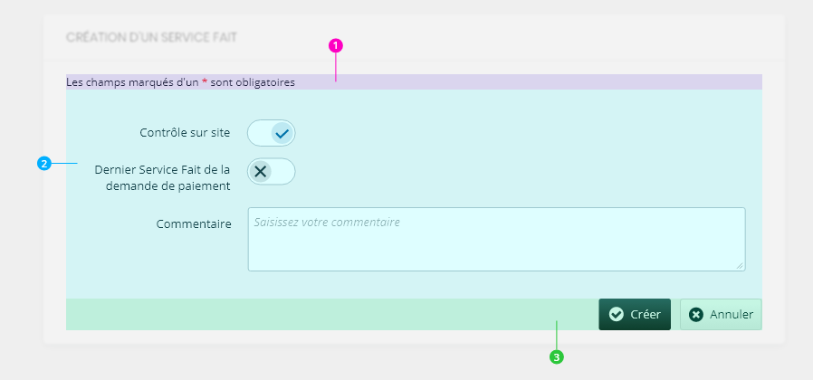
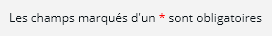
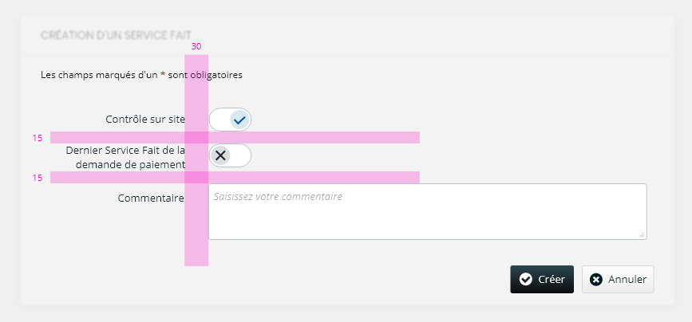
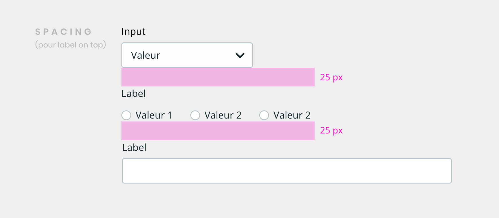

## Use

Use mg-form to build clean forms.  
The component manages:

- the spacing between inputs
- the required fileds message

## Anatomy



1. Required field(s) message
2. Inputs zone
3. Actions zone

## Style

### Required field(s) message



Text is in 'Open Sans', Regular, 12px, [@color-dark](./?path=/docs/style-colors--docs)  
The "\*" is in [@color-danger](./?path=/docs/style-colors--docs)

## Spacing

### Inputs

The `mg-form` component applies a 15px margin to the bottom of the slotted `mg-input-*` elements.
The space between the label and the input area is increased to 30px.



#### Label on top

When the `label-on-top` prop is used, the vertical spacing is increased to 25px.



## Behavior

### Required field(s) message

This message is automatically generated by the component.

- If there is only 1 input required (among other inputs)

  > Field with a \* is required

- If there are many required inputs (among other inputs)

  > Fields with a \* are required

- If there is only 1 input and it is required

  > The field is required

  In this case, the \* is hidden on inputs labels.

- If all inputs are required

  > All fields are required

  In this case, the \* is hidden on inputs labels.

## Combining `mg-input-*` with legacy libraries

If you are creating a form that combines `mg-components` inputs with inputs from one of our legacy libraries (e.g., form, ui-components, ui-components-vuejs), you can achieve consistent styling by applying the `mg-u-form-legacy` class to the `mg-form` element. This ensures that `mg-input-*` components behave in accordance with Bootstrap styling conventions.

```html
<mg-form class="form-horizontal mg-u-form-legacy">
  <text-field
    label="Text field label"
    reference="reference"
    help="Text field tooltip"
  ></text-field>
  <mg-input-text
    label="Mg input text label"
    identifier="identifier"
    tooltip="Mg input text tooltip"
  ></mg-input-text>
</mg-form>
```

## 👍 Good practices

### Enabling _submit_ button

You can disable _submit button_ until all required fields are empty.
For this, use "valid/invalid" options.

## 💥 Troubleshooting

### axe-core: `aria-valid-attr` error for `aria-role` props

#### Issue

When we run a unit test with axe-core on an `<mg-form />` element we can get the following error:  [`aria-valid-attr`](https://github.com/dequelabs/axe-core/blob/develop/doc/rule-descriptions.md).

#### Workaround

To succeed the test with the `<mg-form />` property `aria-role`, you need to bind this `prop` as a framework JS property, ex:
- vue: `<mg-form :aria-role.prop="presentation"></mg-form>`
- angular: `<mg-form ng-prop-aria-role="presentation"></mg-form>`
- jsx: `<mg-form ariaRole={"presentation"}></mg-form>`

#### Explanation

When you use JS property binding instead of HTML attribute, the component prop isn't rendered in the DOM, which results in a valid HTML DOM semantic, and succeed the test.

## CSS Variables

If needed some [variables](./?path=/docs/css-variables--docs) are available to customize the component:

- `--mg-form-inputs-title-width`: Define slotted input label width, default: `23rem`

## Example

**Code example does not reflect all the code.**

Here we have a `form-valid` event listener on the `mg-form` to define if the "submit" button should be enable or not.  
The "Display errors" button use the `mg-form` `displayError()` method.

<!-- Auto Generated Below -->


## Properties

| Property          | Attribute          | Description                                                                                                                                                                                                                                                                                                                                                                                                                                                                                                                                                     | Type                                             | Default               |
| ----------------- | ------------------ | --------------------------------------------------------------------------------------------------------------------------------------------------------------------------------------------------------------------------------------------------------------------------------------------------------------------------------------------------------------------------------------------------------------------------------------------------------------------------------------------------------------------------------------------------------------- | ------------------------------------------------ | --------------------- |
| `ariaRole`        | `aria-role`        | Define `<form/>` element aria role see more about aria roles use case: https://developer.mozilla.org/en-US/docs/Web/Accessibility/ARIA/Roles                                                                                                                                                                                                                                                                                                                                                                                                                    | `"form" \| "none" \| "presentation" \| "search"` | `undefined`           |
| `disabled`        | `disabled`         | Define if form is disabled                                                                                                                                                                                                                                                                                                                                                                                                                                                                                                                                      | `boolean`                                        | `false`               |
| `identifier`      | `identifier`       | Identifier is used for the element ID (id is a reserved prop in Stencil.js) If not set, it will be created.                                                                                                                                                                                                                                                                                                                                                                                                                                                     | `string`                                         | `createID('mg-form')` |
| `invalid`         | `invalid`          | Define form invalid state                                                                                                                                                                                                                                                                                                                                                                                                                                                                                                                                       | `boolean`                                        | `undefined`           |
| `labelOnTop`      | `label-on-top`     | Define if slotted mg-component's label are displayed on top                                                                                                                                                                                                                                                                                                                                                                                                                                                                                                     | `boolean`                                        | `undefined`           |
| `name`            | `name`             | Input name If not set the value equals the identifier                                                                                                                                                                                                                                                                                                                                                                                                                                                                                                           | `string`                                         | `this.identifier`     |
| `readonly`        | `readonly`         | Define if form is readonly                                                                                                                                                                                                                                                                                                                                                                                                                                                                                                                                      | `boolean`                                        | `false`               |
| `requiredMessage` | `required-message` | Define when required message is display. When it is unset, component use it internal logic to manage "required message" help text display. When you set the prop to `default`, you override the component internal logique to torce it display "required message" help text. When you set the prop to `hide`, it will prevent the rendering of the message in the component's DOM. As **this element is an accessibility requirement in the view**, you **MUST*** re-implement this message on your own and display it when your form contains required inputs. | `"default" \| "hide"`                            | `undefined`           |
| `valid`           | `valid`            | Define form valid state                                                                                                                                                                                                                                                                                                                                                                                                                                                                                                                                         | `boolean`                                        | `undefined`           |


## Events

| Event         | Description                                                        | Type                   |
| ------------- | ------------------------------------------------------------------ | ---------------------- |
| `form-submit` | Emitted event on form submit                                       | `CustomEvent<boolean>` |
| `form-valid`  | Emitted event on form validity check Tells if form is valid or not | `CustomEvent<boolean>` |


## Methods

### `displayError() => Promise<void>`

Display input error if it exists.

#### Returns

Type: `Promise<void>`


----------------------------------------------

*Built with [StencilJS](https://stenciljs.com/)*
