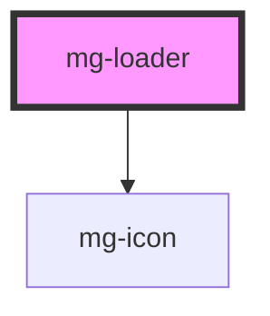

<!-- Auto Generated Below -->

## Properties

| Property      | Attribute      | Description             | Type      | Default     |
| ------------- | -------------- | ----------------------- | --------- | ----------- |
| `message`     | `message`      | Override loader message | `string`  | `undefined` |
| `messageHide` | `message-hide` | Hide message            | `boolean` | `false`     |

## Dependencies

### Depends on

- [mg-icon](../../atoms/mg-icon)

### Graph

----------------------------------------------

*Built with [StencilJS](https://stenciljs.com/)*
