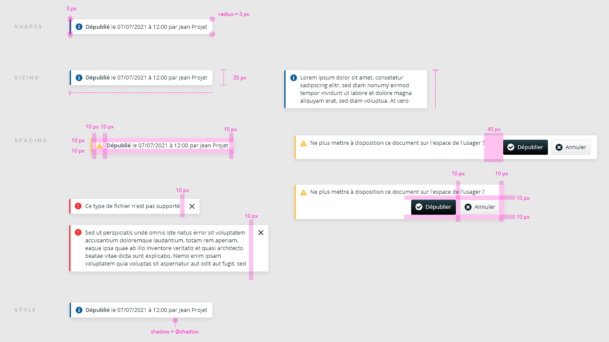
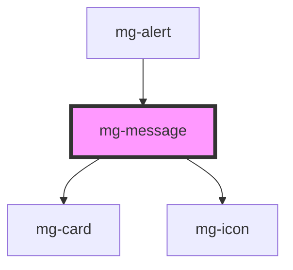

## Usage

### Types

The element can be of four different types depending on the message to be indicated:

- validation (green)
- information (blue)
- warning (orange)
- error (red)

## Specs

<!-- Auto Generated Below -->

## Properties

| Property       | Attribute       | Description          | Type                                           | Default      |
| -------------- | --------------- | -------------------- | ---------------------------------------------- | ------------ |
| `variant`      | `variant`       | Define variant       | `"danger" \| "info" \| "success" \| "warning"` | `'info'`     |
| `variantStyle` | `variant-style` | Define variant style | `"bar-left" \| "fill"`                         | `'bar-left'` |

## CSS Custom Properties

| Name                           | Description                                                                    |
| ------------------------------ | ------------------------------------------------------------------------------ |
| `--mg-c-message-border-radius` | Defines the border radius of the message. Default value: `--mg-b-size-radius`. |

## Dependencies

### Used by

 - [mg-alert](../mg-alert)

### Depends on

- [mg-card](../../atoms/mg-card)
- [mg-icon](../../atoms/mg-icon)

### Graph

----------------------------------------------

*Built with [StencilJS](https://stenciljs.com/)*
