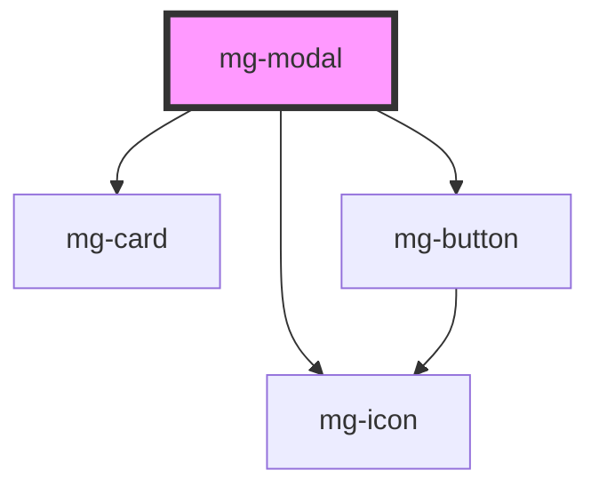

# mg-modal

<!-- Auto Generated Below -->

## Properties

| Property                  | Attribute      | Description                                                                                                 | Type                        | Default                |
| ------------------------- | -------------- | ----------------------------------------------------------------------------------------------------------- | --------------------------- | ---------------------- |
| `closeButton`             | `close-button` | Define if modal has a cross button                                                                          | `boolean`                   | `false`                |
| `dialogRole`              | `dialog-role`  | Modal dialog role.                                                                                          | `"alertdialog" \| "dialog"` | `dialogRoles[0]`       |
| `identifier`              | `identifier`   | Identifier is used for the element ID (id is a reserved prop in Stencil.js) If not set, it will be created. | `string`                    | `createID('mg-modal')` |
| `modalTitle` _(required)_ | `modal-title`  | Displayed modal title                                                                                       | `string`                    | `undefined`            |

## Events

| Event            | Description                          | Type                |
| ---------------- | ------------------------------------ | ------------------- |
| `component-hide` | Emmited event when modal is hidden   | `CustomEvent<void>` |
| `component-show` | Emmited event when modal is diplayed | `CustomEvent<void>` |

## CSS Custom Properties

| Name                           | Description                                                                     |
| ------------------------------ | ------------------------------------------------------------------------------- |
| `--mg-c-modal-border-radius`   | Defines the border radius of the modal. Default value: `--mg-b-size-radius`.    |
| `--mg-c-modal-title-font-size` | Defines the font size of the modal title. Default value: `--mg-b-font-size-h3`. |

## Dependencies

### Depends on

- [mg-card](../../atoms/mg-card)
- [mg-button](../../atoms/mg-button)
- [mg-icon](../../atoms/mg-icon)

### Graph

----------------------------------------------

*Built with [StencilJS](https://stenciljs.com/)*
