## Anatomy

A modal has:

- a closing cross at the top right corner
- a title
- a body composed of fields or a message
- a validation button
- a cancel button

## Behavior

When clicking on the cross, the cancel button or the `<Escape>` key is pressed the modal closes and no processing is done.

When the validation button is clicked, processing is performed and the modal closes.

As long as the user does not press one of these three buttons, the modal does not close.

The modal allows focusing the attention on what it is asking: a confirmation or a cancellation.  
In this sense the rest of the screen should not be accessible:

- it is hidden by a backdrop
- clicking on the backdrop does not close the modal

The title of the modal has a written name.
Ex: Add value

The wording of the validation button is the infinitive verb of the current action.  
Avoid the verb "Validate" if a more explicit one is possible.  
Ex: "Add" for adding a value, "Delete" to delete a value, "Modify" to modify a value.

### Icon or not icon on the action buttons ?

In the case of a targeted action, the icon can help to understand or even reassure > check icon that validates the action.

In the case of a confirmation/cancellation choice: not necessary or even superfluous > the term "Save/Cancel" is enough.

Ex: if I put a check in front of the term "Delete" which is the validation button of a deletion, the check refers to positive while the action of deletion is negative, and the Cancel button also, so not to add to the confusion, do not put an icon...

## Specs

### Shapes

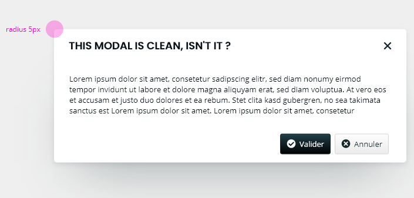

### Fonts

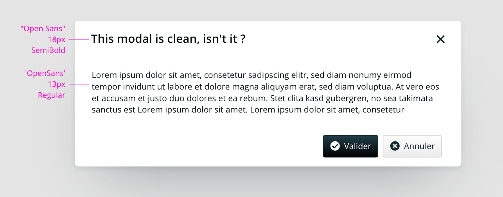

### Spacing

#### Spacing between edges and content

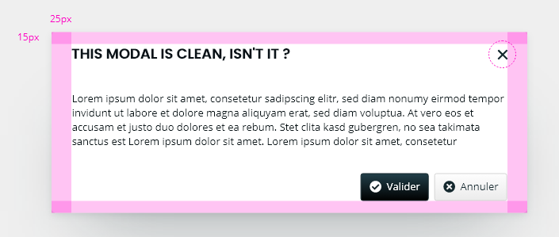

#### Spacing between title, text and buttons

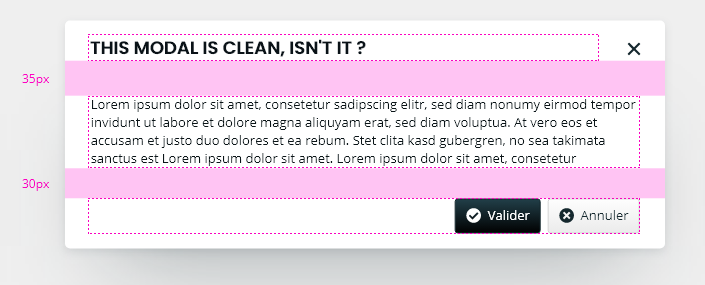
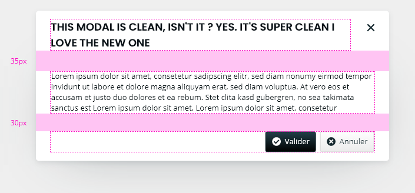

#### Spacing between the title and the cross button

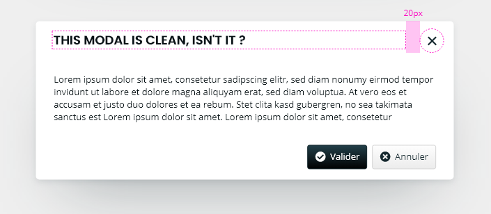
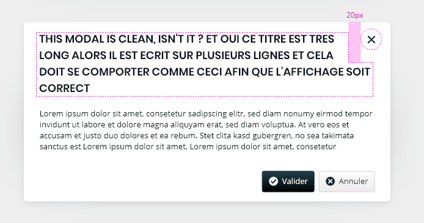

### Alignments

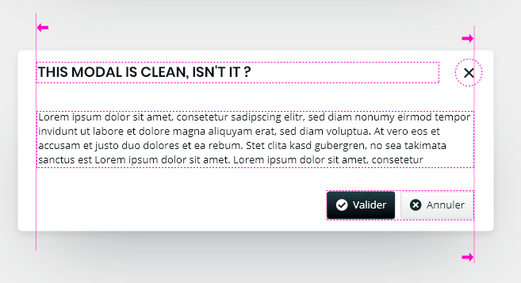

### Sizes

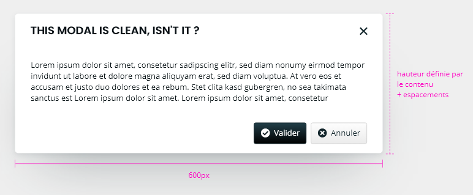

### Colors

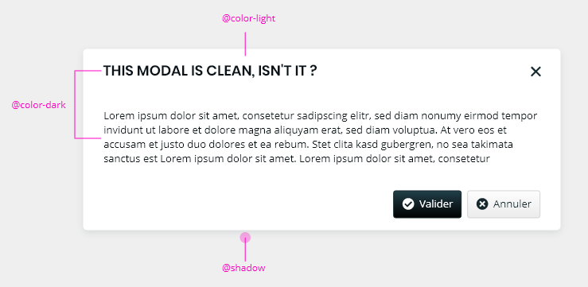

### Backdrop

Color: [@color-light](./?path=/docs/style-colors--docs) with an opacity set to 85%.

## Hide component

To hide the component, you must use the native `hidden` attribute.

<!-- Auto Generated Below -->

## Properties

| Property                  | Attribute      | Description                                                                                                 | Type                        | Default                |
| ------------------------- | -------------- | ----------------------------------------------------------------------------------------------------------- | --------------------------- | ---------------------- |
| `closeButton`             | `close-button` | Define if modal has a cross button                                                                          | `boolean`                   | `false`                |
| `dialogRole`              | `dialog-role`  | Modal dialog role.                                                                                          | `"alertdialog" \| "dialog"` | `dialogRoles[0]`       |
| `identifier`              | `identifier`   | Identifier is used for the element ID (id is a reserved prop in Stencil.js) If not set, it will be created. | `string`                    | `createID('mg-modal')` |
| `modalTitle` _(required)_ | `modal-title`  | Displayed modal title                                                                                       | `string`                    | `undefined`            |

## Events

| Event            | Description                          | Type                |
| ---------------- | ------------------------------------ | ------------------- |
| `component-hide` | Emmited event when modal is hidden   | `CustomEvent<void>` |
| `component-show` | Emmited event when modal is diplayed | `CustomEvent<void>` |

## CSS Custom Properties

| Name                           | Description                                                                     |
| ------------------------------ | ------------------------------------------------------------------------------- |
| `--mg-c-modal-border-radius`   | Defines the border radius of the modal. Default value: `--mg-b-size-radius`.    |
| `--mg-c-modal-title-font-size` | Defines the font size of the modal title. Default value: `--mg-b-font-size-h3`. |

## Dependencies

### Depends on

- [mg-card](../../atoms/mg-card)
- [mg-button](../../atoms/mg-button)
- [mg-icon](../../atoms/mg-icon)

### Graph
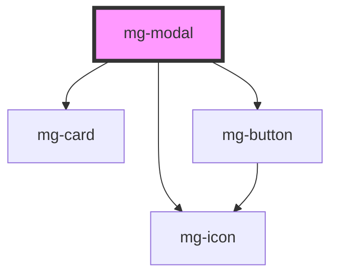

----------------------------------------------

*Built with [StencilJS](https://stenciljs.com/)*
