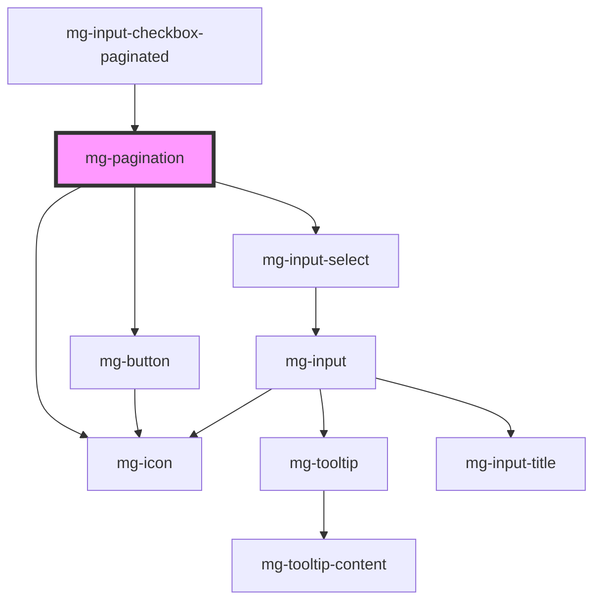

## Usage

A pagination component should be displayed only when it is useful, for example:

- When the number of pages is greater than 1.
- When there are elements to be displayed.

<!-- Auto Generated Below -->

## Properties

| Property               | Attribute                | Description                                                                                                 | Type      | Default                     |
| ---------------------- | ------------------------ | ----------------------------------------------------------------------------------------------------------- | --------- | --------------------------- |
| `currentPage`          | `current-page`           | Component current page                                                                                      | `number`  | `1`                         |
| `hideNavigationLabels` | `hide-navigation-labels` | Hide navigation label                                                                                       | `boolean` | `false`                     |
| `hidePageCount`        | `hide-page-count`        | Hide select input                                                                                           | `boolean` | `false`                     |
| `identifier`           | `identifier`             | Identifier is used for the element ID (id is a reserved prop in Stencil.js) If not set, it will be created. | `string`  | `createID('mg-pagination')` |
| `label`                | `label`                  | Panignation label. Is a short description. Customize default value can be usefull to improve accessibility  | `string`  | `undefined`                 |
| `totalPages`           | `total-pages`            | Component total pages                                                                                       | `number`  | `1`                         |

## Events

| Event                 | Description                            | Type                  |
| --------------------- | -------------------------------------- | --------------------- |
| `current-page-change` | Emmited event when current page change | `CustomEvent<number>` |

## Dependencies

### Used by

 - mg-input-checkbox-paginated

### Depends on

- [mg-button](../../atoms/mg-button)
- [mg-icon](../../atoms/mg-icon)
- [mg-input-select](../inputs/mg-input-select)

### Graph

----------------------------------------------

*Built with [StencilJS](https://stenciljs.com/)*
