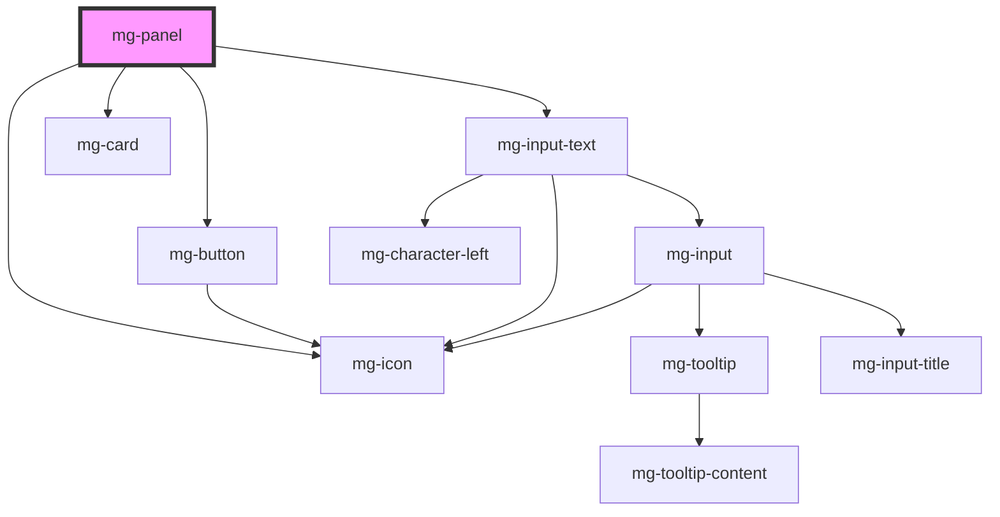

## 💥 Troubleshooting

### How to resize the `<iframe>` element when the `<mg-panel>` component is toggled?

You can use the external library `iframe-resizer`. When the library is instantiated in the `window`, it adds a new property `parentIFrame` which includes a `size()` method.

Then you can use `window.parentIFrame.size()` to manually trigger a resize on the `iframe` when the `<mg-panel>` element's `expanded` property is toggled.

```jsx
class MyComponent {
  [...] 
  #expanded = true;

  handleExpandedChange = () => {
    if (window.parentIFrame) {
      // This setTimeout is mandatory
      // We have to ensure that component resizing is done before triggering iframe resizing
      setTimeout(() => {
        window.parentIFrame.size()
      }, 0);
    }
  };

  render() {
    return (
      <mg-panel
        [...]
        expanded={this.#expanded}
        on-expanded-change={this.handleExpandedChange}
      >
        [...]
      </mg-panel>
    );
  }
}
```

<!-- Auto Generated Below -->


## Properties

| Property                   | Attribute                     | Description                                                                                                 | Type                | Default                |
| -------------------------- | ----------------------------- | ----------------------------------------------------------------------------------------------------------- | ------------------- | ---------------------- |
| `expandToggleDisabled`     | `expand-toggle-disabled`      | Disable possibility to toggle expand                                                                        | `boolean`           | `false`                |
| `expandToggleDisplay`      | `expand-toggle-display`       | Define expand toggle button display                                                                         | `"icon" \| "text"`  | `'text'`               |
| `expanded`                 | `expanded`                    | Panel is opened                                                                                             | `boolean`           | `false`                |
| `identifier`               | `identifier`                  | Identifier is used for the element ID (id is a reserved prop in Stencil.js) If not set, it will be created. | `string`            | `createID('mg-panel')` |
| `panelTitle` _(required)_  | `panel-title`                 | Panel title                                                                                                 | `string`            | `undefined`            |
| `titleEditable`            | `title-editable`              | Define if panel title is editable                                                                           | `boolean`           | `false`                |
| `titlePattern`             | `title-pattern`               | Panel title pattern                                                                                         | `string`            | `undefined`            |
| `titlePatternErrorMessage` | `title-pattern-error-message` | Panel title pattern error message                                                                           | `string`            | `undefined`            |
| `titlePosition`            | `title-position`              | Define title position                                                                                       | `"left" \| "right"` | `'left'`               |


## Events

| Event             | Description                        | Type                   |
| ----------------- | ---------------------------------- | ---------------------- |
| `expanded-change` | Emmited event when expanded change | `CustomEvent<boolean>` |
| `title-change`    | Emmited event when title change    | `CustomEvent<string>`  |


## Slots

| Slot             | Description                |
| ---------------- | -------------------------- |
|                  | Panel content              |
| `"header-right"` | Header right panel content |


## CSS Custom Properties

| Name                            | Description                                                                                                  |
| ------------------------------- | ------------------------------------------------------------------------------------------------------------ |
| `--mg-c-panel-border-radius`    | Defines the border radius of the panel. Default value: `--mg-b-size-radius`.                                 |
| `--mg-c-panel-box-shadow`       | Defines the box shadow of the panel. Default value: `--mg-b-box-shadow`.                                     |
| `--mg-c-panel-color-background` | Defines the background of the panel. Default value: `color-mix(in srgb, var(--mg-b-color-info), white 97%)`. |
| `--mg-c-panel-content-spacing`  | Defines the padding of the panel content. Default value: `--mg-b-size-16`.                                   |


## Dependencies

### Depends on

- [mg-button](../../atoms/mg-button)
- [mg-icon](../../atoms/mg-icon)
- [mg-input-text](../inputs/mg-input-text)
- [mg-card](../../atoms/mg-card)

### Graph


----------------------------------------------

*Built with [StencilJS](https://stenciljs.com/)*
