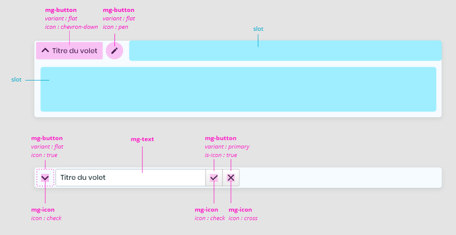
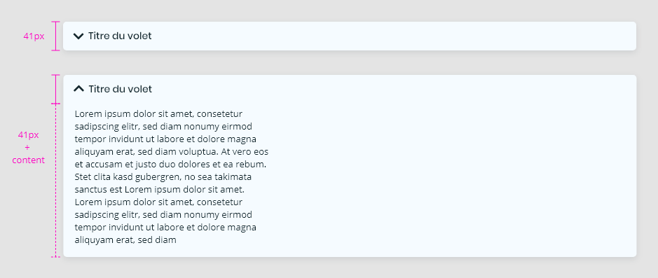
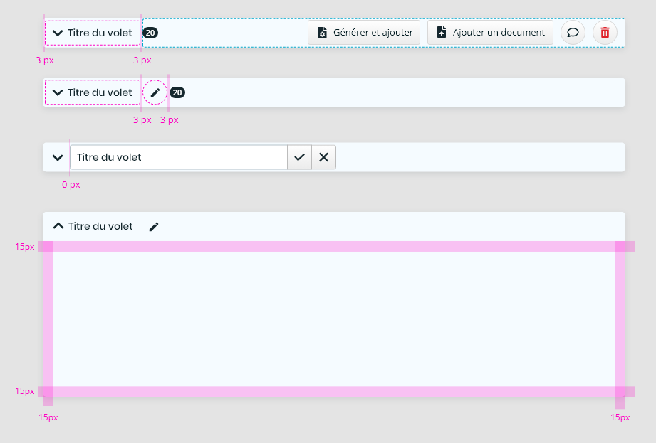
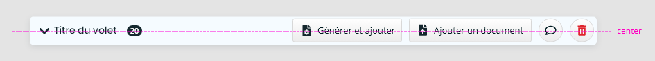
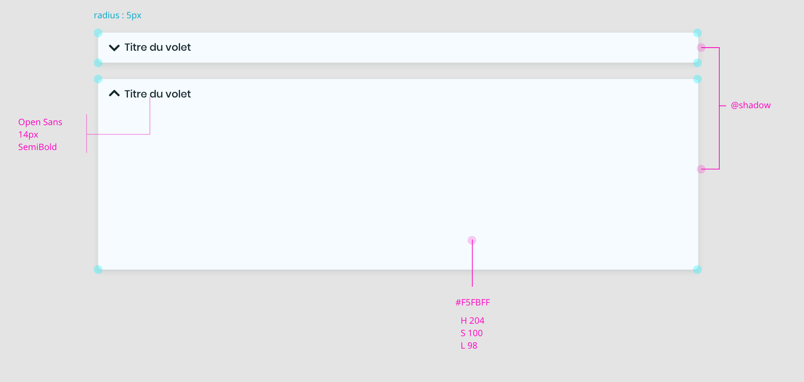
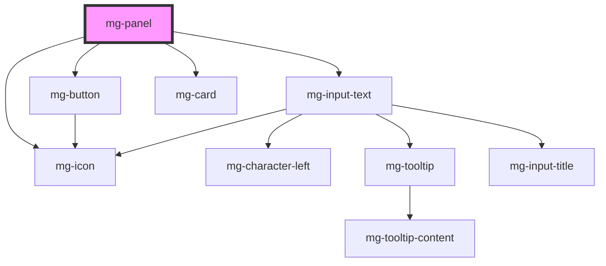

## Behavior

The left zone of the header displays the item label, this zone is clickable and allows the user to unfold/fold the panel.
If no content is available, the panel cannot be unfolded.
When the panel is unfolded, the icon is vertically inverted.

The right area of the header can accommodate any component.

## Anatomy

## Specs

### Sizing

### Spacing

Slot content padding can be customized using the --mg-c-panel-content-padding CSS variable, default is 15px.

### Alignments

### Styles

## CSS Variables

If needed some [variables](./?path=/docs/css-variables--docs) are available to customize the component:

- `--mg-c-panel-border-radius`: Define panel border radius, default: `0.5rem`
- `--mg-c-panel-background`: Define panel background, default: `var(--mg-b-color-info-h) var(--mg-b-color-info-s) calc(var(--mg-b-color-info-l) + 68%)`
- `--mg-c-panel-box-shadow`: Define panel box shadow, default: `var(--mg-b-box-shadow)`
- `--mg-c-panel-content-padding`: Define panel content padding, default: `1.5rem`

Please note that the mg-panel component uses the [mg-card](./?path=/docs/atoms-mg-card--mg-c-card) component. This means that you can benefit from the CSS variables of [mg-card](./?path=/docs/atoms-mg-card--mg-c-card) to customize mg-panel. You can easily change padding, border-radius, etc. Use this feature to seamlessly adapt mg-panel to your design.

<!-- Auto Generated Below -->

## Properties

| Property                   | Attribute                     | Description                                                                                                 | Type                | Default                   |
| -------------------------- | ----------------------------- | ----------------------------------------------------------------------------------------------------------- | ------------------- | ------------------------- |
| `expandToggleDisabled`     | `expand-toggle-disabled`      | Disable possibility to toggle expand                                                                        | `boolean`           | `undefined`               |
| `expandToggleDisplay`      | `expand-toggle-display`       | Define expand toggle button display                                                                         | `"icon" \| "text"`  | `expandToggleDisplays[0]` |
| `expanded`                 | `expanded`                    | Panel is opened                                                                                             | `boolean`           | `false`                   |
| `identifier`               | `identifier`                  | Identifier is used for the element ID (id is a reserved prop in Stencil.js) If not set, it will be created. | `string`            | `createID('mg-panel')`    |
| `panelTitle` _(required)_  | `panel-title`                 | Panel title                                                                                                 | `string`            | `undefined`               |
| `titleEditable`            | `title-editable`              | Define if panel title is editable                                                                           | `boolean`           | `false`                   |
| `titlePattern`             | `title-pattern`               | Panel title pattern                                                                                         | `string`            | `undefined`               |
| `titlePatternErrorMessage` | `title-pattern-error-message` | Panel title pattern error message                                                                           | `string`            | `undefined`               |
| `titlePosition`            | `title-position`              | Define title position                                                                                       | `"left" \| "right"` | `titlePositions[0]`       |

## Events

| Event             | Description                        | Type                   |
| ----------------- | ---------------------------------- | ---------------------- |
| `expanded-change` | Emmited event when expanded change | `CustomEvent<boolean>` |
| `title-change`    | Emmited event when title change    | `CustomEvent<string>`  |

## Dependencies

### Depends on

- [mg-button](../../atoms/mg-button)
- [mg-icon](../../atoms/mg-icon)
- [mg-input-text](../inputs/mg-input-text)
- [mg-card](../../atoms/mg-card)

### Graph

----------------------------------------------

*Built with [StencilJS](https://stenciljs.com/)*
