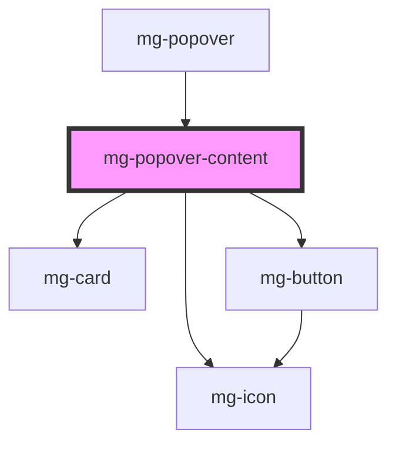

# mg-popover-content

<!-- Auto Generated Below -->

## Properties

| Property      | Attribute      | Description                          | Type      | Default |
| ------------- | -------------- | ------------------------------------ | --------- | ------- |
| `arrowHide`   | `arrow-hide`   | Hide popover arrow                   | `boolean` | `false` |
| `closeButton` | `close-button` | Define if popover has a cross button | `boolean` | `false` |

## Events

| Event          | Description                               | Type                  |
| -------------- | ----------------------------------------- | --------------------- |
| `hide-content` | Emited event when close button is clicked | `CustomEvent<string>` |

## Dependencies

### Used by

 - [mg-popover](..)

### Depends on

- [mg-card](../../../atoms/mg-card)
- [mg-button](../../../atoms/mg-button)
- [mg-icon](../../../atoms/mg-icon)

### Graph

----------------------------------------------

*Built with [StencilJS](https://stenciljs.com/)*
