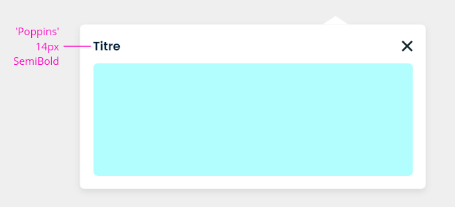
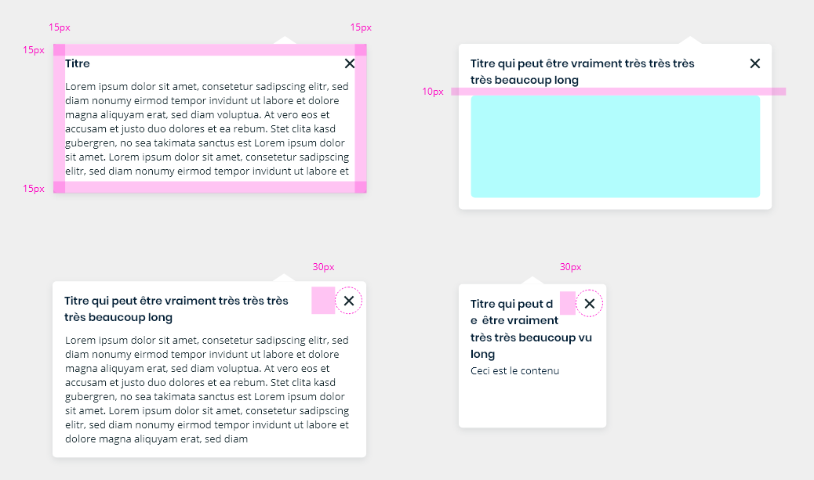
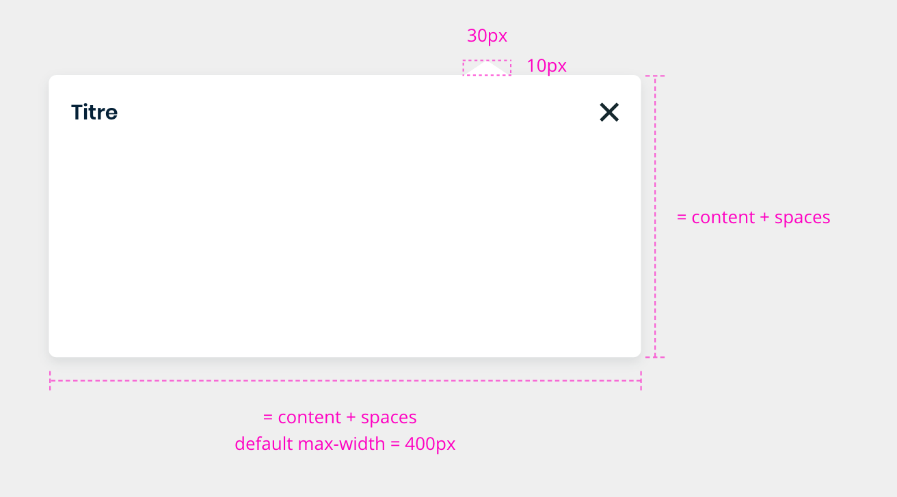
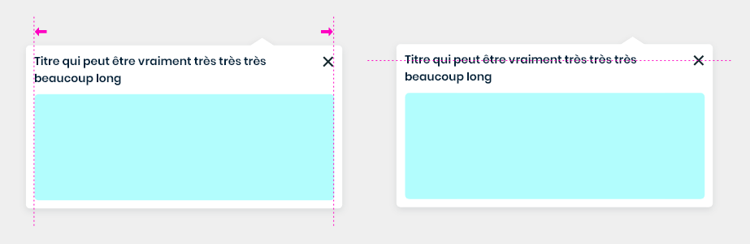
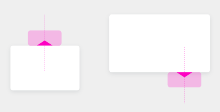
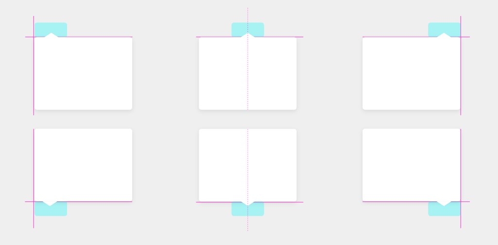
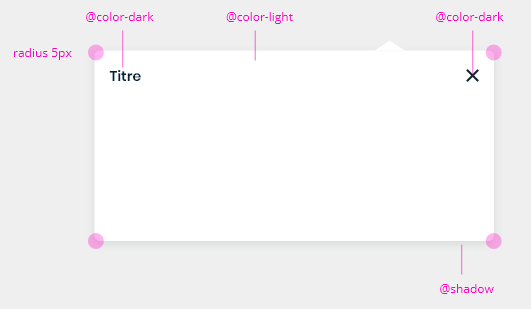
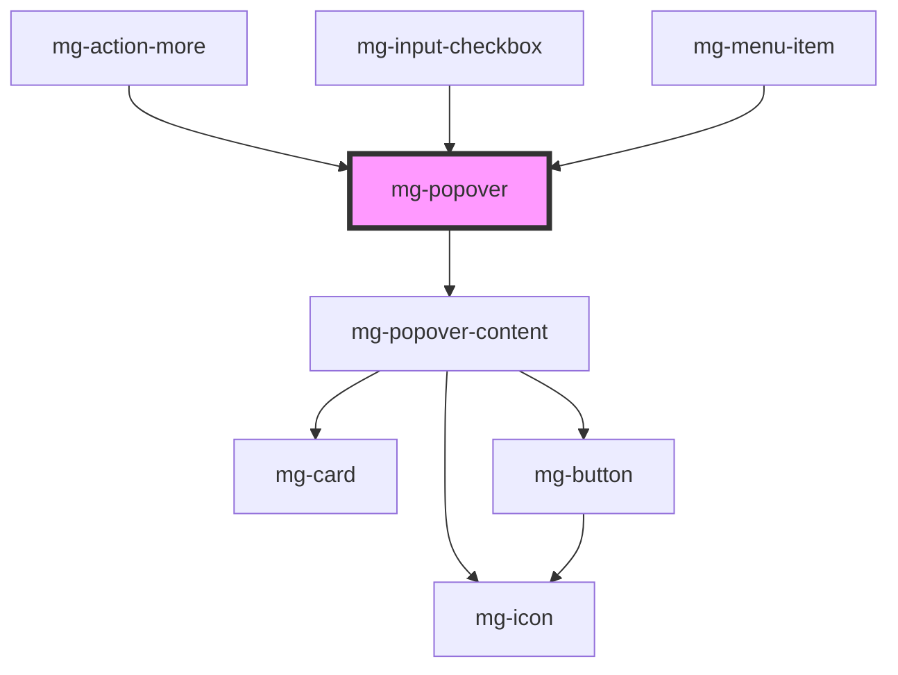

## Usage

A popover is more enhanced than a tooltip but less blocking than a modal.

## Behavior

The window is displayed when clicking on its trigger.

The window is displayed next to its trigger, usually below it. A triangle (in css) makes the link between the trigger and the window.

The window closes:

- when clicking on its trigger
- clicking outside the window
- when the ESC key is pressed
- when clicking on the close button at the top right corner

The size of the window is determined by the content (set a maximum size to avoid problems).

The title and the close button are optional.

## Specs

### Fonts

### Spacing

### Sizing

Default max-width: 400px
The value of the max-width can be modified according to the case via the CSS variable.

### Alignments

### Positioning

#### Item

#### Screen

### Style

## CSS Variables

If needed some [variables](./?path=/docs/css-variables--docs) are available to customize the component:

- `--mg-popover-background-color`: Define popover background color, default: `var(--color-light)`
- `--mg-popover-font-color`: Define popover font color, default: `var(--color-font-dark)`
- `--mg-popover-title-font-size`: Define popover title font size, default: `1.4rem`
- `--mg-popover-padding-vertical`: Define popover vertical padding, default: `1.5rem`
- `--mg-popover-padding-horizontal`: Define popover horizontal padding, default: `--mg-popover-padding-vertical`
- `--mg-popover-max-width`: Define the popover max-width. Default: `40rem`;
- `--mg-popover-min-width`: Define the popover min-width. Default: `unset`;

Please note that the mg-popover component uses the [mg-card](./?path=/docs/atoms-mg-card--mg-card) component. This means that you can benefit from the CSS variables of [mg-card](./?path=/docs/atoms-mg-card--mg-card) to customize mg-popover. You can easily change padding, border-radius, etc. Use this feature to seamlessly adapt mg-popover to your design.

<!-- Auto Generated Below -->

## Properties

| Property      | Attribute      | Description                                                                      | Type                                                                                                                                                                                                         | Default                  |
| ------------- | -------------- | -------------------------------------------------------------------------------- | ------------------------------------------------------------------------------------------------------------------------------------------------------------------------------------------------------------ | ------------------------ |
| `arrowHide`   | `arrow-hide`   | Hide popover arrow                                                               | `boolean`                                                                                                                                                                                                    | `false`                  |
| `closeButton` | `close-button` | Define if popover has a cross button                                             | `boolean`                                                                                                                                                                                                    | `false`                  |
| `disabled`    | `disabled`     | Disable popover                                                                  | `boolean`                                                                                                                                                                                                    | `false`                  |
| `display`     | `display`      | Display popover                                                                  | `boolean`                                                                                                                                                                                                    | `false`                  |
| `identifier`  | `identifier`   | Sets an `id` attribute. Needed by the input for accessibility `aria-decribedby`. | `string`                                                                                                                                                                                                     | `createID('mg-popover')` |
| `placement`   | `placement`    | Popover placement                                                                | `"auto" \| "auto-end" \| "auto-start" \| "bottom" \| "bottom-end" \| "bottom-start" \| "left" \| "left-end" \| "left-start" \| "right" \| "right-end" \| "right-start" \| "top" \| "top-end" \| "top-start"` | `'bottom'`               |

## Events

| Event            | Description                            | Type                   |
| ---------------- | -------------------------------------- | ---------------------- |
| `display-change` | Emited event when display value change | `CustomEvent<boolean>` |

## Dependencies

### Used by

 - [mg-action-more](../mg-action-more)
 - [mg-input-checkbox](../inputs/mg-input-checkbox)
 - [mg-menu-item](../menu/mg-menu-item)

### Depends on

- [mg-popover-content](mg-popover-content)

### Graph

----------------------------------------------

*Built with [StencilJS](https://stenciljs.com/)*
