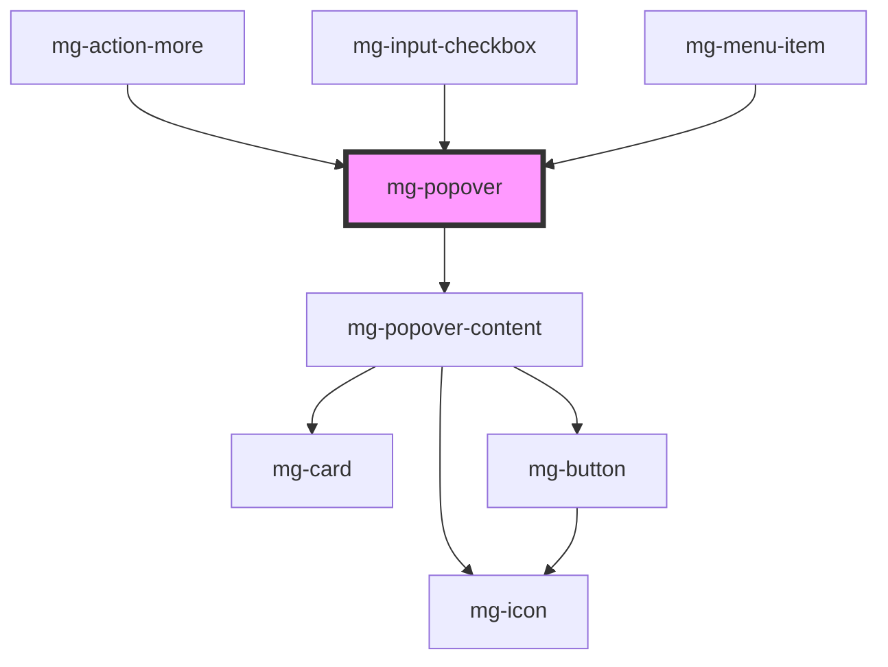

## Usage

A popover is more enhanced than a tooltip but less blocking than a modal.

## `popovertargetaction` attributes in `<mg-popover>` content

The click on button with ’popovertargetaction="hide"’ will hide a shown popover without adding any listener on the targeted button. If you try to hide an already hidden popover, no action will be taken.

```html
<mg-popover>
  <div slot="content">
    <mg-button popovertargetaction="hide">Close</mg-button>
  </div>
</mg-popover>
```

<!-- Auto Generated Below -->


## Properties

| Property      | Attribute      | Description                                                                      | Type                                                                                                                                                                 | Default                  |
| ------------- | -------------- | -------------------------------------------------------------------------------- | -------------------------------------------------------------------------------------------------------------------------------------------------------------------- | ------------------------ |
| `arrowHide`   | `arrow-hide`   | Hide popover arrow                                                               | `boolean`                                                                                                                                                            | `false`                  |
| `closeButton` | `close-button` | Define if popover has a cross button                                             | `boolean`                                                                                                                                                            | `false`                  |
| `disabled`    | `disabled`     | Disable popover                                                                  | `boolean`                                                                                                                                                            | `false`                  |
| `display`     | `display`      | Display popover                                                                  | `boolean`                                                                                                                                                            | `false`                  |
| `identifier`  | `identifier`   | Sets an `id` attribute. Needed by the input for accessibility `aria-decribedby`. | `string`                                                                                                                                                             | `createID('mg-popover')` |
| `placement`   | `placement`    | Popover placement                                                                | `"bottom" \| "bottom-end" \| "bottom-start" \| "left" \| "left-end" \| "left-start" \| "right" \| "right-end" \| "right-start" \| "top" \| "top-end" \| "top-start"` | `'bottom'`               |


## Events

| Event             | Description                            | Type                   |
| ----------------- | -------------------------------------- | ---------------------- |
| `component-close` | Emmited event when popover is closed   | `CustomEvent<void>`    |
| `display-change`  | Emited event when display value change | `CustomEvent<boolean>` |


## Slots

| Slot        | Description                           |
| ----------- | ------------------------------------- |
|             | Element that will display the popover |
| `"content"` | popover content                       |


## CSS Custom Properties

| Name                                | Description                                                                                          |
| ----------------------------------- | ---------------------------------------------------------------------------------------------------- |
| `--mg-c-popover-color-background`   | Defines the background color of the popover. Default value: `--mg-b-color-light`.                    |
| `--mg-c-popover-color-text`         | Defines the font color of the popover. Default value: `--mg-b-color-font-dark`.                      |
| `--mg-c-popover-max-width`          | Defines the max-width of the popover. Default value: `--mg-b-size-floating-element-max-width`.       |
| `--mg-c-popover-min-width`          | Defines the min-width of the popover. Default value: `unset`.                                        |
| `--mg-c-popover-padding-horizontal` | Defines the horizontal padding of the popover. Default value: `unset`, fallback to `--mg-b-size-16`. |
| `--mg-c-popover-padding-vertical`   | Defines the vertical padding of the popover. Default value: `unset`, fallback to `--mg-b-size-16`.   |
| `--mg-c-popover-title-font-size`    | Defines the font size of the popover title. Default value: `--mg-b-font-size-h5`.                    |


## Dependencies

### Used by

 - [mg-action-more](../mg-action-more)
 - [mg-input-checkbox](../inputs/mg-input-checkbox)
 - [mg-menu-item](../menu/mg-menu-item)

### Depends on

- mg-popover-content

### Graph


----------------------------------------------

*Built with [StencilJS](https://stenciljs.com/)*
