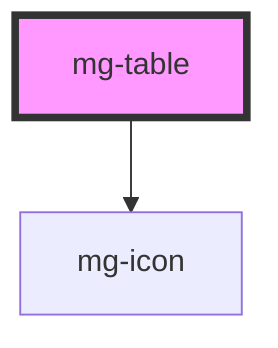

<!-- Auto Generated Below -->

## Properties

| Property    | Attribute    | Description                             | Type                                                                                                                             | Default     |
| ----------- | ------------ | --------------------------------------- | -------------------------------------------------------------------------------------------------------------------------------- | ----------- |
| `columns`   | --           | Define column properties                | `{ [key: number]: { align?: "center" \| "right" \| "left"; sortable?: boolean; datatype?: "string" \| "numeric" \| "date"; }; }` | `undefined` |
| `fullWidth` | `full-width` | Define if table fits its parent element | `boolean`                                                                                                                        | `false`     |
| `size`      | `size`       | Define table size                       | `"large" \| "medium" \| "small" \| "xlarge"`                                                                                     | `'medium'`  |

## Slots

| Slot | Description   |
| ---- | ------------- |
|      | Table content |

## Dependencies

### Depends on

- [mg-icon](../../atoms/mg-icon)

### Graph

----------------------------------------------

*Built with [StencilJS](https://stenciljs.com/)*
