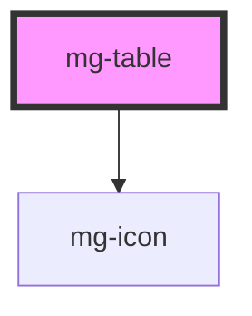

## Sorting

The `mg-table` component supports sorting for different data types. You can specify the sortable columns and their data types using the `columns` property.

### Date

To enable sorting for date columns, set the `datatype` property to `"date"` in the `columns` object.
The date values should be in a format that can be parsed by JavaScript's `Date` object. If you need to display a different format, you must use the `data-sort` attribute on the `tr` or `th` cell, like `<td data-sort="1982-06-02">02/06/1982</td>`.

### Numeric

To enable sorting for numeric columns, set the `datatype` property to `"numeric"` in the `columns` object. This will ensure that the values are sorted numerically.
Note that when defining a column as `"numeric"`, its content will be right-aligned.

#### Currency

For currency values, you can also use the `datatype` property set to `"numeric"` combined with the use of the `data-sort` attribute on the cell, like `<td data-sort="1234567890.12">1 234 567 890,12 €</td>`.

## Ressources

- [Styling Tables the Modern CSS Way - Piccalilli](https://piccalil.li/blog/styling-tables-the-modern-css-way/)
- [Under-Engineered Responsive Tables — Adrian Roselli](https://adrianroselli.com/2020/11/under-engineered-responsive-tables.html)
- [Sortable Table Example | APG | WAI | W3C](https://www.w3.org/WAI/ARIA/apg/patterns/table/examples/sortable-table/)
- [aria-sort - Accessibility | MDN](https://developer.mozilla.org/en-US/docs/Web/Accessibility/ARIA/Attributes/aria-sort)

<!-- Auto Generated Below -->

## Properties

| Property    | Attribute    | Description                             | Type                                                                                                                             | Default     |
| ----------- | ------------ | --------------------------------------- | -------------------------------------------------------------------------------------------------------------------------------- | ----------- |
| `columns`   | --           | Define column properties                | `{ [key: number]: { align?: "center" \| "right" \| "left"; sortable?: boolean; datatype?: "string" \| "numeric" \| "date"; }; }` | `undefined` |
| `fullWidth` | `full-width` | Define if table fits its parent element | `boolean`                                                                                                                        | `false`     |
| `size`      | `size`       | Define table size                       | `"large" \| "medium" \| "small" \| "xlarge"`                                                                                     | `'medium'`  |

## Slots

| Slot | Description   |
| ---- | ------------- |
|      | Table content |

## Dependencies

### Depends on

- [mg-icon](../../atoms/mg-icon)

### Graph

----------------------------------------------

*Built with [StencilJS](https://stenciljs.com/)*
