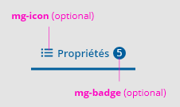
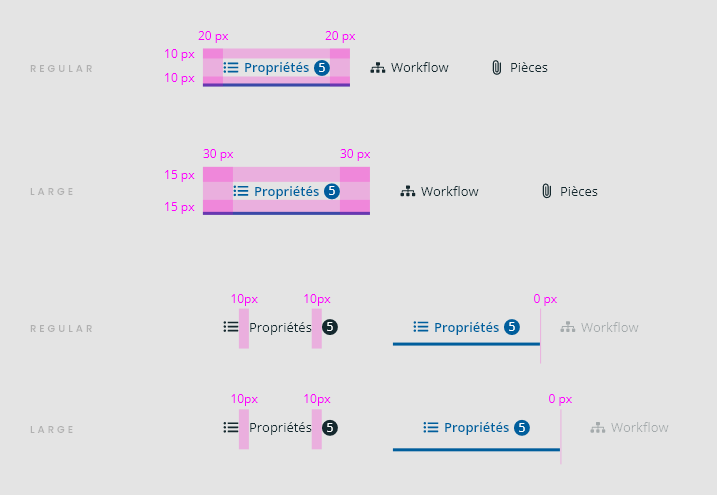
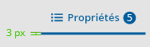
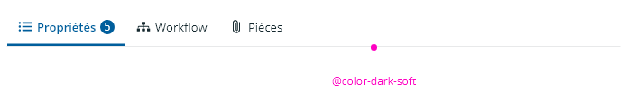
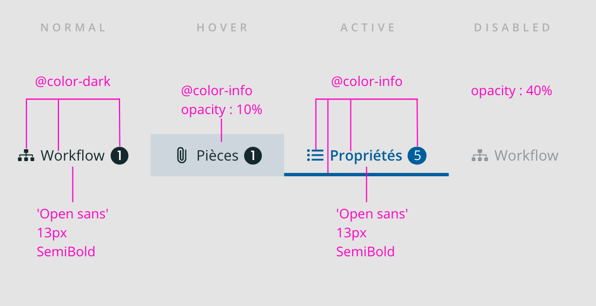
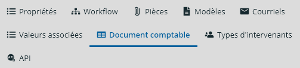
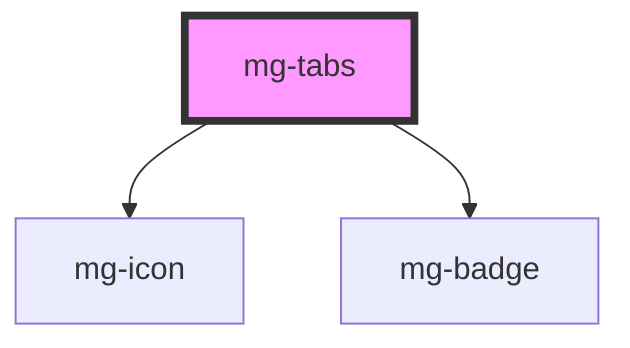

## Anatomy

## Specs

### Spacing

- Regular
  - X = 20px;
  - Y = 10px;
- Large
  - X = 30px;
  - Y = 15px;

- if only text, no extra spacing,
- if no badge: no extra spacing on the right
- if only icon: no extra spacing on the right

### Sizing

The header bottom border is 100% wide, 1px sizing and its color is @color-dark-soft. You can override it with [CSS variable](./?path=/docs/molecules-mg-tabs--docs#css-variables).

### States

### Responsive

#### Line breaks (current management)

## CSS variables

If needed some [variables](./?path=/story/css-variables--page) are available to customize the component:

- `--mg-tabs-border-bottom`: define tabs header border-bottom. Default: `solid 0.1rem hsl(var(--mg-color-dark-soft-hsl))`.

<!-- Auto Generated Below -->

## Properties

| Property             | Attribute    | Description                                                                                                 | Type                    | Default               |
| -------------------- | ------------ | ----------------------------------------------------------------------------------------------------------- | ----------------------- | --------------------- |
| `activeTab`          | `active-tab` | Active tab number                                                                                           | `number`                | `undefined`           |
| `identifier`         | `identifier` | Identifier is used for the element ID (id is a reserved prop in Stencil.js) If not set, it will be created. | `string`                | `createID('mg-tabs')` |
| `items` _(required)_ | --           | Tabs items                                                                                                  | `TabItem[] \| string[]` | `undefined`           |
| `label` _(required)_ | `label`      | Tabs label. Include short tabs description. Required for accessibility                                      | `string`                | `undefined`           |
| `size`               | `size`       | Define tabs size                                                                                            | `"large" \| "regular"`  | `'regular'`           |

## Events

| Event               | Description                         | Type                  |
| ------------------- | ----------------------------------- | --------------------- |
| `active-tab-change` | Emited event when active tab change | `CustomEvent<number>` |

## Slots

| Slot              | Description                                                                        |
| ----------------- | ---------------------------------------------------------------------------------- |
| `"tab_content-n"` | Tab content, where `n` represents the position of the tab content. It starts at 1. |

## Dependencies

### Depends on

- [mg-icon](../../atoms/mg-icon)
- [mg-badge](../../atoms/mg-badge)

### Graph

----------------------------------------------

*Built with [StencilJS](https://stenciljs.com/)*
