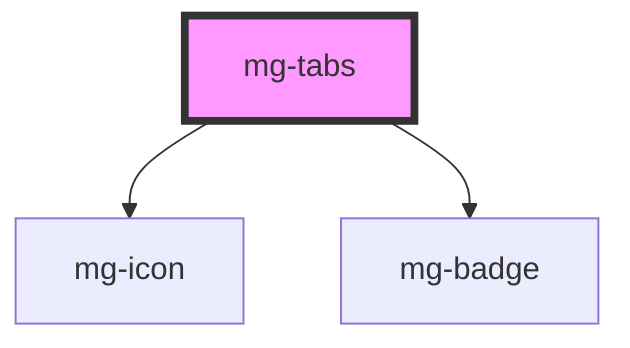

<!-- Auto Generated Below -->

## Properties

| Property             | Attribute    | Description                                                                                                 | Type                    | Default               |
| -------------------- | ------------ | ----------------------------------------------------------------------------------------------------------- | ----------------------- | --------------------- |
| `activeTab`          | `active-tab` | Active tab number                                                                                           | `number`                | `undefined`           |
| `identifier`         | `identifier` | Identifier is used for the element ID (id is a reserved prop in Stencil.js) If not set, it will be created. | `string`                | `createID('mg-tabs')` |
| `items` _(required)_ | --           | Tabs items                                                                                                  | `TabItem[] \| string[]` | `undefined`           |
| `label` _(required)_ | `label`      | Tabs label. Include short tabs description. Required for accessibility                                      | `string`                | `undefined`           |
| `size`               | `size`       | Define tabs size                                                                                            | `"large" \| "medium"`   | `'medium'`            |

## Events

| Event               | Description                         | Type                  |
| ------------------- | ----------------------------------- | --------------------- |
| `active-tab-change` | Emited event when active tab change | `CustomEvent<number>` |

## Slots

| Slot              | Description                                                                        |
| ----------------- | ---------------------------------------------------------------------------------- |
| `"tab_content-n"` | Tab content, where `n` represents the position of the tab content. It starts at 1. |

## CSS Custom Properties

| Name                     | Description                                                                                         |
| ------------------------ | --------------------------------------------------------------------------------------------------- |
| `--mg-c-tabs-color`      | Defines tabs global color, used for bottom line and active tabs. Default value: `--mg-b-color-app`. |
| `--mg-c-tabs-color-text` | Defines tabs text color. Unset by default, fallback on `--mg-b-color-dark`.                         |

## Dependencies

### Depends on

- [mg-icon](../../atoms/mg-icon)
- [mg-badge](../../atoms/mg-badge)

### Graph

----------------------------------------------

*Built with [StencilJS](https://stenciljs.com/)*
